# Vista Lógica — TrustBid

> **4+1 · Vista 1 de 5** · [← Índice](./README.md) · [Siguiente: Procesos →](./2-vista-procesos.md)
> Responde: *¿qué hace el sistema y cuál es su dominio?*
> Interesado: analista funcional, usuario final, auditor.

---

## 1. Descomposición funcional de alto nivel

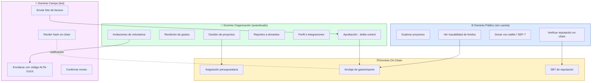

## 2. Actores y roles

Los roles viven en la columna `users.role` y se aplican con `@Roles(...)` +
`RolesGuard` (`apps/api/src/common/guards/roles.guard.ts`).

| Rol | Origen | Puede | Etiqueta en UI |
|---|---|---|---|
| `admin` | bootstrap de la org al primer login | todo; crear/aprobar gastos (auto-anclaje); emitir invitaciones; mint/revoke de SBT | Administrador |
| `admin_regional` | asignación manual | aprueba gastos; emite invitaciones de bot | — |
| `auditor` | asignación manual | aprueba/rechaza gastos; lectura amplia | Auditor (solo lectura en UI) |
| `contador` | asignación manual | carga gastos (quedan `pending`) | Contador |
| `responsable` | asignación manual | carga gastos de su área | Resp. de Área |
| `voluntario` | auto-creado al enrolarse por bot | carga gastos desde WhatsApp/Telegram (siempre `pending`) | — |
| `donante` | enum del schema | rol previsto, sin flujo autenticado propio hoy | Donante |
| Público anónimo | — | consulta proyectos, trazabilidad, badges; inicia donación | — |

> ⚠️ **Trampa de rol en el registro.** `RegistrationDto` acepta `role` del cliente y
> `findOrCreateUser` lo persiste tal cual (`auth.service.ts:361`). Quien cree su organización
> eligiendo `responsable` o `donante` **queda sin permisos de `admin` en su propia ONG**
> —no puede editar la organización, emitir invitaciones de bot ni badges— y no existe flujo
> para corregirlo. Además el enum del DTO tiene 3 valores (`admin`, `responsable`, `donante`)
> mientras el de Postgres ya tiene 6: registrarse como `contador` o `auditor` es rechazado por
> la validación aunque la base los admita.

**Regla estructural del dominio** (`projects.service.ts:14`):
`APPROVER_ROLES = ['admin', 'admin_regional', 'auditor']`. Un gasto cargado por uno de estos
roles se **auto-autoriza** y ancla al instante; cargado por cualquier otro queda `pending` y
requiere un aprobador **distinto** del creador.

## 3. Modelo de dominio (clases de servicio)

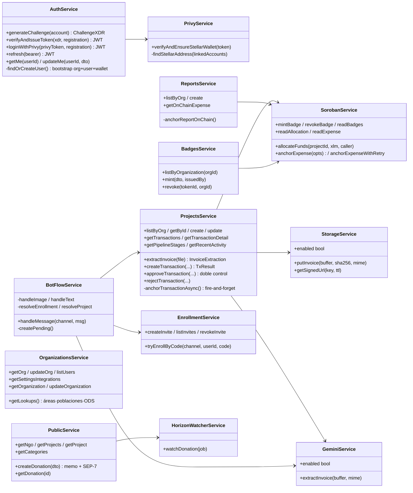

### Servicios de soporte

| Servicio | Rol | Degradación |
|---|---|---|
| `ConversationService` | estado efímero del voluntario en Redis (`bot:conv:{canal}:{id}`, TTL 30 min) | requiere Redis |
| `BotNotificationService` | escucha `transaction.anchored` y avisa el hash por el canal correcto | silencioso si el canal está deshabilitado |
| `WhatsappService` / `TelegramService` | implementan la interfaz `BotChannel` (`sendText`, `downloadMedia`) | `enabled=false` sin credenciales |
| `HorizonWatcherProcessor` | worker BullMQ que busca el memo de la donación en Horizon | requiere Redis |
| `AreasService` | áreas presupuestarias de la organización (`areas`, con `budget_amount`); las transacciones se imputan por `area_id` | — |
| `PipelineTemplatesService` | plantillas de pipeline reutilizables: crear, editar, **duplicar** y borrar | — |
| `BillingService` | planes, suscripción vigente, historial de pagos y uso (proyectos/usuarios/tx/reportes) | **sin pasarela de pago** — ver abajo |

### La abstracción `BotChannel`

El punto de diseño más limpio del bot (`modules/whatsapp/bot-channel.ts`): un único
`BotFlowService` sirve a los dos canales porque ambos implementan el mismo contrato.

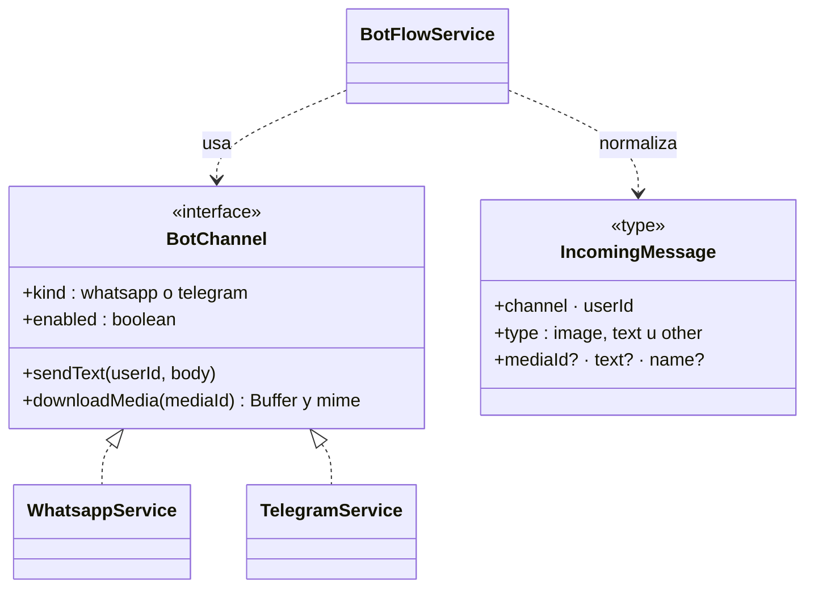

Simétricamente, `StellarSigner` (`packages/stellar-sdk/src/signer.ts`) unifica los dos
rieles de firma: `WalletKitSigner` (browser, Freighter/Albedo) y `PrivyStellarSigner`
(server, `rawSign` Tier 2). La lógica de negocio no distingue el riel.

## 4. Contratos Soroban — modelo lógico on-chain

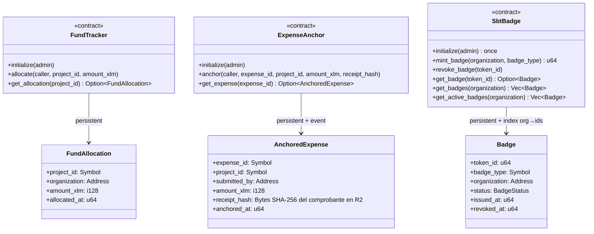

**Invariantes verificadas por el código Rust:**

| Contrato | Invariante | Implementación |
|---|---|---|
| `fund-tracker` | re-asignar sobrescribe (última asignación gana) | clave `DataKey::Allocation(project_id)` |
| `fund-tracker` | `initialize` es idempotente (no panica) | no chequea existencia previa |
| `expense-anchor` | cada anclaje emite el evento `expense_anchored` | `env.events().publish(...)` |
| `expense-anchor` | re-anclar el mismo `expense_id` sobrescribe | clave `DataKey::Expense(expense_id)` |
| `sbt-badge` | `initialize` **sólo una vez** (panica `already_initialized`) | chequeo de `DataKey::Admin` |
| `sbt-badge` | `token_id` autoincremental desde 1 | `DataKey::NextTokenId` |
| `sbt-badge` | mint/revoke sólo el admin (`require_admin`) | `admin.require_auth()` |
| `sbt-badge` | tipos válidos: `kyb_verified`, `transparency_{bronze,silver,gold}` | `validate_badge_type`, panica si no |
| `sbt-badge` | **soulbound**: no existe función de transferencia | ausencia deliberada de `transfer` |
| `sbt-badge` | revocar no borra: `status=Revoked` + `revoked_at`, `issued_at` intacto | append-only de hecho |

> ⚠️ **Limitación conocida**: `fund-tracker` acepta `amount_xlm` negativo (hay un test que lo
> documenta: `test_negative_amount_accepted`). La validación de rango vive hoy sólo en el DTO
> de la API, no en el contrato.

### Codificación de identificadores

Los IDs de PostgreSQL son UUID (36 chars); los `Symbol` de Soroban admiten hasta 32
caracteres y en la práctica se usan cortos. `SorobanService` los reduce así
(`soroban.service.ts:107`):

```ts
const symId = projectId.replace(/-/g, '').slice(-12);   // últimos 12 hex del UUID
const amountRaw = BigInt(Math.round(amountXlm * 1e7));  // stroops (7 decimales)
```

> Consecuencia: la clave on-chain es un **sufijo** del UUID, no el UUID. La probabilidad de
> colisión es baja (48 bits) pero no nula, y no hay detección de colisión.

## 5. Máquinas de estado del dominio

### 5.1 Transacción (gasto/donación) — `transactions.tx_status`

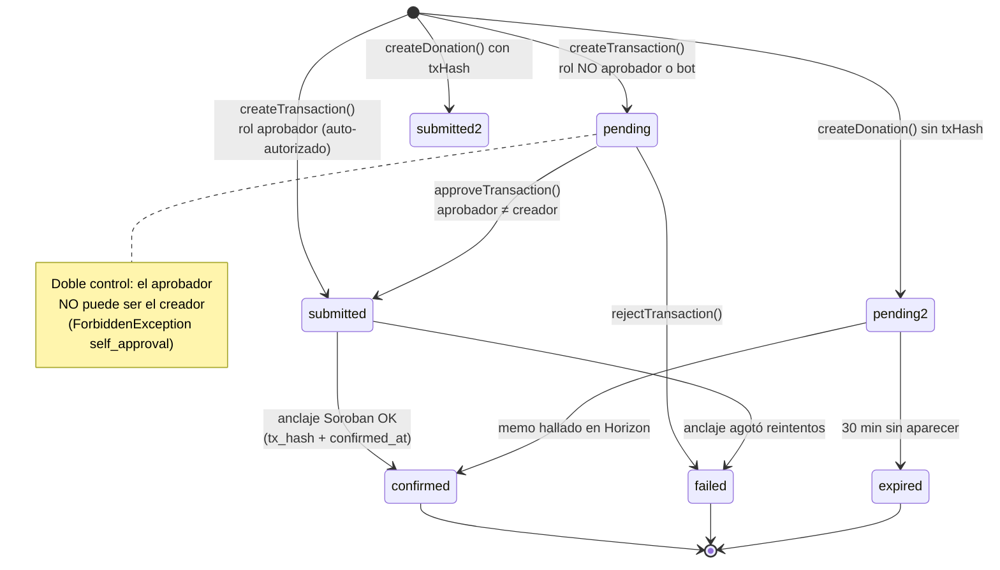

`pending2`/`submitted2` son el mismo estado `pending`/`submitted` del enum; se separan en el
diagrama para distinguir el camino donación (vigilado por Horizon) del camino gasto
(anclado en Soroban).

### 5.2 Proyecto y reporte — `blockchain_status`

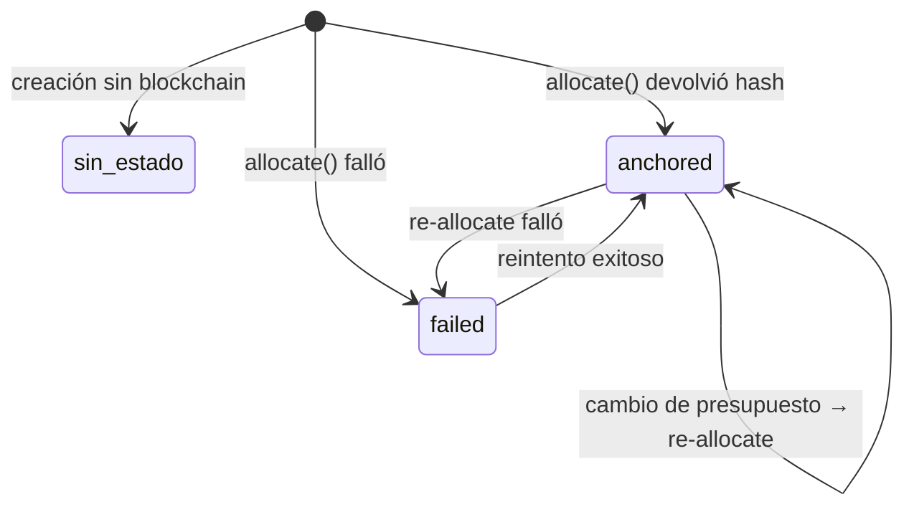

Reportes agregan un estado `pending` explícito, escrito antes de invocar el contrato
(`reports.service.ts:120`).

### 5.3 SBT de reputación

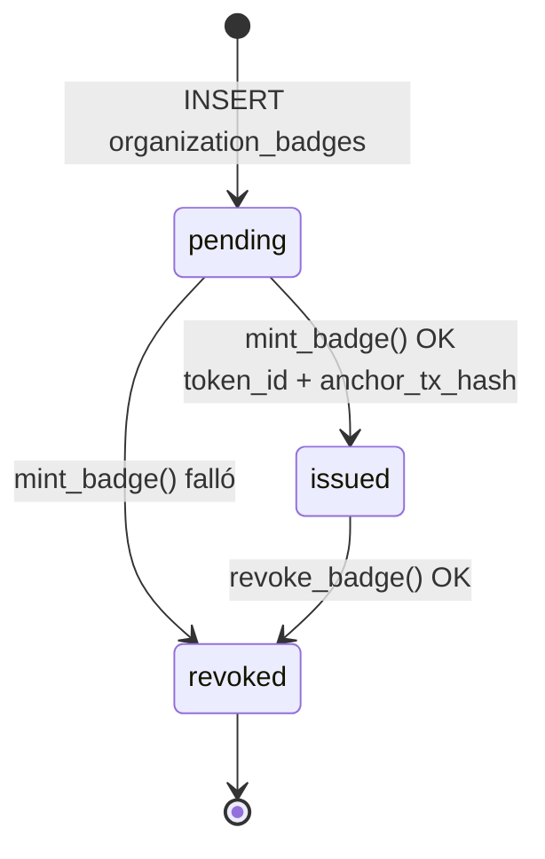

> Nota de dominio: cuando el mint falla, la fila se marca `revoked` (no existe estado
> `failed` en el enum `badge_status`), lo que mezcla "nunca se emitió" con "se revocó".

### 5.4 Conversación del bot

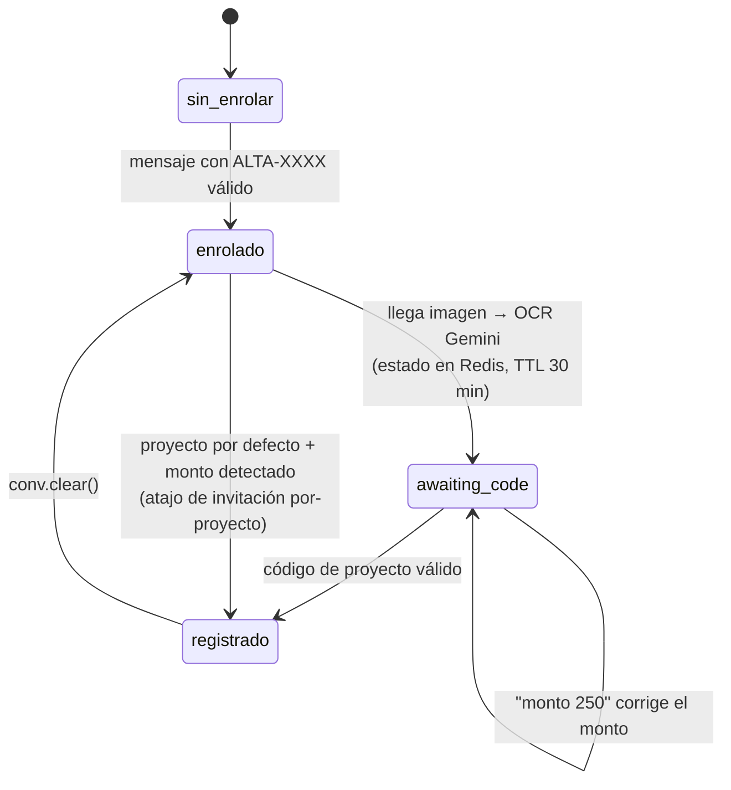

## 6. Modelo de datos y multi-tenancy

### 6.1 Núcleo del modelo

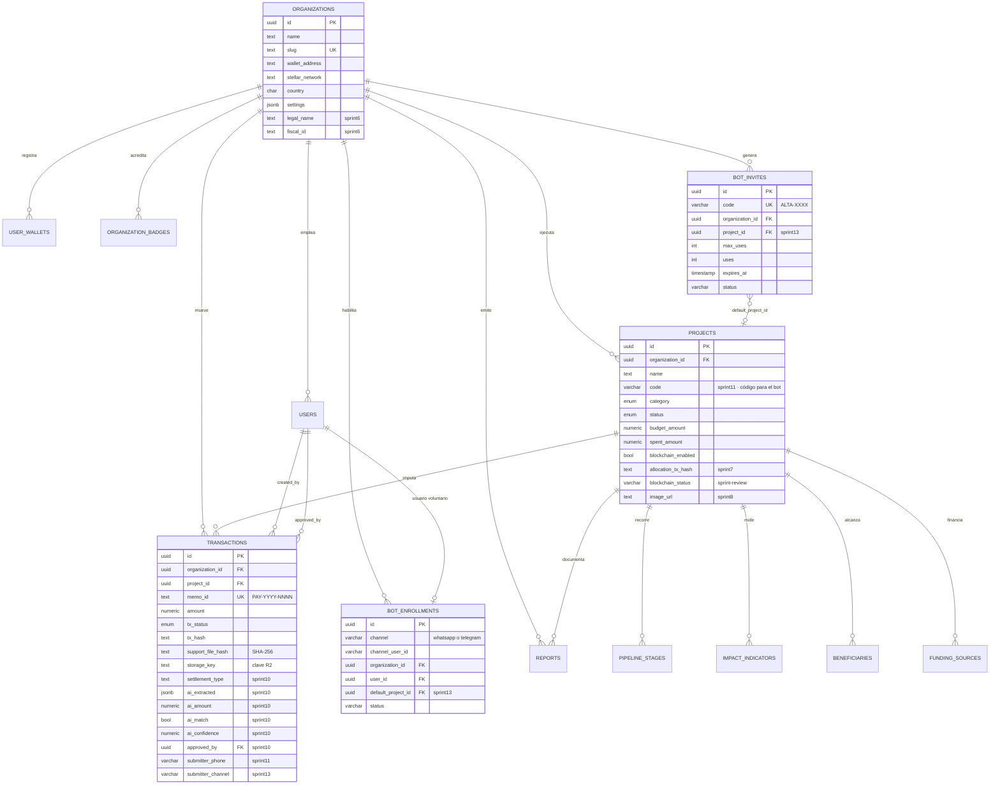

El DER completo (25+ tablas en 4 vistas de dominio) está en [der.md](../der.md).

### 6.2 Evolución del schema

| Migración | Aporte |
|---|---|
| `init-db.sql` | núcleo: organizations, users, user_wallets, projects, accounts, transactions, reports, report_attachments, activity_events, custodian_keys, indexer_state + RLS |
| `sprint3-schema.sql` | planes, programas, áreas, fuentes de fondeo, splits, pipeline (templates/stages/transitions), indicadores de impacto, beneficiarios, OCR, templates de reporte |
| `sprint4-sbt-zk.sql` | `organization_badges`, `zk_proofs` + enums de badge y ZK |
| `sprint5-wallet-auth.sql` | ampliación del enum `wallet_provider` (xbull, rabet, lobstr, hana, hot-wallet, privy) |
| `sprint6-org-profile.sql` | perfil extendido de ONG + catálogos `intervention_areas`, `target_populations`, `ods_goals` y sus tablas puente |
| `sprint7-anchor-txhash.sql` | `reports.anchor_tx_hash`, `projects.allocation_tx_hash` |
| `sprint8-project-image.sql` | `projects.image_url` |
| `sprint9-transaction-invoice.sql` | `invoice_number`, `tax_id`, `invoice_date` |
| `sprint10-invoice-veracity.sql` | veracidad IA + doble control: `settlement_type`, `storage_key`, `ai_*`, `approved_by/at` |
| `sprint11-whatsapp-bot.sql` | `projects.code`, `transactions.submitter_phone`, `bot_enrollments` |
| `sprint12-bot-invites.sql` | `bot_invites` con código, cupo y vencimiento |
| `sprint13-project-invites-channels.sql` | invitación por proyecto + canal (`telegram`) |
| `sprint-review-blockchain-status.sql` | `blockchain_status` en `projects` y `reports` |
| `sprint14-settings-areas-notifications.sql` | `areas` gana `description` y `budget_amount`; `transactions.area_id` (+ índice); tabla `notification_preferences` |
| `sprint15-settings-profile-invites-billing.sql` | `organizations`: `mission`, `logo_url`, `timezone` (default `America/Bogota`), `language`; tablas `user_invites`, `subscription_plans`, `organization_subscriptions`, `subscription_payments` + seed de planes |

### 6.3 Multi-tenancy: lo declarado vs. lo aplicado

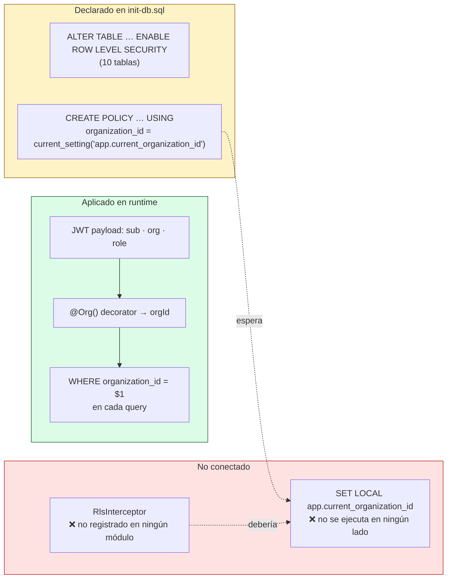

**Estado real:** el aislamiento funciona, pero por disciplina en la capa de servicio, no por
la base. Dos consecuencias:

1. Un `WHERE organization_id` omitido en un service nuevo no lo atrapa nada.
2. Las políticas RLS, tal como están escritas, **bloquearían todas las lecturas** si se
   activara la conexión con un rol no-superusuario sin setear la variable de sesión.

Camino para cerrarlo: registrar `RlsInterceptor` globalmente y hacer que ejecute
`SET LOCAL app.current_organization_id = $orgId` dentro de una transacción por request, con
un cliente tomado del pool en vez de `pool.query` directo.

## 7. Superficie de API (contratos lógicos)

### 7.1 Público (sin JWT — decorador `@Public()`)

| Método | Ruta | Devuelve |
|---|---|---|
| `GET` | `/` | metadata de la API (red, versión, docs) |
| `GET` | `/health` | `status`, `uptime` |
| `GET` | `/.well-known/stellar.toml` | SEP-1: `SIGNING_KEY`, `WEB_AUTH_ENDPOINT`, USDC |
| `GET` | `/ngo` | perfil de la ONG + totales + uso de fondos por categoría |
| `GET` | `/projects?q=&category=` | listado público de proyectos |
| `GET` | `/projects/:id` | detalle + pipeline + trazabilidad + impacto |
| `GET` | `/categories` | categorías con proyectos activos |
| `POST` | `/donations` | crea intención → `memoId` + link SEP-7 |
| `GET` | `/donations/:id` | estado de la donación (`verificationCode` = tx hash) |
| `GET` | `/organizations/:id/badges` | SBT en DB + lectura on-chain |
| `GET` | `/auth/challenge?account=G…` | XDR del challenge SEP-10 |
| `POST` | `/auth/token` | verifica XDR firmado → JWT |
| `POST` | `/auth/privy` | verifica token Privy → JWT |
| `GET/POST` | `/webhooks/whatsapp` | verificación Meta + recepción de mensajes |
| `POST` | `/webhooks/telegram` | recepción de updates |
| `GET` | `/my/org/lookups` | catálogos (áreas, poblaciones, ODS) — público pese al prefijo |

### 7.2 Autenticado (JWT `Bearer`)

| Método | Ruta | Roles | Nota |
|---|---|---|---|
| `GET/PATCH` | `/auth/me` | cualquiera | perfil + wallet primaria |
| `POST` | `/auth/refresh` | cualquiera | reemite el JWT |
| `GET` | `/my/projects` · `/my/projects/:id` | cualquiera | scope por `org` del JWT |
| `POST` | `/my/projects` | cualquiera | dispara `allocate()` si `blockchainEnabled` |
| `PATCH` | `/my/projects/:id` | cualquiera | re-ancla si cambia el presupuesto |
| `GET` | `/my/projects/recent-activity` | cualquiera | últimas transacciones de la org |
| `GET` | `/my/projects/:id/on-chain` | cualquiera | lectura directa de `fund-tracker` |
| `GET` | `/my/projects/:id/pipeline-stages` | cualquiera | etapas con estado calculado |
| `GET` | `/my/projects/:id/transactions[/:txId]` | cualquiera | detalle incluye URL firmada de R2 |
| `POST` | `/my/projects/:id/transactions/ocr` | admin·contador·responsable | OCR sin persistir |
| `POST` | `/my/projects/:id/transactions` | admin·contador·responsable | multipart, crea gasto |
| `PATCH` | `/my/projects/:id/transactions/:txId/approve` | admin·auditor | doble control + anclaje |
| `PATCH` | `/my/projects/:id/transactions/:txId/reject` | admin·auditor | marca `failed` |
| `GET/POST` | `/my/reports` | cualquiera | crear ancla el reporte |
| `GET` | `/my/reports/:id/on-chain` | cualquiera | lectura de `expense-anchor` |
| `GET/PATCH` | `/my/org` · `/my/org/profile` | PATCH: admin | perfil básico y extendido |
| `GET` | `/my/org/users` · `/my/org/settings/integrations` | cualquiera | — |
| `PATCH` | `/my/org/users/:id` | admin | cambia rol / estado de un usuario |
| `GET/POST/DELETE` | `/my/org/invites[/:id]` | admin | invitaciones **por email** — ver ⚠️ abajo |
| `GET/PUT` | `/my/org/settings/notifications` | PUT: admin | preferencias de notificación |
| `POST` | `/my/org/logo` · `/my/org/avatar` | logo: admin | multipart → R2 `avatars/{org,user}/<id>` |
| `GET/POST/PATCH/DELETE` | `/my/areas[/:id]` | escritura: admin | áreas presupuestarias |
| `GET/POST/PATCH/DELETE` | `/my/pipeline-templates[/:id]` | escritura: admin | plantillas de pipeline |
| `POST` | `/my/pipeline-templates/:id/duplicate` | admin | clona una plantilla |
| `GET` | `/my/billing` · `/my/billing/plans` | cualquiera | suscripción, uso y catálogo de planes |
| `POST` | `/my/billing/change-plan` · `/my/billing/cancel` | admin | ⚠️ sin cobro real |
| `POST/GET/DELETE` | `/my/bot/invites[/:id]` | admin·admin_regional | invitaciones del bot |
| `POST` | `/admin/badges/mint` · `/admin/badges/:tokenId/revoke` | admin | SBT |

> ⚠️ **Dos superficies incompletas.**
> **Invitaciones de usuario**: se crean, listan y revocan, pero no hay SMTP conectado ni
> endpoint que canjee el token — el estado `accepted` de `user_invites` es inalcanzable.
> **Billing**: `change-plan` y `cancel` sólo escriben en `organization_subscriptions`; no hay
> pasarela de pago ni webhook, y los límites del plan (`max_projects`, `max_users`) **no se
> aplican** en ningún guard.
>
> Ojo con la homonimia: `/my/org/invites` (usuarios, por email) y `/my/bot/invites`
> (voluntarios, por código `ALTA-XXXX`) son mecanismos distintos y sin relación entre sí.

> Observación: los guards son globales (`APP_GUARD`), así que **toda ruta sin `@Public()`
> exige JWT**; y las rutas `/my/*` sin `@Roles` quedan abiertas a cualquier rol autenticado
> de la organización, incluido `voluntario`.

## 8. Trazabilidad: dato → evidencia

La cadena de custodia que hace verificable un gasto:

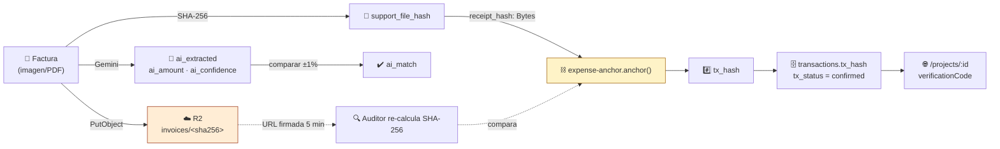

La clave en R2 **es** el hash del contenido: si alguien sustituye el archivo, la clave deja
de coincidir y el hash anclado on-chain no valida. Ese es el mecanismo de integridad.

---

## Referencias al código

| Concepto | Archivo |
|---|---|
| Reglas de aprobación y anclaje | `platform/apps/api/src/modules/projects/projects.service.ts` |
| SEP-10 (challenge, verificación, bootstrap) | `platform/apps/api/src/modules/auth/auth.service.ts` |
| Riel Privy | `platform/apps/api/src/modules/auth/privy.service.ts` |
| Clientes de contrato + conversión de tipos | `platform/apps/api/src/modules/soroban/soroban.service.ts` |
| Contratos Rust | `platform/contracts/contracts/{fund-tracker,expense-anchor,sbt-badge}/src/lib.rs` |
| Schema y migraciones | `platform/apps/api/db/*.sql` |
| Roles en UI | `platform/apps/dapp/src/components/settings/roles.ts` |
