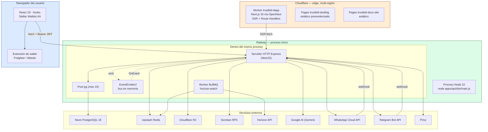
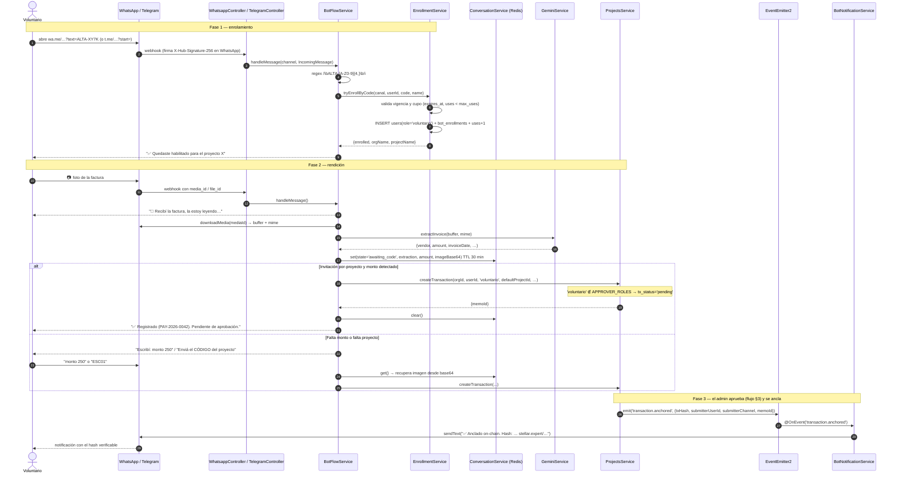
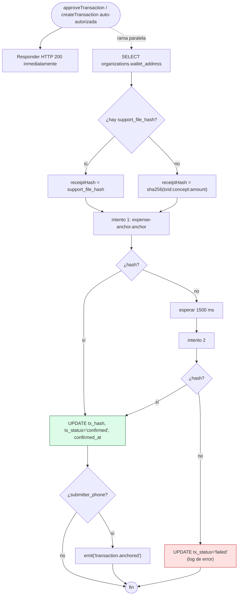
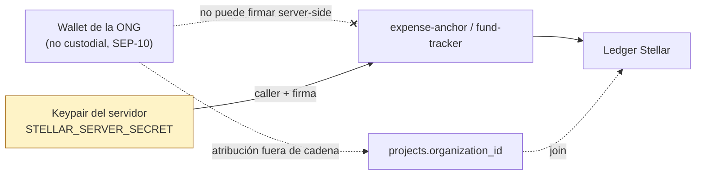
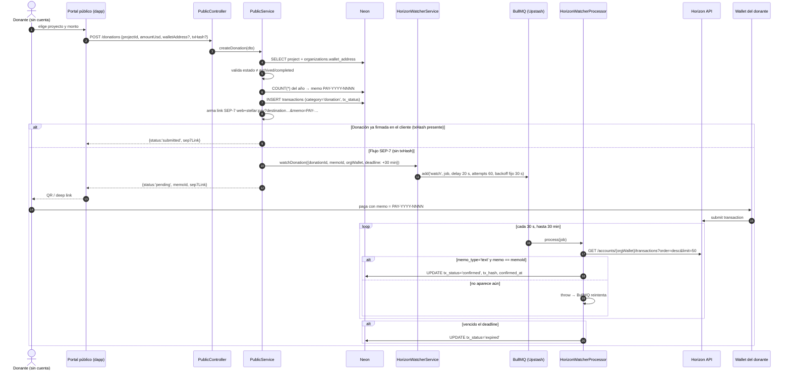
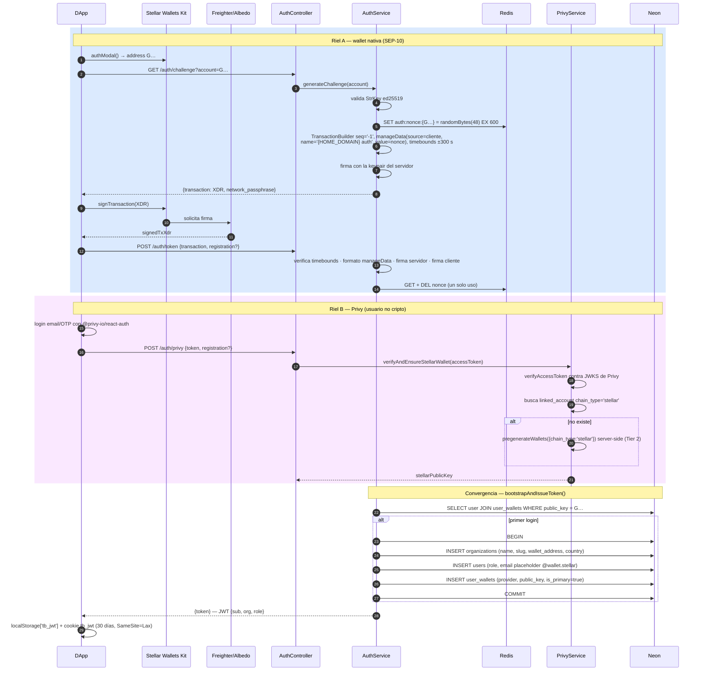
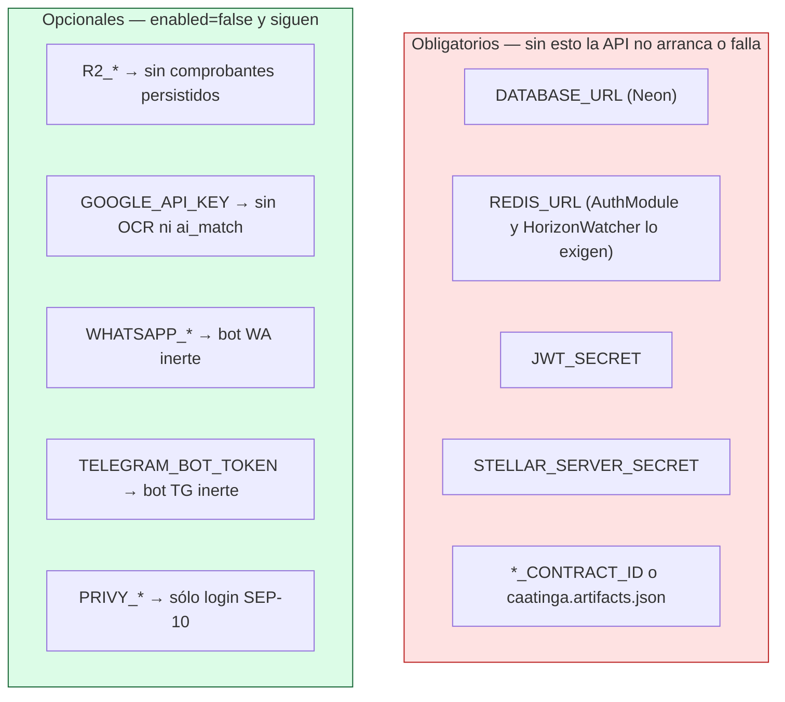

# Vista de Procesos — TrustBid

> **4+1 · Vista 2 de 5** · [← Lógica](./1-vista-logica.md) · [Índice](./README.md) · [Siguiente: Desarrollo →](./3-vista-desarrollo.md)
> Responde: *¿cómo se comporta el sistema en ejecución? ¿qué corre en paralelo?*
> Interesado: integrador, responsable de performance y disponibilidad.

---

## 1. Unidades de ejecución



**Observación estructural:** el backend es un **monolito modular de proceso único**. El worker
BullMQ (`HorizonWatcherProcessor`) corre *dentro* del mismo proceso que el servidor HTTP, no
en un servicio aparte. El bus de eventos (`EventEmitter2`) también es en memoria — no
sobrevive a un reinicio ni cruza instancias.

> Consecuencia operativa: escalar la API a más de una réplica duplicaría el consumo de la cola
> (BullMQ lo coordina bien) pero también duplicaría los listeners de `transaction.anchored`
> por instancia. Hoy corre una sola instancia en Railway.

## 2. Concurrencia y estado compartido

| Recurso | Tipo | Dónde vive | Vida útil |
|---|---|---|---|
| Nonce SEP-10 | Redis `auth:nonce:{G…}` | Upstash | 600 s, un solo uso (`DEL` al verificar) |
| Estado de conversación del bot | Redis `bot:conv:{canal}:{userId}` | Upstash | 1800 s |
| Cola `horizon-watch` | BullMQ sobre Redis | Upstash | hasta 60 intentos × 30 s |
| Sesión de usuario | JWT firmado (sin estado en servidor) | localStorage + cookie `tb_jwt` | `JWT_EXPIRES_IN` (8 h por defecto) |
| Pool de conexiones | `pg.Pool` | proceso API | `max: 10`, idle 30 s, connect timeout 5 s |
| Eventos de dominio | `EventEmitter2` | memoria del proceso | instantáneo, no persistido |

El **único estado en memoria del proceso** son los listeners de eventos y el pool. Todo lo
demás es externo, lo que hace al proceso API razonablemente *stateless*.

## 3. Escenario base — rendición y aprobación de un gasto (dashboard)

Es el flujo central del producto: muestra IA, storage, doble control y anclaje.

```mermaid
sequenceDiagram
    autonumber
    actor C as Contador
    participant UI as DApp (Worker CF)
    participant API as ProjectsController
    participant SVC as ProjectsService
    participant G as GeminiService
    participant S as StorageService (R2)
    participant DB as Neon PostgreSQL
    actor A as Admin/Auditor
    participant SOR as SorobanService
    participant RPC as Soroban RPC

    C->>UI: adjunta factura + monto declarado
    UI->>API: POST /my/projects/:id/transactions (multipart)
    API->>SVC: createTransaction(orgId, userId, role, dto, file)
    SVC->>DB: SELECT project WHERE id AND organization_id
    SVC->>SVC: sha256(file.buffer) → support_file_hash
    SVC->>S: putInvoice(buffer, sha256, mime)
    S-->>SVC: storage_key = invoices/&lt;sha256&gt;
    SVC->>G: extractInvoice(buffer, mime)
    G-->>SVC: {vendor, amount, invoiceNumber, taxId, confidence}
    SVC->>SVC: ai_match = abs(ai_amount − declarado) ≤ max(0.01, 1%)
    SVC->>DB: SELECT COUNT(*) año → memo_id PAY-YYYY-NNNN
    SVC->>DB: INSERT transactions (tx_status='pending', ai_*)
    Note over SVC: rol 'contador' ∉ APPROVER_ROLES → queda pendiente
    SVC-->>UI: 201 {id, memoId, status:'pending', ai:{…}}

    Note over A,DB: — Segundo actor, momento distinto —

    A->>UI: abre pendientes → ve monto, ai_match, factura
    UI->>API: GET /my/projects/:id/transactions/:txId
    API->>S: getSignedUrl(storage_key, 300 s)
    S-->>UI: invoiceUrl (expira en 5 min)
    A->>UI: Aprobar
    UI->>API: PATCH …/transactions/:txId/approve
    API->>SVC: approveTransaction(orgId, approverId, …)
    SVC->>DB: SELECT tx → valida tx_status='pending'
    alt created_by == approverUserId
        SVC-->>UI: 403 self_approval
    else aprobador distinto
        SVC->>DB: UPDATE tx_status='submitted', approved_by, approved_at
        SVC-->>UI: 200 {status:'submitted'}  ← respuesta inmediata
        par Anclaje asíncrono (fire-and-forget)
            SVC->>DB: SELECT organizations.wallet_address
            SVC->>SOR: anchorExpenseWithRetry({expenseId, projectId, amount, receiptHash})
            SOR->>RPC: expense-anchor.anchor() firmado por el servidor
            RPC-->>SOR: tx hash
            SOR-->>SVC: hash
            SVC->>DB: UPDATE tx_hash, tx_status='confirmed', confirmed_at
            SVC->>SVC: emit('transaction.anchored') si hay submitter_phone
        end
    end
```

**Puntos de diseño visibles en el diagrama:**

- El HTTP responde en el paso 24; el anclaje sigue después. La UI muestra `submitted` y luego
  `confirmed` cuando refresca.
- La URL de la factura es **firmada y efímera** (300 s): el comprobante nunca se expone público.
- El chequeo de auto-aprobación es explícito y devuelve `403 self_approval`.

## 4. Escenario bot — rendición desde el campo



**Detalles de implementación relevantes:**

- La imagen se guarda **en base64 dentro de Redis** mientras dura la conversación
  (`ConversationService`). Una factura de ~2 MB ocupa ~2.7 MB en Redis por 30 minutos.
- WhatsApp valida `X-Hub-Signature-256` con HMAC-SHA256 y `timingSafeEqual`; **si
  `WHATSAPP_APP_SECRET` no está configurado, la verificación devuelve `true`** (decisión de MVP
  documentada en el código, `whatsapp.service.ts:52`).
- Telegram no tiene validación de firma equivalente en el código actual.
- El voluntario nunca elige el estado: su gasto siempre nace `pending`.

## 5. Anclaje on-chain (fire-and-forget)



### Firmante y atribución

Todas las invocaciones Soroban las firma **la keypair del servidor**
(`STELLAR_SERVER_SECRET`). El parámetro `callerPublicKey` que reciben los métodos de
`SorobanService` se lee de la organización pero **se descarta** (`void callerPublicKey`,
`soroban.service.ts:112` y `:146`), porque el contrato exige `caller.require_auth()` y sólo
quien firma puede autorizarse.



> 🚩 **El log contradice al ledger.** `projects.service.ts:352` escribe
> `Allocation anchored project=… tx=… caller=${callerPublicKey}` con la **wallet de la ONG**,
> pero el `organization` que quedó grabado en `fund-tracker` es la dirección del servidor.
> Un auditor que confíe en el log llegará a una conclusión falsa. Esto además significa que el
> ítem **I-15 de `ISSUES.md`**, marcado como cerrado, está **neutralizado en la capa Soroban**.

> **Implicancia de confianza:** on-chain, el emisor de todos los anclajes es TrustBid. La
> vinculación gasto→ONG es verificable a través de la API pública, no del ledger solo. Cerrar
> esto requeriría autorización delegada de Soroban (firma de la ONG sobre la entrada de auth)
> o wallets custodiales con KMS — ambos previstos en el diseño, ninguno implementado.

## 6. Escenario donación pública — SEP-7 + vigilancia Horizon



**Parámetros de la cola** (`horizon-watcher.service.ts:31-38`):

| Parámetro | Valor | Efecto |
|---|---|---|
| `delay` | 20 000 ms | primera comprobación 20 s después de crear la intención |
| `attempts` | 60 | tope de reintentos |
| `backoff` | `fixed` 30 000 ms | una consulta a Horizon cada 30 s |
| ventana total | 30 min | `DONATION_WATCH_WINDOW_MS` en `public.service.ts:14` |
| `removeOnComplete` | `true` | no acumula jobs exitosos |
| `removeOnFail` | 200 | conserva los últimos 200 fallidos para diagnóstico |

> Costo: hasta 60 llamadas a Horizon por donación no confirmada, cada una trayendo 50
> transacciones de la cuenta. Con muchas donaciones simultáneas conviene mover a *streaming*
> de Horizon o a un indexador.

## 7. Autenticación — dos rieles, un punto de convergencia



**Detalles verificables:**

- El *bootstrap* de la organización es **transaccional** (`BEGIN`/`COMMIT`/`ROLLBACK`,
  `auth.service.ts:328-403`): o se crean org + usuario + wallet, o no se crea nada.
- El primer usuario de cada organización queda `admin` por defecto.
- El `email` de un usuario de wallet es un placeholder `{G…}@wallet.stellar`; el de un
  voluntario de bot, `{canal}-{userId}@bot.local`.
- La cookie `tb_jwt` existe **sólo** para que el middleware edge de Next pueda gatear
  `/dashboard`; la validación real la hace la API (`middleware.ts:8-10`).

### ⚠️ Asimetría entre los dos rieles: identidad sí, firma no

Los rieles convergen para **autenticar**, pero **no** para firmar transacciones Stellar:

| | Riel A — Wallet nativa | Riel B — Privy |
|---|---|---|
| Prueba de identidad | firma SEP-10 en la extensión | access token verificado contra JWKS |
| Origen de la wallet | del usuario, no custodial | embebida, pregenerada **server-side** |
| Firma de transacciones | `WalletKitSigner` (browser) — **en uso** | `PrivyStellarSigner` (`rawSign`) — **escrito pero nunca invocado** |
| Soporte del proveedor | nativo | **Stellar es Tier 2 en Privy**: sin SDK de alto nivel, hash firmado manualmente |

`PrivyStellarSigner` serializa el hash de la tx a hex con prefijo `0x`, llama
`privy.wallets().rawSign(walletId, {params:{hash}})` y adjunta la firma con `addSignature`.
Ningún flujo del código lo instancia hoy — el riel Privy termina en
`bootstrapAndIssueToken()` y las transacciones on-chain las sigue firmando la keypair del
servidor (§5).

> 🚩 **Bloqueante declarado en el propio código.** Tanto `privy.service.ts` como
> `privy-stellar-signer.ts` llevan el comentario `TODO(privy-stellar)`: *"Tier 2 — rawSign
> manual. VALIDAR EN SANDBOX/TESTNET que la firma producida es aceptada por Horizon antes de
> mover fondos reales… esta cuenta maneja fondos de ONGs."* Es el único punto donde el código
> se marca a sí mismo como no apto para producción. Mientras no se ejercite y valide contra
> Horizon, **las organizaciones que entren por Privy no pueden firmar nada por sí mismas**.

> ⚠️ Desalineación a tener presente: la cookie dura 30 días y el JWT 8 h. Pasadas las 8 h el
> middleware deja pasar y la API responde 401; la UI debe manejar ese 401 (los hooks lo hacen:
> `if (res.status === 401) setError('unauthenticated')`).

## 8. Perfil de latencia y modos de falla

| Operación | Camino crítico | Latencia dominante | Si el dependiente cae |
|---|---|---|---|
| `GET /projects` | API → Neon | query SQL | 500 (la dapp cae al *seed* local en SSR) |
| `POST /auth/token` | API → Redis + crypto | verificación de firmas | 500 si Redis no responde |
| `POST …/transactions` | API → R2 + Gemini + Neon | **Gemini (segundos)** | R2/Gemini nulos → sigue sin comprobante/IA |
| `PATCH …/approve` | API → Neon | ~1 query | responde igual; el anclaje falla aparte |
| Anclaje Soroban | fuera del request | 5–10 s + reintento | `tx_status='failed'`, requiere reproceso manual |
| Webhook del bot | canal → API → Gemini → Neon | Gemini | el usuario recibe mensaje de error amable |
| Donación SEP-7 | UI → API → Redis | encolado | sin Redis, `watchDonation` falla → 500 |

**El costo latente**: `extractInvoice` corre **en línea** dentro del `POST` de transacción
(`projects.service.ts:496`), así que la latencia percibida al cargar un gasto con factura es
la de Gemini. Moverlo a la cola BullMQ existente sería la optimización de mayor impacto.

### Degradación por servicio



`SorobanService` usa `getOrThrow` sobre `STELLAR_SERVER_SECRET` y resuelve los contract IDs
desde env o, en su defecto, desde `caatinga.artifacts.json`; si ninguno existe, **el módulo
falla al construirse y la API no levanta**.

## 9. Idempotencia y consistencia

| Punto | Garantía actual | Riesgo |
|---|---|---|
| `memo_id` `PAY-YYYY-NNNN` | `COUNT(*)` del año + 1, sin lock | **carrera**: dos inserts concurrentes pueden calcular el mismo `n`; la unicidad la salva el índice único, pero el segundo insert falla |
| Nonce SEP-10 | `SET` + `DEL` explícito | correcto (un solo uso) |
| Anclaje de gasto | ninguna llave de idempotencia | un reintento manual re-ancla y sobrescribe en el contrato |
| `tryEnrollByCode` | `SELECT` + `INSERT` sin transacción | dos mensajes simultáneos del mismo usuario podrían duplicar el enrolamiento |
| `uses` de invitación | `UPDATE … uses = uses + 1` | atómico a nivel fila ✅ |
| Bootstrap de organización | transacción explícita | correcto ✅ |
| `approveTransaction` | `SELECT` y luego `UPDATE`, sin `FOR UPDATE` | doble clic podría disparar dos anclajes |

## 10. Observabilidad

- **Logs**: `Logger` de NestJS por servicio; los mensajes clave incluyen `tx=…`,
  `project=…`, `expense=…`, lo que permite correlacionar un anclaje de punta a punta.
- **Health**: `GET /health` (uptime) y `GET /` (red, versión) — ambos públicos.
- **Worker CF**: `[observability] enabled = true` en `apps/dapp/wrangler.toml`.
- **CI**: `soroban-integration.yml` sube los logs de la corrida de integración como artefacto.
- **No hay**: tracing distribuido, métricas agregadas, ni alertas sobre `tx_status='failed'`.
  Una transacción que agota reintentos queda en `failed` sin que nadie se entere
  automáticamente — es la brecha operativa más relevante de esta vista.

---

## Referencias al código

| Proceso | Archivo |
|---|---|
| Anclaje asíncrono + reintentos | `apps/api/src/modules/projects/projects.service.ts:601-661` · `modules/soroban/soroban.service.ts:169-193` |
| Cola y worker Horizon | `apps/api/src/modules/horizon/horizon-watcher.{service,processor}.ts` |
| Bus de eventos y notificación | `apps/api/src/modules/whatsapp/bot-notification.service.ts` |
| Flujo del bot | `apps/api/src/modules/whatsapp/bot-flow.service.ts` |
| SEP-10 | `apps/api/src/modules/auth/auth.service.ts:70-210` |
| Estado efímero en Redis | `apps/api/src/modules/whatsapp/conversation.service.ts` |
