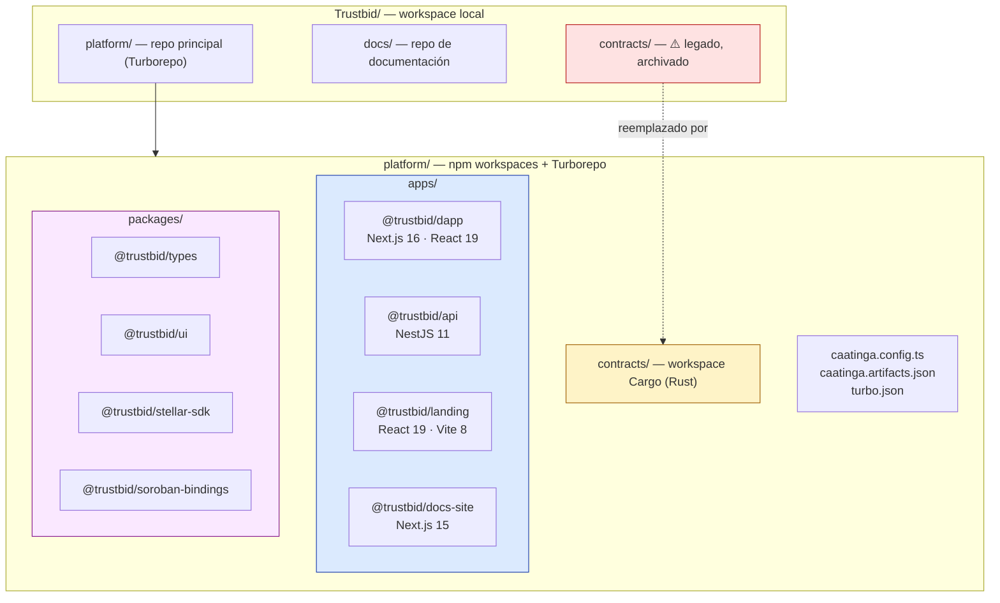
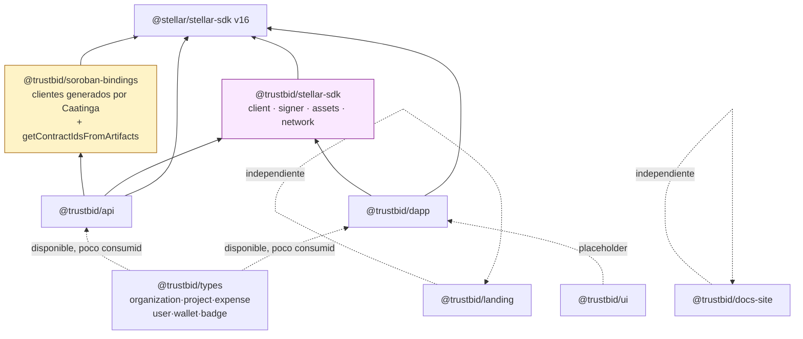
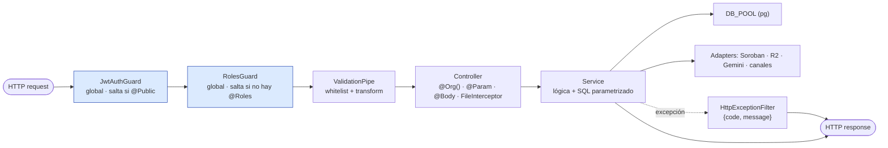
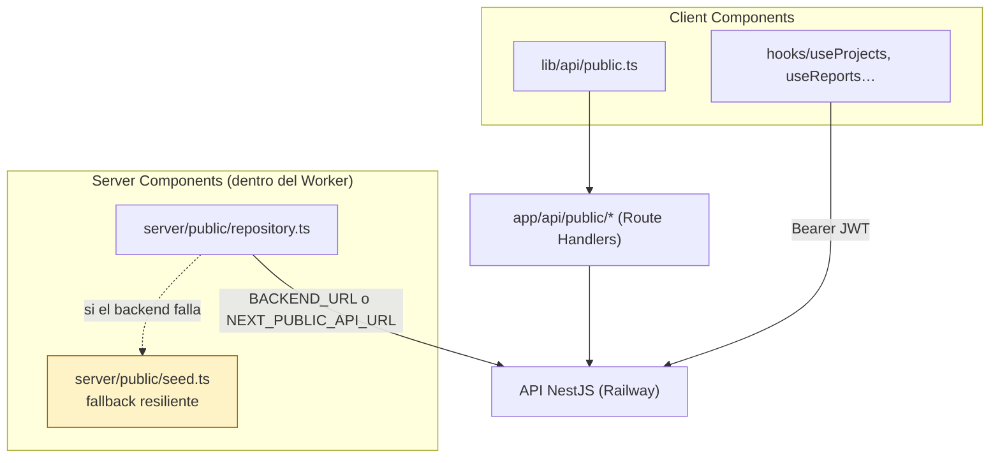
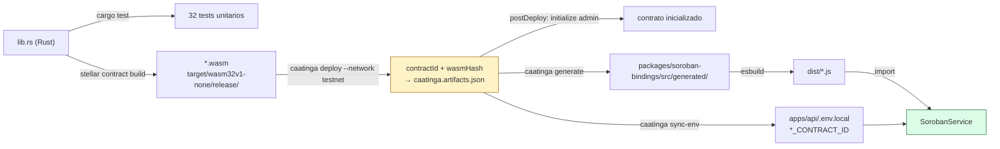
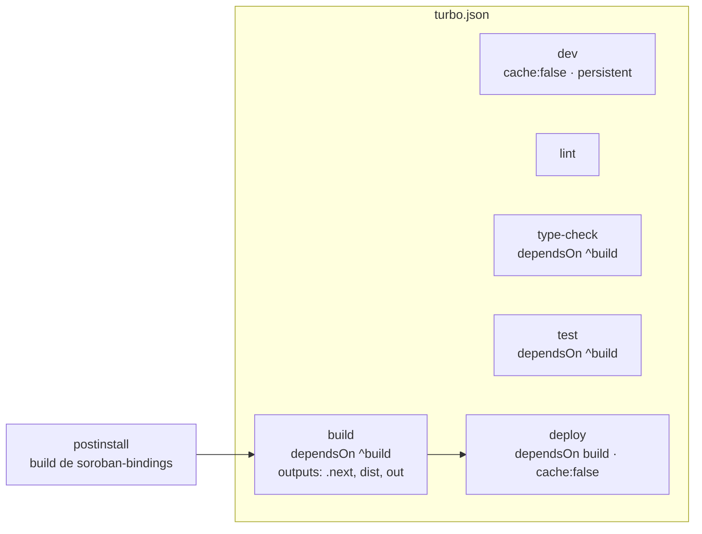

# Vista de Desarrollo — TrustBid

> **4+1 · Vista 3 de 5** · [← Procesos](./2-vista-procesos.md) · [Índice](./README.md) · [Siguiente: Física →](./4-vista-fisica.md)
> Responde: *¿cómo está organizado el código y cómo se construye?*
> Interesado: desarrollador, líder técnico, encargado de release.

---

## 1. Organización del workspace



| Ruta | Repo GitHub | Estado |
|---|---|---|
| `platform/` | `TrustBid/platform` | activo, privado — **contiene los contratos** |
| `docs/` | `TrustBid/docs` | activo, privado |
| `contracts/` (raíz del workspace) | `TrustBid/contracts` | ⚠️ archivado; usar `platform/contracts/` |

## 2. Grafo de dependencias internas



**Lectura del grafo:**

- `@trustbid/soroban-bindings` es el único paquete **compilado** (esbuild → `dist/`); los
  demás se consumen como TypeScript fuente (`main: ./src/index.ts`).
- `@trustbid/stellar-sdk` es el punto de simetría entre rieles: define la interfaz
  `StellarSigner` que implementan `WalletKitSigner` (dapp) y `PrivyStellarSigner` (api).
- `@trustbid/types` y `@trustbid/ui` existen y compilan, pero hoy están **subutilizados**: la
  dapp declara sus tipos localmente (`src/types/`, y los `interface` dentro de cada hook) y la
  API los suyos en cada service. Es deuda de convergencia, no un bloqueo.
- `landing` y `docs-site` no dependen de ningún paquete del workspace.

### Por qué los bindings deben compilarse primero

`@trustbid/soroban-bindings` expone `./dist/*.js` en su campo `exports`. `npm ci` **no**
ejecuta el script `prepare` de los workspaces, así que sin un build explícito la API crashea
en runtime al importar los clientes. Por eso el build está forzado en tres lugares:

| Lugar | Instrucción |
|---|---|
| `platform/package.json` | `"postinstall": "npm run build -w @trustbid/soroban-bindings"` |
| `apps/api/package.json` | `dev` y `build` lo compilan antes de `nest` |
| `nixpacks.toml` / `Dockerfile.api` | primer comando de la fase de build |

## 3. Estructura interna de `apps/api`

```
apps/api/src/
├── main.ts                    # bootstrap: CORS por lista, ValidationPipe global, filtro de errores
├── app.module.ts              # composición raíz + guards globales (APP_GUARD)
├── app.controller.ts          # GET / y GET /health (públicos)
├── common/
│   ├── decorators/            # @Public() · @Roles() · @Org()
│   ├── guards/                # JwtAuthGuard · RolesGuard        (ambos globales)
│   ├── filters/               # HttpExceptionFilter → {code, message}
│   ├── interceptors/          # RlsInterceptor  ⚠️ NO registrado
│   └── utils/                 # stellar-network.ts (mainnet/testnet)
├── database/
│   └── database.module.ts     # @Global → provee DB_POOL (pg.Pool, max 10)
└── modules/
    ├── auth/                  # SEP-10 + Privy + JWT + REDIS_CLIENT
    ├── organizations/         # perfil, usuarios, invitaciones, notificaciones, logo/avatar
    ├── projects/              # proyectos + transacciones + aprobación + OCR
    ├── reports/               # reportes + anclaje
    ├── public/                # portal público + SEP-1 + donaciones
    ├── badges/                # SBT (mint/revoke/read)
    ├── areas/                 # áreas presupuestarias             (sprint14)
    ├── pipeline-templates/    # plantillas de pipeline + duplicar  (sprint14/15)
    ├── billing/               # planes y suscripción — sin pasarela de pago (sprint15)
    ├── soroban/               # único punto de contacto con los contratos
    ├── storage/               # R2 (S3 API): comprobantes + logos/avatares
    ├── ai/                    # Gemini
    ├── horizon/               # cola BullMQ + worker de donaciones
    └── whatsapp/              # bot multicanal (WhatsApp + Telegram)
```

Son **14 módulos**. `areas`, `pipeline-templates` y `billing` entraron con el trabajo de
Configuración (`sprint14`/`sprint15`) y siguen el mismo patrón que el resto: controller
delgado + service con SQL parametrizado, sin ORM.

### Patrón de módulo



**Convenciones observadas de forma consistente en el código:**

1. Sin ORM: SQL parametrizado directo sobre `pg`. Los nombres de columna en updates dinámicos
   se arman desde un mapa literal, nunca desde input del usuario
   (`projects.service.ts:127-149`).
2. Errores como `{ code, message }` — `code` es un slug estable (`not_found`,
   `self_approval`, `invalid_project`, `token_expired`) pensado para que el front discrimine.
3. Cada adapter externo expone `enabled` y falla en silencio devolviendo `null`.
4. Snake_case en SQL → camelCase en la respuesta, mapeado a mano en cada service.
5. Comentarios de decisión en español, en el punto donde la decisión duele (p. ej. por qué el
   `caller` es el servidor y no la ONG).

## 4. Estructura interna de `apps/dapp`

```
apps/dapp/src/
├── middleware.ts              # gatea /dashboard/* por presencia de cookie tb_jwt
├── app/
│   ├── page.tsx · login · register
│   ├── dashboard/             # área privada: projects · reports · settings
│   ├── public/                # portal público SSR: projects · donate
│   └── api/public/*           # Route Handlers = proxy fino hacia la API
├── components/
│   ├── ui/                    # shadcn/radix (button, dialog, table, …)
│   ├── dashboard/             # PendingApprovalsDialog · RegisterTransactionDialog
│   ├── public/                # DonateFlow · TraceabilityTable · FundUsageChart …
│   ├── settings/              # tabs: General·Users·Areas·Integrations·Templates…
│   ├── blockchain/            # BlockchainAnchorBadge · OrgBadges
│   └── shared/                # Sidebar · OnboardingNameModal
├── hooks/                     # useProjects · useReports · useOrg · useAlerts …
├── lib/
│   ├── api/                   # base-url.ts · public.ts
│   ├── auth/sep10.ts          # login SEP-10 + sesión (localStorage + cookie)
│   ├── stellar/               # walletKitSigner.ts
│   ├── wallet/adapter.ts      # Stellar Wallets Kit (modal + directo)
│   └── i18n/                  # es/en · LanguageProvider · dictionaries
├── server/public/             # repository.ts (SSR) + seed.ts (fallback)
└── types/                     # dashboard.ts · public.ts
```

### Los dos caminos de datos



- Los **hooks del dashboard** llaman directo a la API con `Authorization: Bearer` — no pasan
  por los Route Handlers.
- Los **Route Handlers** existen sólo para el portal público, y son proxies delgados (leen
  query params, reenvían, devuelven el JSON con el mismo status).
- El **seed** garantiza que el portal público nunca muestre una página rota si la API cae.
  Contrapartida: puede mostrar datos de demo sin que sea evidente.
- Métricas y alertas del dashboard (`useDashboardMetrics`, `useAlerts`) se **derivan en
  cliente** a partir de `useProjects` + `useReports` + `useRecentActivity`; no hay endpoint de
  agregación en la API.

## 5. Contratos Soroban — estructura de build

```
platform/contracts/
├── Cargo.toml                 # workspace resolver 2 · perfil release optimizado a tamaño
├── contracts/
│   ├── fund-tracker/src/lib.rs      # 7 tests
│   ├── expense-anchor/src/lib.rs    # 9 tests
│   └── sbt-badge/src/lib.rs         # 16 tests
└── */test_snapshots/          # snapshots generados por el SDK de test
```

Perfil `release` (`Cargo.toml`): `opt-level="z"`, `lto=true`, `codegen-units=1`,
`panic="abort"`, `strip="symbols"`, `overflow-checks=true`. Existe además
`release-with-logs` (hereda de release con `debug-assertions`) para depurar en testnet.

### Cadena Caatinga: contrato → binding → API



`SorobanService` resuelve cada contract ID en este orden (`soroban.service.ts:59-64`):
**env var → `caatinga.artifacts.json` → `getOrThrow` (falla el arranque)**. Es decir, el repo
puede levantar sin `.env` de contratos si los artefactos están commiteados.

### Comandos de contratos (desde `platform/`)

| Comando | Qué hace |
|---|---|
| `npm run contracts:test` | `cargo test --workspace` vía `scripts/contracts.sh` |
| `npm run contracts:build` | `stellar contract build` |
| `npm run contracts:deploy` | `caatinga deploy --network testnet --source trustbid` |
| `npm run contracts:generate` | genera bindings TS + los compila |
| `npm run contracts:sync-env` | escribe los contract IDs en `apps/api/.env.local` |
| `npm run contracts:doctor` | diagnóstico completo del entorno |
| `npm run contracts:smoke` | lecturas de verificación (`get_allocation`, `get_expense`, `get_badges`) |
| `npm run contracts:status` | frescura de los bindings vs. el deploy |
| `npm run contracts:integration` | doctor + smoke + prueba de `SorobanService` |
| `npm run contracts:regression` | pipeline offline + testnet completa |
| `npm run release:gate` | compuerta de release (`scripts/release-gate.sh`) |

## 6. Pipeline de build (Turborepo)



| Comando raíz | Efecto |
|---|---|
| `npm run dev` | dapp (3000) + api (3001) en paralelo |
| `npm run dev:dapp` / `dev:api` / `dev:landing` / `dev:docs` | app individual |
| `npm run build` | `turbo build` sobre todo el grafo |
| `npm run lint` · `npm run type-check` | por workspace |

Puertos de desarrollo: dapp `3000`, api `3001`, docs-site `3002`, landing `5173`.

## 7. Integración continua

```mermaid
graph TB
    PR["Push / PR"] --> C1
    PR --> C2
    PR --> C3
    PR --> C4

    subgraph C1["contracts.yml<br/>paths: contracts/**"]
        A1["Rust stable + target wasm32v1-none"] --> A2["cargo test --workspace"] --> A3["stellar contract build"] --> A4["caatinga doctor (advisory)"]
    end
    subgraph C2["soroban-integration.yml<br/>testnet"]
        B1["restaura identidad Stellar CLI"] --> B2["caatinga sync-env"] --> B3["caatinga doctor --strict"] --> B4["suite de integración"] --> B5["sube logs como artefacto"]
    end
    subgraph C3["deploy-dapp.yml<br/>main · paths apps/dapp/** + stellar-sdk"]
        D1["verifica variables de build"] --> D2["opennextjs-cloudflare build"] --> D3["wrangler deploy"] --> D4["smoke test HTTP"]
    end
    subgraph C4["deploy-landing.yml<br/>main · paths apps/landing/**"]
        E1["npm ci + build (SSR prerender)"] --> E2["pages deploy dist --project-name=trustbid-landing"]
    end
```



**Nota histórica útil** (documentada en el propio workflow): `contracts.yml` instala el binario
precompilado de `stellar-cli` en vez de `cargo install --locked`, porque el árbol de
dependencias pineado de la CLI 23.0.0 dejó de compilar con rustc ≥ 1.97 y rompía el CI; de
paso ahorra ~10 min por corrida.

**Lo que el CI aún no cubre:**

| Faltante | Impacto |
|---|---|
| Sin job de tests de la API en CI | `soroban.service.spec.ts` (321 líneas) y `app.controller.spec.ts` sólo corren localmente |
| Sin deploy automatizado de la API | Railway despliega por su cuenta; no hay gate del monorepo |
| Sin `type-check` / `lint` de todo el monorepo en PR | errores de tipos llegan al build de deploy |
| Sin tests E2E de la dapp | el smoke test post-deploy es un `curl` |

## 8. Testing

| Nivel | Herramienta | Cobertura actual |
|---|---|---|
| Contratos Soroban | `cargo test` | **32 tests**: fund-tracker 7, expense-anchor 9, sbt-badge 16 — todos verdes ([informe](../informe-pruebas-contratos.md)) |
| API unitario | Jest + ts-jest | `soroban.service.spec.ts`, `app.controller.spec.ts` |
| API E2E | Jest (`test/jest-e2e.json`) | scaffold presente |
| Integración testnet | `scripts/integration/api-http.ts` (tsx) | `npm run contracts:api-e2e` con `E2E_API_URL` / `E2E_JWT` |
| Regresión completa | `scripts/contracts-regression.sh` | offline + testnet |
| Frontend | — | sin suite |

Los tests de contratos son la parte más sólida del árbol de pruebas: cubren caminos felices,
casos límite (`get` de inexistente, re-anclaje, doble `initialize`), emisión de eventos,
aislamiento entre organizaciones y panics esperados (`#[should_panic]`).

## 9. Convenciones de trabajo

- **Ramas**: `main` (producción) · `develop` (integración) · `feat/*` · `fix/*` · `chore/*`.
- Todo cambio entra por PR; nunca push directo a `main`; 1 aprobación + CI en verde.
- Node ≥ 20 (`engines`), npm 11.12.1 fijado como `packageManager`; el Dockerfile usa Node 22.
- Documentación de agentes en `platform/AGENTS.md`; contexto extendido en `platform/CONTEXT.md`;
  deuda conocida en `platform/ISSUES.md`.

## 10. Deuda técnica visible desde esta vista

| # | Deuda | Dónde | Costo de arrastrarla |
|---|---|---|---|
| 1 | `RlsInterceptor` escrito pero no registrado | `common/interceptors/rls.interceptor.ts` | falsa sensación de defensa en profundidad |
| 2 | `@trustbid/types` y `@trustbid/ui` casi sin uso | `packages/` | tipos duplicados entre api y dapp que pueden divergir |
| 3 | OCR síncrono dentro del POST | `projects.service.ts:496` | latencia de segundos en el camino crítico |
| 4 | `memo_id` por `COUNT(*)` sin lock | `projects.service.ts:518` y `public.service.ts:373` | carreras bajo concurrencia |
| 5 | Fallback de pubkey hardcodeada `GAOJ53SV…` | 4 apariciones en services | comportamiento silencioso e inesperado si falta la env |
| 6 | Imagen del comprobante en base64 en Redis | `conversation.service.ts` | consumo de memoria proporcional al tamaño de la factura |
| 7 | Sin tests de API en CI | `.github/workflows/` | regresiones detectadas recién en runtime |
| 8 | `backend-spec.md` describe módulos inexistentes | `docs/arquitectura/` | confunde diseño con estado (mitigado en esta serie 4+1) |
| 9 | `PrivyStellarSigner` escrito y nunca invocado, con `TODO` de bloqueo a producción | `modules/auth/privy-stellar-signer.ts` | el riel Privy no puede firmar; bloqueante de mainnet |
| 10 | El fix I-15 (caller = wallet de la ONG) quedó neutralizado en `SorobanService` y el log dice lo contrario | `soroban.service.ts:112` · `projects.service.ts:352` | auditoría engañosa: el log afirma un `caller` que no es el real |
| 11 | Enum de rol del `RegistrationDto` (3 valores) desfasado del enum de Postgres (6) | `auth/dto/token-request.dto.ts` | registrarse como `responsable`/`donante` deja al fundador sin permisos de admin |
| 12 | Migraciones sin tabla de versiones ni herramienta | `apps/api/db/*.sql` | imposible saber qué corrió en cada entorno |

> El detalle de cada ítem y su reconciliación con `ISSUES.md` / `PROFILE-PENDING.md` está en
> [README §5](./README.md#5-reconciliación-con-los-backlogs-existentes).

---

## Referencias al código

| Tema | Archivo |
|---|---|
| Composición de módulos | `platform/apps/api/src/app.module.ts` |
| Orquestación de contratos | `platform/caatinga.config.ts` |
| Artefactos de deploy on-chain | `platform/caatinga.artifacts.json` |
| Pipeline Turborepo | `platform/turbo.json` |
| Workflows CI/CD | `platform/.github/workflows/*.yml` |
| Build de la API para Railway | `platform/Dockerfile.api` · `platform/nixpacks.toml` |
