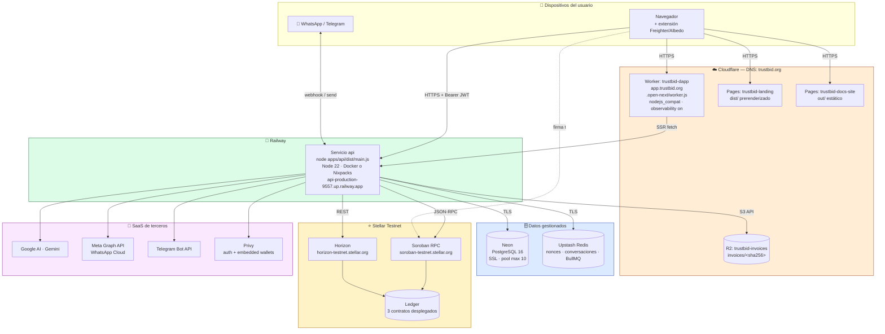
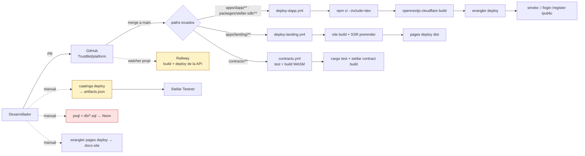
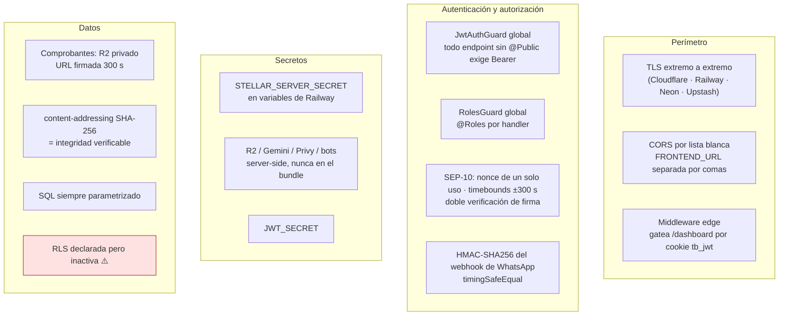

# Vista Física (Despliegue) — TrustBid

> **4+1 · Vista 4 de 5** · [← Desarrollo](./3-vista-desarrollo.md) · [Índice](./README.md) · [Siguiente: +1 Escenarios →](./5-escenarios.md)
> Responde: *¿dónde corre cada artefacto y cómo se comunican los nodos?*
> Interesado: DevOps, ingeniería de sistemas, seguridad.

---

## 1. Topología de despliegue

## 2. Inventario de nodos y artefactos

| Nodo | Artefacto | Runtime | Origen del despliegue |
|---|---|---|---|
| Cloudflare Worker `trustbid-dapp` | `.open-next/worker.js` + `.open-next/assets` | workerd + `nodejs_compat` | `deploy-dapp.yml` (push a `main`, paths `apps/dapp/**` o `packages/stellar-sdk/**`) |
| Cloudflare Pages `trustbid-landing` | `apps/landing/dist` | estático | `deploy-landing.yml` (push a `main`) |
| Cloudflare Pages `trustbid-docs-site` | `apps/docs-site/out` | estático | `wrangler pages deploy` (manual) |
| Cloudflare R2 `trustbid-invoices` | objetos `invoices/<sha256>` | almacenamiento | escritura en runtime desde la API |
| Railway `api` | `apps/api/dist/main.js` | Node 22 (Debian slim) | build propio de Railway (Dockerfile o nixpacks) |
| Neon | schema `public`, 25+ tablas | PostgreSQL 16 | SQL manual (`apps/api/db/*.sql`) |
| Upstash | keyspace Redis | Redis | provisión gestionada |
| Stellar Testnet | 3 contratos WASM | Soroban | `caatinga deploy` (manual/DevOps) |

### Detalle de los contratos en el ledger

Deploy del **2026-07-04**, registrado en `platform/caatinga.artifacts.json`:

| Contrato | Contract ID | WASM hash |
|---|---|---|
| `fund-tracker` | `CC6OJ26655KKLDZB6HXBV2IN4WWU7GMU57IX7WQSF3SKAEJRMAPQVHYS` | `e2d972627fc5070bfcc6a447ab87919f10687df82c4293203c2d1c5849a3d62d` |
| `expense-anchor` | `CABW2KK4CRLHOB4GATGIT2MDGE3HLTDTI5YZOFOQHGLONQTNU3MYYOAW` | `9507405a2d7125eeaccc16332e1c354a2d74defd88ca3f13c9fbe358195cdede` |
| `sbt-badge` | `CCBTM23SCCOEA7Y55DL4ENJNWID7OATWB7RXHAS7MD6CQHW3PMG4CDNK` | `2a91bd5ac87dd5b888e681bf152c105eac8068a579ddd2cec397f4ecfa0f8377` |

Los tres se inicializaron con `admin = ${source.address}` mediante el `postDeploy` de Caatinga,
y se validaron con lecturas de humo (`get_allocation` → `null`, `get_expense` → `null`,
`get_badges` → array).

## 3. Endpoints y dominios

| Componente | URL de producción | Notas |
|---|---|---|
| DApp | `https://app.trustbid.org` | Worker (no Pages) — la dapp es dinámica: Route Handlers, Privy, wallets |
| Landing | `trustbid.org` vía Pages `trustbid-landing` | prerender SSR + hidratación |
| Docs | Pages `trustbid-docs-site` (`trustbid-docs-site-6fp.pages.dev`) | referenciada por `GET /` de la API |
| API | `https://api-production-9557.up.railway.app` | dominio de Railway, sin dominio propio aún |
| SEP-1 | `{API}/.well-known/stellar.toml` | apunta `WEB_AUTH_ENDPOINT` a `{API}/auth` |

> 🚩 **Desalineación de dominio — impacta SEP-10, no sólo la estética.** `HOME_DOMAIN`
> define el nombre de la operación `ManageData` del challenge (`"{dominio} auth"`,
> `auth.service.ts:66`) y el `.env.example` lo trae como `trustbid.app`, mientras el dominio
> productivo es `trustbid.org` / `app.trustbid.org`. En paralelo, el TOML publica
> `ORG_URL="https://trustbid.app"` **hardcodeado** (`public.controller.ts:57`). Un cliente
> SEP-10/SEP-1 estricto que valide el `home_domain` del challenge contra el TOML **rechaza el
> login**. Hoy funciona porque ambos extremos del challenge los produce el mismo servidor.
> Es el ítem **I-8 de `platform/ISSUES.md`**, aún abierto.
>
> **Punto de fricción adicional**: la URL de la API aparece **hardcodeada como fallback** en
> tres lugares (`base-url.ts`, `RegisterTransactionDialog.tsx`, `public.controller.ts`).
> Convendría unificarla en una variable y darle un dominio propio (`api.trustbid.org`).

## 4. Configuración por entorno

### Variables obligatorias de la API

| Variable | Uso | Si falta |
|---|---|---|
| `DATABASE_URL` | pool `pg` (SSL automático si contiene `neon.tech`) | toda query falla |
| `REDIS_URL` | `AuthModule` y `HorizonWatcherModule` (`getOrThrow`) | **la API no arranca** |
| `JWT_SECRET` | firma de sesión | tokens inválidos |
| `JWT_EXPIRES_IN` | vida del JWT (por defecto `8h`) | — |
| `STELLAR_SERVER_SECRET` | firma SEP-10 **y** de toda invocación Soroban | **la API no arranca** |
| `STELLAR_NETWORK` | `testnet` \| `public` (`mainnet` aceptado en Soroban) | asume testnet |
| `STELLAR_RPC_URL` | endpoint Soroban | usa `soroban-testnet.stellar.org` |
| `FUND_TRACKER_CONTRACT_ID`, `EXPENSE_ANCHOR_CONTRACT_ID`, `SBT_BADGE_CONTRACT_ID` | contratos | cae a `caatinga.artifacts.json`; sin eso **no arranca** |
| `FRONTEND_URL` | lista de orígenes CORS separada por coma | sólo `localhost:3000` |
| `HOME_DOMAIN` | dominio del challenge SEP-10 (`"{dominio} auth"`) | `trustbid.app` |
| `API_URL` | `WEB_AUTH_ENDPOINT` del TOML | fallback hardcodeado |

### Variables opcionales (degradación controlada)

| Variable | Capacidad que habilita |
|---|---|
| `R2_ACCOUNT_ID`, `R2_ACCESS_KEY_ID`, `R2_SECRET_ACCESS_KEY`, `R2_BUCKET` | persistencia de comprobantes + URLs firmadas |
| `GOOGLE_API_KEY`, `GEMINI_MODEL` | OCR y validación IA (`gemini-2.0-flash` por defecto) |
| `WHATSAPP_TOKEN`, `WHATSAPP_PHONE_NUMBER_ID`, `WHATSAPP_APP_SECRET`, `WHATSAPP_VERIFY_TOKEN`, `WHATSAPP_GRAPH_VERSION`, `WHATSAPP_BOT_NUMBER` | canal WhatsApp + validación de firma + links `wa.me` |
| `TELEGRAM_BOT_TOKEN`, `TELEGRAM_BOT_USERNAME` | canal Telegram + links `t.me` |
| `PRIVY_APP_ID`, `PRIVY_APP_SECRET` | riel de login no-cripto |
| `STELLAR_SERVER_PUBLIC_KEY` | `SIGNING_KEY` del TOML y fallback de `caller` |

### Variables de build de la dapp

`NEXT_PUBLIC_*` se **hornean en el bundle** en tiempo de build. El workflow lo trata como
error fatal: si falta `NEXT_PUBLIC_API_URL`, `NEXT_PUBLIC_PRIVY_APP_ID`,
`NEXT_PUBLIC_STELLAR_NETWORK` o `NEXT_PUBLIC_HORIZON_URL`, el deploy **se corta antes de
compilar** — porque Next compilaría igual y el fallo aparecería recién en producción (sin
`PRIVY_APP_ID`, el login por email simplemente desaparece de la UI).

## 5. Flujo de despliegue

**Automatizado**: dapp, landing, tests de contratos, integración Soroban.
**Manual**: migraciones SQL, deploy de contratos, deploy de docs-site.
**Externo al repo**: el deploy de la API lo dispara Railway por su cuenta.

> La brecha más riesgosa es **las migraciones SQL a mano**: no hay herramienta de migración
> (Flyway/Prisma/Kysely), ni tabla de versiones de schema, ni registro de qué migración corrió
> en qué entorno. El orden correcto está implícito en los nombres de archivo
> (`init-db` → `sprint3` → … → `sprint13`).

### Doble configuración de build en Railway

Coexisten `Dockerfile.api` y `nixpacks.toml`. El Dockerfile se usa **sólo** en el servicio que
define `RAILWAY_DOCKERFILE_PATH=Dockerfile.api`; el resto cae a nixpacks. Ambos hacen lo mismo
(instalar deps → compilar bindings → compilar API → `node apps/api/dist/main.js`), pero el
Dockerfile fija Node 22 e instala `python3 make g++ pkg-config libudev-dev` para compilar
módulos nativos — `usb`, dependencia transitiva de `@trezor/transport` vía
`stellar-wallets-kit`. El mismo tropiezo aparece en el runner de `deploy-dapp.yml`.

## 6. Seguridad de la vista física

### Riesgos abiertos en esta vista

| Riesgo | Detalle | Mitigación sugerida |
|---|---|---|
| **Clave única de firma** | una sola `STELLAR_SERVER_SECRET` firma SEP-10 y todos los anclajes; su compromiso permite falsificar anclajes | separar keypair de auth y de anclaje; mover a KMS (ya previsto en `custodian_keys`) |
| **RLS inactiva** | el aislamiento depende del `WHERE` de cada service | registrar `RlsInterceptor` + `SET LOCAL` por request |
| **Webhook sin firma si falta el secret** | `verifySignature` devuelve `true` cuando `WHATSAPP_APP_SECRET` no está seteado | exigir el secret en producción |
| **Telegram sin verificación de origen** | el controller acepta cualquier POST al path | usar `secret_token` de `setWebhook` |
| **Migraciones manuales** | sin registro de versiones ni rollback | adoptar una herramienta de migración |
| **Un solo entorno de contratos** | `caatinga.config.ts` define sólo `testnet` | agregar red `public` antes de mainnet |
| **JWT en localStorage** | expuesto a XSS; además espejado a cookie no-`HttpOnly` | cookie `HttpOnly`+`Secure` emitida por la API |
| **Sin dominio propio para la API** | la URL de Railway está hardcodeada como fallback | `api.trustbid.org` vía Cloudflare |

## 7. Escalabilidad y capacidad

| Dimensión | Estado actual | Techo | Camino de crecimiento |
|---|---|---|---|
| DApp | Worker CF, multi-región | muy alto (edge) | ya escala solo |
| Landing / docs | Pages, estático | muy alto | ya escala solo |
| API | **1 proceso Node** | limitado por CPU y por `max: 10` del pool | replicar; el bus `EventEmitter2` en memoria es lo primero que hay que resolver |
| PostgreSQL | Neon con SSL | plan de Neon | read replicas para el portal público |
| Redis | Upstash | plan de Upstash | — |
| Worker BullMQ | dentro del proceso API | compite por CPU con HTTP | extraer a servicio propio |
| Anclajes Soroban | secuenciales, firmados por una keypair | **el `sequence number` de la cuenta serializa las txs** | pool de cuentas firmantes o *channel accounts* |
| Consultas a Horizon | hasta 60 por donación pendiente | rate limit de Horizon | streaming o indexador propio |

> El cuello de botella estructural más duro es el **sequence number** de la cuenta firmante:
> Stellar exige orden estricto por cuenta, así que dos anclajes concurrentes desde la misma
> keypair colisionan. El patrón estándar (channel accounts) todavía no está implementado.

## 8. Camino a mainnet

Lo que hay que resolver antes de mover fondos reales, según lo que muestra el código:

```mermaid
graph LR
    T["Testnet<br/>(hoy)"] --> G1["1· Red 'public' en caatinga.config.ts"]
    G1 --> G2["2· Re-deploy de los 3 contratos + nuevos IDs"]
    G2 --> G3["3· Validar firma Privy Tier 2 (rawSign) en sandbox"]
    G3 --> G4["4· Activar RLS real"]
    G4 --> G5["5· Rotar claves a KMS · separar keypairs"]
    G5 --> G6["6· Emisor USDC de mainnet<br/>GA5ZSEJY… (ya contemplado en el código)"]
    G6 --> G7["7· Corregir ORG_URL del stellar.toml"]
    G7 --> G8["8· Alertas sobre tx_status='failed'"]
    G8 --> M["Mainnet"]

    style T fill:#dcfce7,stroke:#166534
    style M fill:#fef3c7,stroke:#a16207
```

El código **ya distingue** mainnet de testnet en varios puntos: `isMainnetNetwork()` acepta
`public` y `mainnet`, el emisor de USDC se elige por red en `public.service.ts:413` y en
`public.controller.ts:38`, y Horizon conmuta de URL en `horizon-watcher.processor.ts`. Lo que
falta es la parte operativa, no la lógica.

> ⚠️ Bloqueante explícito en el código: `privy.service.ts` y `privy-stellar-signer.ts` llevan
> un `TODO(privy-stellar)` que pide **validar en sandbox la firma `rawSign` Tier 2 antes de
> producción**, porque esa cuenta maneja fondos de ONGs. Hoy el riel Privy sólo verifica
> identidad y lee la wallet; la firma no está ejercitada.

---

## Referencias

| Tema | Archivo |
|---|---|
| Worker de la dapp | `platform/apps/dapp/wrangler.toml` · `open-next.config.ts` |
| Pages | `platform/apps/landing/wrangler.toml` · `apps/docs-site/wrangler.toml` |
| Build de la API | `platform/Dockerfile.api` · `platform/nixpacks.toml` |
| Variables | `platform/.env.example` |
| Artefactos on-chain | `platform/caatinga.artifacts.json` |
| Workflows de deploy | `platform/.github/workflows/deploy-{dapp,landing}.yml` |
| Vista de despliegue previa | [../diagrama-despliegue.md](../diagrama-despliegue.md) |
