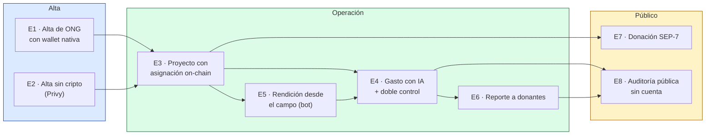

# +1 Escenarios — TrustBid

> **4+1 · Vista 5 de 5** · [← Física](./4-vista-fisica.md) · [Índice](./README.md)
> Responde: *¿cómo se validan y encajan entre sí las otras cuatro vistas?*
> Interesado: todos. Los escenarios son el pegamento del modelo 4+1.

Ocho escenarios end-to-end, todos **implementados y verificables en el código**. Cada uno
declara qué elemento de cada vista ejercita, para que sirva de prueba de coherencia
arquitectónica.

---

## Mapa de escenarios

---

## E1 · Alta de una ONG con wallet nativa

**Actor:** responsable de la ONG con Freighter o Albedo instalado.
**Valor:** entrar sin formularios de contraseña, probando control de la wallet.

| Vista | Elementos ejercitados |
|---|---|
| Lógica | `AuthService.generateChallenge` / `verifyAndIssueToken` / `findOrCreateUser`; entidades `organizations`, `users`, `user_wallets` |
| Procesos | nonce en Redis (TTL 600 s, un solo uso); bootstrap transaccional; firma en la extensión |
| Desarrollo | `apps/dapp/src/lib/auth/sep10.ts` · `lib/wallet/adapter.ts` · `apps/api/src/modules/auth/` |
| Física | Worker CF → Railway → Neon + Upstash |

**Recorrido:**

1. `/register`: el usuario completa nombre de la organización, país y rol.
2. `connectWalletWithModal()` abre el modal del Stellar Wallets Kit → devuelve `address` y
   el `productId` del wallet elegido.
3. `GET /auth/challenge?account=G…` → la API valida el StrKey, guarda un nonce de 48 bytes en
   Redis y devuelve un XDR con `sequence = 0`, una operación `manageData` cuyo `source` es el
   cliente y `timebounds` de ±300 s, firmado por el servidor.
4. La wallet firma; `POST /auth/token` verifica en orden: timebounds → formato de la
   operación → nonce (y lo borra) → firma del servidor → firma del cliente.
5. `findOrCreateUser` abre transacción e inserta `organizations` + `users` (rol `admin`) +
   `user_wallets` (`is_primary=true`), o hace rollback.
6. JWT `{sub, org, role}` → `localStorage` + cookie `tb_jwt`.

**Criterios de aceptación verificables**

- Reusar el mismo challenge dos veces → `401 expired_challenge` (el nonce se borró).
- Challenge de más de 5 minutos → `401 expired_challenge` (timebounds).
- XDR sin la firma del servidor → `400 invalid_transaction`.
- Segundo login de la misma wallet → **no** crea otra organización.

---

## E2 · Alta de una ONG sin conocimiento cripto (Privy)

**Actor:** responsable de una ONG sin wallet.
**Valor:** el mismo producto sin barrera de entrada cripto.

| Vista | Elementos ejercitados |
|---|---|
| Lógica | `PrivyService.verifyAndEnsureStellarWallet` → `bootstrapAndIssueToken` (mismo punto de convergencia que E1) |
| Procesos | verificación JWKS remota; creación server-side de la wallet (Tier 2) |
| Desarrollo | `@privy-io/react-auth` en la dapp · `@privy-io/node` en la API |
| Física | Railway → `auth.privy.io` |

**Recorrido:**

1. `PrivyEmailButton` inicia login por email/OTP en el cliente.
2. `POST /auth/privy {token}`; la API verifica el access token contra el JWKS de la app.
3. Busca un `linked_account` con `chain_type='stellar'`. Si no existe, lo **pregenera
   server-side** (`pregenerateWallets`) — la creación client-side del SDK de React sólo cubre
   EVM y Solana.
4. Converge en `bootstrapAndIssueToken(stellarPublicKey, {provider:'privy'})`: mismo
   bootstrap de organización que E1, mismo JWT.

**Criterios de aceptación**

- Sin `PRIVY_APP_ID`/`PRIVY_APP_SECRET` → `503 privy_not_configured`, y **el resto de la API
  sigue funcionando** (init lazy).
- Token inválido o vencido → `401 invalid_privy_token`.
- El usuario creado queda con `wallet_provider = 'privy'` y una wallet Stellar real.

> ⚠️ Limitación vigente: este riel **verifica identidad**, no firma. `PrivyStellarSigner`
> (firma `rawSign` Tier 2) está escrito pero marcado como pendiente de validación en sandbox.

---

## E3 · Crear un proyecto con asignación presupuestaria on-chain

**Actor:** administrador de la ONG.
**Valor:** el presupuesto queda comprometido en el ledger, no sólo en una base privada.

| Vista | Elementos ejercitados |
|---|---|
| Lógica | `ProjectsService.create` → `SorobanService.allocateFunds`; contrato `fund-tracker` |
| Procesos | anclaje dentro del request; actualización de `blockchain_status` |
| Desarrollo | `@trustbid/soroban-bindings/fund-tracker` generado por Caatinga |
| Física | Railway → Soroban RPC → ledger testnet |

**Recorrido:**

1. `POST /my/projects` con nombre, categoría, presupuesto, fechas y `blockchainEnabled`.
2. `INSERT projects` en estado `draft`.
3. Si `blockchainEnabled`, se lee `organizations.wallet_address` (sólo como referencia) y se
   invoca `fund-tracker.allocate({caller: servidor, project_id: sufijo del UUID, amount_xlm:
   monto × 1e7})`.
4. Con hash → `allocation_tx_hash` + `blockchain_status='anchored'`; sin hash →
   `blockchain_status='failed'`.
5. `GET /my/projects/:id/on-chain` lee `get_allocation` directo del contrato para contrastar
   la base contra el ledger.

**Criterios de aceptación**

- Editar el presupuesto con `blockchain_enabled=true` **re-ancla** (`update()` compara el
  monto previo).
- Si el RPC no responde, el proyecto se crea igual con `blockchain_status='failed'`.
- La lectura on-chain devuelve el monto en XLM (dividido por 1e7), no en stroops.

---

## E4 · Rendir un gasto con validación IA y doble control

**Escenario central del producto.** Detalle de secuencia en
[2-vista-procesos.md §3](./2-vista-procesos.md#3-escenario-base--rendición-y-aprobación-de-un-gasto-dashboard).

| Vista | Elementos ejercitados |
|---|---|
| Lógica | `createTransaction` + `approveTransaction`; `APPROVER_ROLES`; máquina de estados de `tx_status` |
| Procesos | R2 + Gemini en línea; anclaje fire-and-forget con reintento; evento `transaction.anchored` |
| Desarrollo | `modules/projects` · `modules/storage` · `modules/ai` · `modules/soroban` |
| Física | Railway → R2 + Google AI + Soroban RPC |

**Recorrido resumido:** contador carga factura + monto → SHA-256 → R2 (`invoices/<sha256>`) →
Gemini extrae vendor/monto/fecha/CUIT → `ai_match` si la diferencia ≤ máx(0.01, 1 %) →
`tx_status='pending'` → admin/auditor revisa con URL firmada de 5 min → aprueba →
`submitted` → anclaje en `expense-anchor` con el hash del comprobante → `confirmed` + `tx_hash`.

**Criterios de aceptación**

| Caso | Resultado esperado |
|---|---|
| El creador intenta aprobar su propio gasto | `403 self_approval` |
| Aprobar algo que no está `pending` | `400 not_pending` |
| Carga hecha por `admin`/`auditor`/`admin_regional` | nace `submitted` y se ancla al instante |
| Monto de factura ≠ monto declarado | `ai_match=false` + `ai_flags="amount_mismatch: declarado=X factura=Y"` |
| Gemini deshabilitado | la transacción se crea igual con `ai_*` en null |
| R2 deshabilitado | se crea igual, sin `storage_key`, y el anclaje usa un hash derivado de `txId:concept:amount` |
| El anclaje falla dos veces | `tx_status='failed'`, con log de error |
| Se altera el archivo en R2 | la clave (= hash) deja de coincidir → integridad detectable |

---

## E5 · Rendición desde el campo por WhatsApp o Telegram

**Actor:** voluntario sin cuenta en la plataforma, con un teléfono.
**Valor:** captura del gasto en el momento y lugar donde ocurre.

| Vista | Elementos ejercitados |
|---|---|
| Lógica | `EnrollmentService` (invitaciones `ALTA-XXXX`) · `BotFlowService` · interfaz `BotChannel` |
| Procesos | webhooks entrantes; conversación en Redis (30 min); notificación por `EventEmitter2` |
| Desarrollo | `modules/whatsapp/` sirve **ambos** canales con un solo flujo |
| Física | Meta Graph API y Telegram Bot API → Railway |

Secuencia completa en
[2-vista-procesos.md §4](./2-vista-procesos.md#4-escenario-bot--rendición-desde-el-campo).

**Recorrido:**

1. El admin crea una invitación (`POST /my/bot/invites` con `label`, `maxUses`,
   `expiresInDays` y opcionalmente `projectId`); la API devuelve `waLink` y `tgLink`.
2. El voluntario abre el link; el mensaje ya trae `ALTA-XXXX`.
3. `tryEnrollByCode` valida vigencia y cupo, crea un `users` con rol `voluntario` y un
   `bot_enrollments`, e incrementa `uses`.
4. El voluntario manda la foto: Gemini extrae los datos; si la invitación era por proyecto y
   el monto se detectó, la transacción se crea directo; si no, el bot pide `monto 250` o el
   código del proyecto.
5. La transacción nace `pending` (rol `voluntario` no es aprobador) y sigue el flujo E4.
6. Al anclarse, `BotNotificationService` le manda el hash y el link a stellar.expert por el
   mismo canal.

**Criterios de aceptación**

- Código inválido / vencido / sin cupo → tres mensajes distintos y específicos.
- Mensaje de alguien no enrolado → instrucción de pedir el link, sin filtrar información.
- El alfabeto del código excluye `0/O/1/I` para evitar errores al dictarlo.
- Reusar una invitación por-proyecto **actualiza** el `default_project_id` del voluntario.
- Con `WHATSAPP_APP_SECRET` presente, un webhook con firma inválida se rechaza.

---

## E6 · Emitir un reporte a donantes con anclaje

| Vista | Elementos ejercitados |
|---|---|
| Lógica | `ReportsService.create`; entidad `reports`; `blockchain_status` |
| Procesos | anclaje fire-and-forget vía `expense-anchor` (reusa el contrato de gastos) |
| Desarrollo | `modules/reports` |
| Física | Railway → Soroban RPC |

**Recorrido:** `POST /my/reports` valida que el proyecto sea de la organización, inserta el
reporte como `submitted` con autor y timestamp, calcula un hash determinista
`sha256(reportId:projectId:title:fundsUsed:periodStart:periodEnd)` y lo ancla en
`expense-anchor` con reintentos. `GET /my/reports/:id/on-chain` recupera la evidencia.

**Criterios de aceptación**

- El reporte responde sin esperar la cadena; `blockchain_status` pasa `pending → anchored`
  o `→ failed`.
- El hash es reproducible: recalculado con los mismos campos, coincide con lo anclado.
- Proyecto de otra organización → `400 invalid_project`.

> Observación de diseño: los reportes reutilizan `expense-anchor` en vez de tener contrato
> propio, y ocupan el mismo espacio de claves `Symbol` que los gastos. Funciona porque ambos
> IDs son UUID, pero mezcla dos conceptos en un mismo almacenamiento on-chain.

---

## E7 · Donación pública con SEP-7 y confirmación automática

| Vista | Elementos ejercitados |
|---|---|
| Lógica | `PublicService.createDonation`; `memo_id` `PAY-YYYY-NNNN` |
| Procesos | cola BullMQ `horizon-watch`: 20 s de delay, 60 intentos, 30 s de backoff, 30 min de ventana |
| Desarrollo | `modules/public` + `modules/horizon`; portal en `apps/dapp/src/app/public/` |
| Física | Upstash (cola) → Horizon → Neon |

Secuencia en
[2-vista-procesos.md §6](./2-vista-procesos.md#6-escenario-donación-pública--sep-7--vigilancia-horizon).

**Recorrido:** el donante elige proyecto y monto → la API valida que el proyecto acepte
donaciones, genera el memo y arma el link SEP-7
(`web+stellar:pay?destination=…&asset_code=USDC&asset_issuer=…&memo=PAY-…&memo_type=text`) →
si no vino con `txHash`, encola la vigilancia → el worker busca cada 30 s una transacción con
`memo_type='text'` y `memo == memoId` en las últimas 50 de la cuenta → al encontrarla marca
`confirmed` con el hash; a los 30 min sin aparecer, `expired`.

**Criterios de aceptación**

- Proyecto `archived` o `completed` → `400 validation_error`.
- El emisor de USDC cambia según `STELLAR_NETWORK` (testnet `GBBD47IF…` / mainnet `GA5ZSEJY…`).
- Si el donante firmó en el navegador (`txHash` presente), la donación nace `submitted` y no
  se encola vigilancia.
- `GET /donations/:id` expone el hash como `verificationCode`.

---

## E8 · Auditoría pública sin cuenta

**Actor:** donante, periodista, organismo de control.
**Valor:** la promesa central del producto — verificar sin pedir permiso.

| Vista | Elementos ejercitados |
|---|---|
| Lógica | `PublicService.getProject` (pipeline + trazabilidad + impacto); `BadgesService.listByOrganization`; SEP-1 |
| Procesos | SSR en el Worker con fallback a seed; lecturas on-chain por simulación (sin costo) |
| Desarrollo | `apps/dapp/src/app/public/` · `server/public/repository.ts` |
| Física | Worker CF → Railway → Neon + Soroban RPC |

**Recorrido:**

1. `/public/projects` lista proyectos no archivados con presupuesto, ejecutado y beneficiarios.
2. `/public/projects/:id` muestra el pipeline con fechas reales de transición, la tabla de
   trazabilidad (concepto, monto, `verificationCode` = tx hash, estado) y los indicadores de
   impacto (objetivo vs. real).
3. `GET /organizations/:id/badges` cruza `organization_badges` de la base con la lectura
   on-chain de `sbt-badge.get_badges`.
4. `GET /.well-known/stellar.toml` publica `SIGNING_KEY`, `WEB_AUTH_ENDPOINT` y el USDC
   aceptado (SEP-1).
5. Cualquiera puede tomar un `tx_hash`, abrirlo en stellar.expert y ver el `receipt_hash`
   anclado.

**Criterios de aceptación**

- Sin autenticación en ningún paso.
- Si la API cae, el portal público sigue respondiendo desde el seed (no muestra error).
- La comparación DB ↔ on-chain de badges permite detectar divergencias.
- La verificación de un comprobante es reproducible: descargar el archivo (URL firmada, con
  permiso) → recalcular SHA-256 → comparar con el `receipt_hash` del ledger.

---

## Matriz de cobertura: escenarios × vistas

| Escenario | Módulos API | Contratos | Servicios externos | Nodos |
|---|---|---|---|---|
| E1 Alta wallet | auth | — | Redis | Worker · Railway · Neon · Upstash |
| E2 Alta Privy | auth | — | Privy | + Privy |
| E3 Proyecto | projects, soroban | fund-tracker | — | + Soroban RPC |
| E4 Gasto | projects, storage, ai, soroban | expense-anchor | R2, Gemini | + R2 · Google AI |
| E5 Bot | whatsapp, ai, projects, soroban | expense-anchor | Meta, Telegram, Gemini | + Meta · Telegram |
| E6 Reporte | reports, soroban | expense-anchor | — | — |
| E7 Donación | public, horizon | — | Horizon | + Upstash (cola) |
| E8 Auditoría | public, badges, soroban | sbt-badge | — | — |

**Cobertura resultante:** los 8 escenarios ejercitan **11 de los 14 módulos de la API**, **los
3 contratos**, **los 6 servicios externos** y **los 8 nodos de despliegue**.

**Los 3 módulos sin escenario** son los de Configuración (`sprint14`/`sprint15`), y la razón
es que ninguno cierra hoy un recorrido de punta a punta:

| Módulo | Por qué no hay escenario |
|---|---|
| `areas` | CRUD completo y funcional, pero las áreas todavía no participan de ningún flujo de negocio más allá de imputar `transactions.area_id` |
| `pipeline-templates` | las plantillas se crean y duplican, pero no hay flujo que instancie una plantilla sobre un proyecto |
| `billing` | sin pasarela de pago, el recorrido termina en un `UPDATE`; y los límites del plan no se aplican en ningún guard (ver [README §5.4 · N-12](./README.md#54-hallazgos-nuevos-de-este-relevamiento)) |

Que un módulo no tenga escenario no es un defecto de este documento: es la señal de que la
funcionalidad está construida pero **todavía no conectada a un caso de uso completo**.

## Escenarios diseñados pero no implementados

Se listan para que quede explícito el borde entre lo construido y lo previsto:

| Escenario | Estado | Documento de diseño |
|---|---|---|
| Desembolso masivo vía SDP | ❌ sin código | [flujos-integraciones-stellar.md §D](../flujos-integraciones-stellar.md) |
| KYC/KYB con SEP-9 / SEP-12 | ❌ sin código (badge `kyb_verified` se emite a mano) | [§C](../flujos-integraciones-stellar.md) |
| Prueba ZK de compliance presupuestario | ❌ sólo tabla `zk_proofs` | [§G](../flujos-integraciones-stellar.md) |
| Wallet custodial con AWS KMS | ❌ sólo tabla `custodian_keys` | [backend-spec.md](../backend-spec.md) |
| Off-ramp a moneda local (SEP-6/24) | ❌ sin código | [§D](../flujos-integraciones-stellar.md) |
| Exportación de reportes por template de donante | ❌ tabla `report_templates` sin flujo | [diagrama-secuencia.md Flujo 4](../diagrama-secuencia.md) |

---

## Referencias

| Escenario | Punto de entrada en el código |
|---|---|
| E1 | `apps/api/src/modules/auth/auth.service.ts:72` |
| E2 | `apps/api/src/modules/auth/privy.service.ts:55` |
| E3 | `apps/api/src/modules/projects/projects.service.ts:303` |
| E4 | `apps/api/src/modules/projects/projects.service.ts:460` y `:667` |
| E5 | `apps/api/src/modules/whatsapp/bot-flow.service.ts:44` |
| E6 | `apps/api/src/modules/reports/reports.service.ts:73` |
| E7 | `apps/api/src/modules/public/public.service.ts:342` |
| E8 | `apps/api/src/modules/public/public.service.ts:156` · `modules/badges/badges.service.ts:20` |
