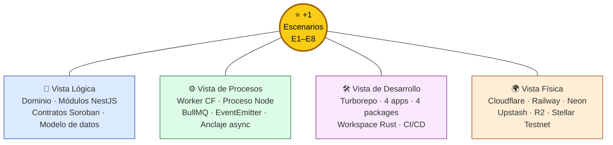

# TrustBid — Arquitectura 4+1 (estado actual)

> **Fecha del relevamiento:** 2026-08-03 · actualizado contra `origin/main` (`e5f266f`)
> **Fuente:** código de `platform/` (monorepo Turborepo) + `platform/contracts/` (Rust/Soroban).
> Todo lo que se afirma acá está verificado contra el código, no contra el diseño previo.

El modelo **4+1** (Kruchten, 1995) describe la arquitectura desde cinco vistas concurrentes.
Cada una responde una pregunta distinta y se dirige a un interesado distinto:

| Vista | Pregunta que responde | Interesado | Documento |
|---|---|---|---|
| **Lógica** | ¿Qué hace el sistema? ¿Cuál es el dominio? | Analista / usuario final | [1-vista-logica.md](./1-vista-logica.md) |
| **Procesos** | ¿Cómo se comporta en ejecución? ¿Qué es concurrente? | Integrador / performance | [2-vista-procesos.md](./2-vista-procesos.md) |
| **Desarrollo** | ¿Cómo está organizado el código? | Desarrollador / PM técnico | [3-vista-desarrollo.md](./3-vista-desarrollo.md) |
| **Física** | ¿Dónde corre cada cosa? | Ingeniero de sistemas / DevOps | [4-vista-fisica.md](./4-vista-fisica.md) |
| **+1 Escenarios** | ¿Cómo se validan las otras cuatro? | Todos | [5-escenarios.md](./5-escenarios.md) |

---

## 1. Qué es TrustBid, en una frase

Una capa de **transparencia y trazabilidad de fondos para ONGs**: cada gasto rendido se
valida con IA, se guarda con su comprobante *content-addressed* en R2, requiere **doble
control humano** y recién entonces se **ancla on-chain en Stellar/Soroban** — quedando
verificable públicamente sin necesidad de cuenta.

## 2. Alcance real implementado

Inventario verificado contra el código (`platform/apps/api/src`, `platform/apps/dapp/src`,
`platform/contracts/contracts`):

| Capacidad | Estado | Dónde vive |
|---|---|---|
| Login wallet nativa (SEP-10 challenge/response + JWT) | ✅ Implementado | `apps/api/src/modules/auth/auth.service.ts` |
| Login no-cripto (Privy, wallet Stellar embebida) | ✅ Implementado (firma Tier 2 sin validar en prod) | `apps/api/src/modules/auth/privy.service.ts` |
| Multi-tenant por `organization_id` | ✅ Implementado a nivel query (no vía RLS activa — ver nota §4) | todos los services |
| CRUD de proyectos + asignación presupuestaria on-chain | ✅ Implementado | `modules/projects` + `fund-tracker` |
| Registro de gastos con comprobante | ✅ Implementado | `modules/projects/projects.service.ts` |
| OCR + extracción estructurada de facturas (Gemini) | ✅ Implementado | `modules/ai/gemini.service.ts` |
| Validación IA monto declarado vs. monto de factura | ✅ Implementado (tolerancia 1 %) | `projects.service.ts:489-512` |
| Doble control (aprobador ≠ creador) | ✅ Implementado | `projects.service.ts:667-718` |
| Anclaje de gasto on-chain con reintentos | ✅ Implementado | `modules/soroban/soroban.service.ts` |
| Almacenamiento inmutable de comprobantes (R2, SHA-256) | ✅ Implementado | `modules/storage/storage.service.ts` |
| Reportes + anclaje on-chain del reporte | ✅ Implementado | `modules/reports/reports.service.ts` |
| SBT de reputación (mint/revoke/read) | ✅ Implementado | `modules/badges` + `sbt-badge` |
| Portal público (proyectos, trazabilidad, impacto) | ✅ Implementado | `modules/public` + `apps/dapp/src/app/public` |
| Donación con link SEP-7 + vigilancia Horizon | ✅ Implementado | `public.service.ts` + `modules/horizon` |
| `/.well-known/stellar.toml` (SEP-1) | ✅ Implementado | `public.controller.ts:26-66` |
| Bot de rendición por WhatsApp Cloud API | ✅ Implementado | `modules/whatsapp` |
| Bot de rendición por Telegram Bot API | ✅ Implementado | `modules/whatsapp/telegram.service.ts` |
| Invitaciones de voluntario por código `ALTA-XXXX` | ✅ Implementado | `modules/whatsapp/enrollment.service.ts` |
| Notificación del hash on-chain al voluntario | ✅ Implementado (vía EventEmitter) | `bot-notification.service.ts` |
| Perfil extendido de organización (ODS, poblaciones, áreas) | ✅ Implementado | `modules/organizations` |
| Áreas presupuestarias de la organización | ✅ Implementado | `modules/areas` (sprint14) |
| Plantillas de pipeline reutilizables | ✅ Implementado | `modules/pipeline-templates` (sprint14/15) |
| Preferencias de notificación por organización | ✅ Implementado (persistencia; sin envío) | `organizations.controller.ts` · `notification_preferences` |
| Logo de organización y avatar de usuario | ✅ Implementado | `storage.service.putProfileImage` → `avatars/{org,user}/<id>` |
| Invitaciones de usuario por email | ⚠️ Parcial — se crean y revocan, **no se envían ni se pueden aceptar** | `modules/organizations` · `user_invites` |
| Planes y suscripción (billing) | ⚠️ Parcial — **sin pasarela de pago**: cambiar de plan es un `UPDATE` | `modules/billing` (sprint15) |
| i18n es/en en dapp y landing | ✅ Implementado | `apps/dapp/src/lib/i18n` |
| RLS de PostgreSQL **activa en runtime** | ⚠️ Schema sí, aplicación no (ver §4) | `apps/api/db/init-db.sql` |
| Desembolsos / SDP (Stellar Disbursement Platform) | ❌ Diseñado, no implementado | sólo en `backend-spec.md` |
| Pruebas ZK de compliance | ❌ Diseñado (schema `zk_proofs`), sin código | `db/sprint4-sbt-zk.sql` |
| Wallets custodiales con AWS KMS | ❌ Diseñado (tabla `custodian_keys`), sin código | `db/init-db.sql:317` |
| Off-ramp / anchors SEP-6/SEP-24 | ❌ No implementado | — |

## 3. Contratos desplegados (Stellar Testnet)

Fuente: `platform/caatinga.artifacts.json` (deploy del 2026-07-04).

| Contrato | Contract ID | WASM hash (prefijo) |
|---|---|---|
| `fund-tracker` | `CC6OJ26655KKLDZB6HXBV2IN4WWU7GMU57IX7WQSF3SKAEJRMAPQVHYS` | `e2d97262…` |
| `expense-anchor` | `CABW2KK4CRLHOB4GATGIT2MDGE3HLTDTI5YZOFOQHGLONQTNU3MYYOAW` | `9507405a…` |
| `sbt-badge` | `CCBTM23SCCOEA7Y55DL4ENJNWID7OATWB7RXHAS7MD6CQHW3PMG4CDNK` | `2a91bd5a…` |

## 4. Hallazgos de arquitectura que conviene tener presentes

Estos puntos surgen del relevamiento y afectan decisiones de diseño; se detallan en las
vistas correspondientes.

1. **La RLS está declarada pero no activa.** `init-db.sql` habilita `ROW LEVEL SECURITY` y
   define políticas contra `current_setting('app.current_organization_id')`, pero ningún
   punto del código ejecuta `SET LOCAL app.current_organization_id`, y `RlsInterceptor`
   (`common/interceptors/rls.interceptor.ts`) no está registrado en ningún módulo. **El
   aislamiento multi-tenant real hoy lo garantiza el `WHERE organization_id = $1` explícito
   en cada query.** Detalle en [1-vista-logica.md §6](./1-vista-logica.md#6-modelo-de-datos-y-multi-tenancy).
2. **El riel Privy verifica identidad pero su firma nunca se ejercitó.** Stellar es soporte
   *Tier 2* en Privy: no hay SDK de alto nivel, la firma se hace con `rawSign` manual sobre el
   hash de la transacción. `PrivyStellarSigner` está escrito pero **ningún flujo lo invoca**
   — hoy `POST /auth/privy` sólo valida el access token y lee (o pregenera server-side) la
   wallet embebida. El propio código lleva un `TODO(privy-stellar)` pidiendo validarlo en
   sandbox *antes de producción, porque esa cuenta maneja fondos de ONGs*. **Es el único
   hallazgo que el código marca explícitamente como bloqueante de mainnet.** Ver
   [2-vista-procesos.md §7](./2-vista-procesos.md#7-autenticación--dos-rieles-un-punto-de-convergencia)
   y [4-vista-fisica.md §8](./4-vista-fisica.md#8-camino-a-mainnet).
3. **El anclaje on-chain es mediado por TrustBid, no por la ONG.** El `caller` de todas las
   invocaciones Soroban es la keypair del servidor (`STELLAR_SERVER_SECRET`), porque las
   organizaciones usan wallets no custodiales y el backend no puede firmar por ellas. La
   atribución a la ONG se mantiene fuera de cadena, por `project_id`. Ver
   [2-vista-procesos.md §5](./2-vista-procesos.md#5-anclaje-on-chain-fire-and-forget).
4. **Todos los servicios externos degradan con gracia.** R2, Gemini, WhatsApp, Telegram y
   Privy chequean sus credenciales en el constructor y exponen `enabled`; sin credenciales el
   sistema arranca igual y esa capacidad queda inerte. Es una decisión deliberada y consistente.
5. **El anclaje es *fire-and-forget*.** Ni el gasto ni el reporte esperan la confirmación
   Soroban para responder HTTP; el estado se reconcilia después en la columna `tx_status` /
   `blockchain_status`. Esto acota la latencia de la API pero introduce estados intermedios visibles.
6. **La dapp tiene dos caminos de datos hacia la API.** Los Server Components leen por
   `src/server/public/repository.ts` (con *seed* de fallback si el backend cae) y los
   componentes cliente por los Route Handlers `/api/public/*`, que actúan de proxy.

## 5. Reconciliación con los backlogs existentes

`platform/ISSUES.md` (2026-07-09), `ISSUES.md` de la raíz (2026-06-30) y `PROFILE-PENDING.md`
listan trabajo pendiente. Se verificó cada ítem **contra el código actual** — varios están
cerrados, otros siguen abiertos, y **dos figuran como cerrados pero el código dice lo
contrario**.

### 5.1 Cerrados y verificados ✅

| ID | Ítem | Evidencia en el código |
|---|---|---|
| I-11 | Dos módulos de organización en paralelo (`/my/org` + `/my/organization`) | consolidado: existe sólo `OrganizationsModule` con `@Controller('my/org')` y sub-rutas `/profile`, `/lookups` |
| I-6 | Build de la API roto en Railway (`usb` sin Python) | resuelto con `Dockerfile.api` (Node 22 + `python3 make g++ pkg-config libudev-dev`) y `nixpacks.toml` |
| I-9 | La doc decía pnpm siendo npm | corregido en `CLAUDE.md` en este relevamiento |
| P-06 | El rol elegido en el registro no se guardaba | `findOrCreateUser` usa `registration.role` (`auth.service.ts:361`) |
| I-1, I-4 | CORS y variables Soroban | el código soporta lista CORS por coma y resuelve contract IDs desde artefactos |

### 5.2 ⚠️ Marcados como cerrados, pero revertidos o neutralizados en el código

| ID | Lo que dice el backlog | Lo que hace el código hoy |
|---|---|---|
| **I-15** | *"`allocateFunds` firmaba como servidor, no como org → **cerrado**: `projects.create()` lee `org.wallet_address` y lo pasa como `caller`"* | `ProjectsService` **sí** lee y pasa `callerPublicKey`, pero `SorobanService` lo **descarta** (`void callerPublicKey`, `soroban.service.ts:112` y `:146`) y firma con la keypair del servidor. **El efecto del fix se perdió**: on-chain el `organization` de toda asignación es el servidor. Peor: `projects.service.ts:352` **loguea `caller=<wallet de la org>`**, que no es el caller real → el log induce a error en auditoría |
| **I-8** | *"`HOME_DOMAIN=trustbid.app` ≠ dominio real"* — listado como P2 | sigue vigente y con doble impacto: `HOME_DOMAIN` define el nombre de la operación `ManageData` del challenge SEP-10 (`"{dominio} auth"`, `auth.service.ts:66`) **y** el `stellar.toml` publica `ORG_URL="https://trustbid.app"` hardcodeado (`public.controller.ts:57`). Un cliente SEP-10/SEP-1 estricto que valide `home_domain` contra el TOML **rechaza el login** |

### 5.3 Abiertos y confirmados ❌

| ID | Ítem | Verificación |
|---|---|---|
| P-01 / P-02 | Migraciones `sprint5` y `sprint6` marcadas **BLOQUEANTES** en Neon | no hay tabla de versiones de schema ni registro de qué corrió — imposible verificar desde el repo (ver [4-vista-fisica §5](./4-vista-fisica.md#5-flujo-de-despliegue)) |
| P-04 | `GET /ngo` no expone el perfil extendido (ODS, áreas, poblaciones, redes) | `getNgo()` devuelve sólo `name`, `tagline`, `mission`, `totals`, `fundUsage` |
| P-03 / P-07 / P-08 / P-10 | Perfil de ONG en `/public`, filtros por ODS, tab de organización en settings, preview de registro | sin implementar en `apps/dapp/src` |
| P-05 | Onboarding post-registro en `/dashboard/onboarding` | la ruta no existe; sólo hay `OnboardingNameModal` |
| P-09 | `der.md` y `diagrama-clases.md` sin las 6 tablas y 17 columnas del Sprint 6 | confirmado — mitigado parcialmente en [1-vista-logica §6](./1-vista-logica.md#6-modelo-de-datos-y-multi-tenancy) |
| I-3 | Proyecto Pages `trustbid-dapp` huérfano | limpieza operativa, no verificable desde el repo |
| I-5 | Divergencia `develop` ↔ `main` (pricing sólo en main) | requiere inspección de git, fuera del alcance de este relevamiento |

### 5.4 Hallazgos nuevos de este relevamiento

No figuran en ningún backlog previo:

| # | Hallazgo | Dónde |
|---|---|---|
| N-1 | **RLS declarada pero inactiva** — `RlsInterceptor` sin registrar, `SET LOCAL` nunca ejecutado | [1-vista-logica §6.3](./1-vista-logica.md#63-multi-tenancy-lo-declarado-vs-lo-aplicado) |
| N-2 | **La firma de Privy (Tier 2) nunca se ejercitó** — `PrivyStellarSigner` escrito y no invocado | [2-vista-procesos §7](./2-vista-procesos.md#7-autenticación--dos-rieles-un-punto-de-convergencia) |
| N-3 | **Trampa de rol en el registro**: el `RegistrationDto` permite elegir `responsable` o `donante` al crear la organización, y ese rol se persiste. Quien se registre así **queda sin permisos de `admin` en su propia ONG** (no puede editar la org, emitir invitaciones ni badges) y no hay flujo para corregirlo. Además el enum del DTO (3 valores) quedó desfasado del enum de Postgres (6 valores) | `auth/dto/token-request.dto.ts` · `auth.service.ts:361` |
| N-4 | **El `memo_id` se genera con `COUNT(*)` sin lock** en dos lugares distintos → carrera bajo concurrencia | [2-vista-procesos §9](./2-vista-procesos.md#9-idempotencia-y-consistencia) |
| N-5 | **Colisión potencial de `Symbol` on-chain**: la clave es el sufijo de 12 hex del UUID (48 bits), sin detección de colisión | [1-vista-logica §4](./1-vista-logica.md#codificación-de-identificadores) |
| N-6 | **Webhook de WhatsApp sin verificar si falta el secret** (`verifySignature` → `true`) y **Telegram sin verificación de origen** | [4-vista-fisica §6](./4-vista-fisica.md#6-seguridad-de-la-vista-física) |
| N-7 | **Sin alertas sobre `tx_status='failed'`** — un anclaje que agota reintentos queda huérfano sin que nadie se entere | [2-vista-procesos §10](./2-vista-procesos.md#10-observabilidad) |
| N-8 | **El `sequence number` de la única keypair firmante serializa todos los anclajes** — cuello de botella estructural sin *channel accounts* | [4-vista-fisica §7](./4-vista-fisica.md#7-escalabilidad-y-capacidad) |
| N-9 | **Fallback de pubkey hardcodeada** `GAOJ53SV…` en 4 puntos del código | `projects.service.ts`, `reports.service.ts` |
| N-10 | **El seed del portal público puede enmascarar una caída de la API** sin señal visible | [3-vista-desarrollo §4](./3-vista-desarrollo.md#los-dos-caminos-de-datos) |
| N-11 | **Las invitaciones de usuario no llegan a destino ni se pueden canjear.** `POST /my/org/invites` genera un token y una fila en `user_invites`, pero **no hay SMTP** (el propio código lo dice: *"Todavía no hay SMTP conectado: el alta se comparte pasando el enlace"*) **ni endpoint de aceptación** — no existe ninguna ruta que consuma el token, así que `status='accepted'` es inalcanzable | `organizations.service.ts:245` |
| N-12 | **Billing sin pasarela de pago.** `POST /my/billing/change-plan` es un `UPDATE` sobre `organization_subscriptions`; no hay Stripe/MercadoPago, ni webhook, ni cobro. `subscription_payments` sólo se puede poblar a mano. Además **los límites del plan (`max_projects`, `max_users`) no se aplican** en ningún guard | `modules/billing/billing.service.ts` |
| N-13 | **Las preferencias de notificación se guardan pero no se usan.** `notification_preferences` se persiste vía `PUT /my/org/settings/notifications`; ningún emisor las consulta (el bot notifica siempre, y no hay otro canal) | `db/sprint14-…sql` |

## 6. Relación con la documentación previa

Estos cinco documentos **no reemplazan** los artefactos UML existentes: los reorganizan bajo
el marco 4+1 y los actualizan al estado real del código.

| Documento previo | Relación con 4+1 |
|---|---|
| [casos-de-uso.md](../casos-de-uso.md) | Insumo de la vista **+1 Escenarios** |
| [der.md](../der.md) | Detalle de la vista **Lógica** (modelo de datos) |
| [diagrama-clases.md](../diagrama-clases.md) | Detalle de la vista **Lógica** (dominio OOP) |
| [diagrama-secuencia.md](../diagrama-secuencia.md) | Detalle de la vista **Procesos** |
| [flujos-integraciones-stellar.md](../flujos-integraciones-stellar.md) | Detalle de **Procesos** (flujos A–I) |
| [diagrama-componentes.md](../diagrama-componentes.md) | Detalle de **Desarrollo** (C4 nivel 2–3) |
| [diagrama-despliegue.md](../diagrama-despliegue.md) | Detalle de la vista **Física** |
| [backend-spec.md](../backend-spec.md) | Especificación *de diseño*; contiene módulos aún no implementados |
| [informe-pruebas-contratos.md](../informe-pruebas-contratos.md) | Evidencia de la vista **Lógica** (contratos) |

> ⚠️ `backend-spec.md` describe módulos (`disbursements`, `blockchain/zk`) que no existen en el
> código. Al leerlo, tratarlo como *roadmap*, no como estado.
