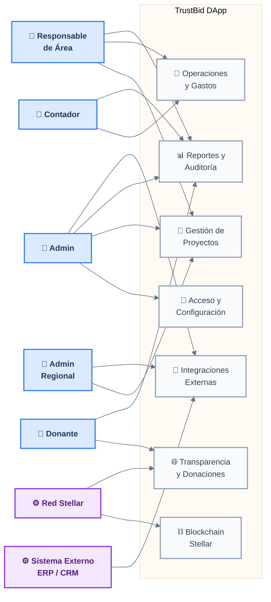

# TrustBid — Diagramas de Casos de Uso

> Generados desde los insights de discovery (4 entrevistados) + stack técnico Stellar.

---

## Overview — Actores y Módulos

---

## Detalle — Todos los Casos de Uso

```mermaid
%%{init: {'theme': 'base', 'themeVariables': {'primaryColor': '#dbeafe', 'primaryTextColor': '#1e3a5f', 'primaryBorderColor': '#3b82f6', 'lineColor': '#64748b', 'fontSize': '13px'}}}%%
graph LR
    classDef actor fill:#dbeafe,stroke:#3b82f6,stroke-width:2px,color:#1e3a5f,font-weight:bold
    classDef sysactor fill:#f3e8ff,stroke:#9333ea,stroke-width:2px,color:#581c87,font-weight:bold
    classDef uc fill:#fffbeb,stroke:#f59e0b,stroke-width:1px,color:#1c1917

    A1["👤 Donante"]:::actor
    A2["👤 Admin"]:::actor
    A3["👤 Responsable\nde Área"]:::actor
    A4["👤 Contador"]:::actor
    A5["👤 Admin Regional"]:::actor
    A6["⚙️ Red Stellar"]:::sysactor
    A7["⚙️ Sistema Externo\nERP/CRM"]:::sysactor

    subgraph SYS ["TrustBid DApp"]
        direction TB

        subgraph CONF ["🔐 Acceso y Configuración"]
            uc1("Registrar organización"):::uc
            uc2("Gestionar usuarios y roles"):::uc
            uc3("Conectar wallet Freighter/Albedo"):::uc
            uc4("Configurar jerarquía de organización"):::uc
        end

        subgraph PROJ ["📁 Gestión de Proyectos"]
            uc5("Crear y configurar proyecto"):::uc
            uc6("Asignar fuentes de financiamiento"):::uc
            uc7("Asignar presupuesto por área"):::uc
            uc8("Configurar pipeline de estados"):::uc
            uc9("Ver dashboard integrado"):::uc
            uc10("Supervisar presupuesto regional"):::uc
            uc11("Aprobar distribución de fondos"):::uc
        end

        subgraph OPS ["💸 Operaciones y Gastos"]
            uc12("Ver presupuesto asignado"):::uc
            uc13("Registrar gasto/transacción"):::uc
            uc14("Distribuir gasto entre proyectos"):::uc
            uc15("Cargar factura por OCR"):::uc
            uc16("Adjuntar evidencia configurable"):::uc
            uc17("Registrar indicadores de impacto"):::uc
            uc18("Registrar beneficiarios reales"):::uc
        end

        subgraph REP ["📊 Reportes y Auditoría"]
            uc19("Crear reporte de avance de hito"):::uc
            uc20("Gestionar estado de reporte"):::uc
            uc21("Configurar template de reporte"):::uc
            uc22("Revisar transacciones del período"):::uc
            uc23("Conciliar comprobante con movimiento"):::uc
            uc24("Validar extracción OCR"):::uc
            uc25("Auditar comprobantes"):::uc
            uc26("Importar movimientos CSV/extracto"):::uc
            uc27("Generar reporte financiero"):::uc
            uc28("Exportar reporte por destinatario"):::uc
        end

        subgraph TRANS ["🌐 Transparencia y Donaciones"]
            uc29("Ver proyectos activos"):::uc
            uc30("Realizar donación Stellar"):::uc
            uc31("Ver trazabilidad de fondos"):::uc
            uc32("Ver pipeline de estados"):::uc
        end

        subgraph CHAIN ["⛓️ Blockchain Stellar"]
            uc33("Confirmar transacción on-chain"):::uc
            uc34("Indexar eventos del ledger"):::uc
            uc35("Ejecutar contrato Soroban"):::uc
        end

        subgraph INTEG ["🔗 Integraciones Externas"]
            uc36("Integrar con sistema externo vía API"):::uc
            uc37("Recibir export vía API"):::uc
        end
    end

    A1 --> uc29
    A1 --> uc30
    A1 --> uc31
    A1 --> uc32
    A1 --> uc28

    A2 --> uc1
    A2 --> uc2
    A2 --> uc3
    A2 --> uc4
    A2 --> uc5
    A2 --> uc6
    A2 --> uc7
    A2 --> uc8
    A2 --> uc9
    A2 --> uc20
    A2 --> uc21
    A2 --> uc36

    A3 --> uc12
    A3 --> uc13
    A3 --> uc14
    A3 --> uc15
    A3 --> uc16
    A3 --> uc17
    A3 --> uc18
    A3 --> uc19

    A4 --> uc22
    A4 --> uc23
    A4 --> uc24
    A4 --> uc25
    A4 --> uc26
    A4 --> uc27
    A4 --> uc28

    A5 --> uc9
    A5 --> uc10
    A5 --> uc11
    A5 --> uc4

    A6 --> uc33
    A6 --> uc34
    A6 --> uc35
    A6 --> uc30

    A7 --> uc37
    A7 --> uc36
```

---

## Actores

| Actor | Tipo | Descripción |
|---|---|---|
| Donante | Primario | Realiza donaciones, rastrea uso de fondos en blockchain |
| Admin | Primario | Administra la ONG, proyectos, usuarios y configuración |
| Responsable de Área | Primario | Gestiona gastos, evidencias e indicadores de su área |
| Contador | Primario | Audita transacciones, concilia comprobantes, genera reportes |
| Admin Regional | Primario | Supervisa múltiples países/oficinas (orgs federadas tipo TECHO) |
| Red Stellar | Secundario (sistema) | Confirma transacciones, indexa ledger, ejecuta contratos Soroban |
| Sistema Externo ERP/CRM | Secundario (sistema) | NetSuite, Salesforce u otras herramientas del donante |

---

## Casos de uso por módulo

### 🔐 Acceso y Configuración (4)
| ID | Caso de uso | Actor principal |
|---|---|---|
| UC01 | Registrar organización | Admin |
| UC02 | Gestionar usuarios y roles | Admin |
| UC03 | Conectar wallet Freighter/Albedo | Admin |
| UC04 | Configurar jerarquía de organización | Admin, Admin Regional |

### 📁 Gestión de Proyectos (7)
| ID | Caso de uso | Actor principal |
|---|---|---|
| UC05 | Crear y configurar proyecto | Admin |
| UC06 | Asignar fuentes de financiamiento | Admin |
| UC07 | Asignar presupuesto por área | Admin |
| UC08 | Configurar pipeline de estados | Admin |
| UC09 | Ver dashboard integrado | Admin, Admin Regional |
| UC10 | Supervisar presupuesto regional | Admin Regional |
| UC11 | Aprobar distribución de fondos | Admin Regional |

### 💸 Operaciones y Gastos (7)
| ID | Caso de uso | Actor principal |
|---|---|---|
| UC12 | Ver presupuesto asignado | Responsable de Área |
| UC13 | Registrar gasto/transacción | Responsable de Área |
| UC14 | Distribuir gasto entre proyectos | Responsable de Área |
| UC15 | Cargar factura por OCR | Responsable de Área |
| UC16 | Adjuntar evidencia configurable | Responsable de Área |
| UC17 | Registrar indicadores de impacto | Responsable de Área |
| UC18 | Registrar beneficiarios reales | Responsable de Área |

### 📊 Reportes y Auditoría (10)
| ID | Caso de uso | Actor principal |
|---|---|---|
| UC19 | Crear reporte de avance de hito | Responsable de Área |
| UC20 | Gestionar estado de reporte | Admin |
| UC21 | Configurar template de reporte | Admin |
| UC22 | Revisar transacciones del período | Contador |
| UC23 | Conciliar comprobante con movimiento | Contador |
| UC24 | Validar extracción OCR | Contador |
| UC25 | Auditar comprobantes | Contador |
| UC26 | Importar movimientos CSV/extracto | Contador |
| UC27 | Generar reporte financiero | Contador |
| UC28 | Exportar reporte por destinatario | Contador, Donante |

### 🌐 Transparencia y Donaciones (4)
| ID | Caso de uso | Actor principal |
|---|---|---|
| UC29 | Ver proyectos activos | Donante |
| UC30 | Realizar donación Stellar | Donante, Red Stellar |
| UC31 | Ver trazabilidad de fondos | Donante |
| UC32 | Ver pipeline de estados | Donante |

### ⛓️ Blockchain Stellar (3)
| ID | Caso de uso | Actor principal |
|---|---|---|
| UC33 | Confirmar transacción on-chain | Red Stellar |
| UC34 | Indexar eventos del ledger | Red Stellar |
| UC35 | Ejecutar contrato Soroban | Red Stellar |

### 🔗 Integraciones Externas (2)
| ID | Caso de uso | Actor principal |
|---|---|---|
| UC36 | Integrar con sistema externo vía API | Admin, Sistema Externo |
| UC37 | Recibir export vía API | Sistema Externo |

---

> **Total:** 7 actores · 37 casos de uso · 40 relaciones
>
> **Fuentes:** Insights de Felipe Tamayo (Fundación Latir), Laura Lucía (ACAPS),
> Sergio Guzmán (Wills Wilde), Ramiro Pérez (TECHO) + stack Stellar/Soroban.
