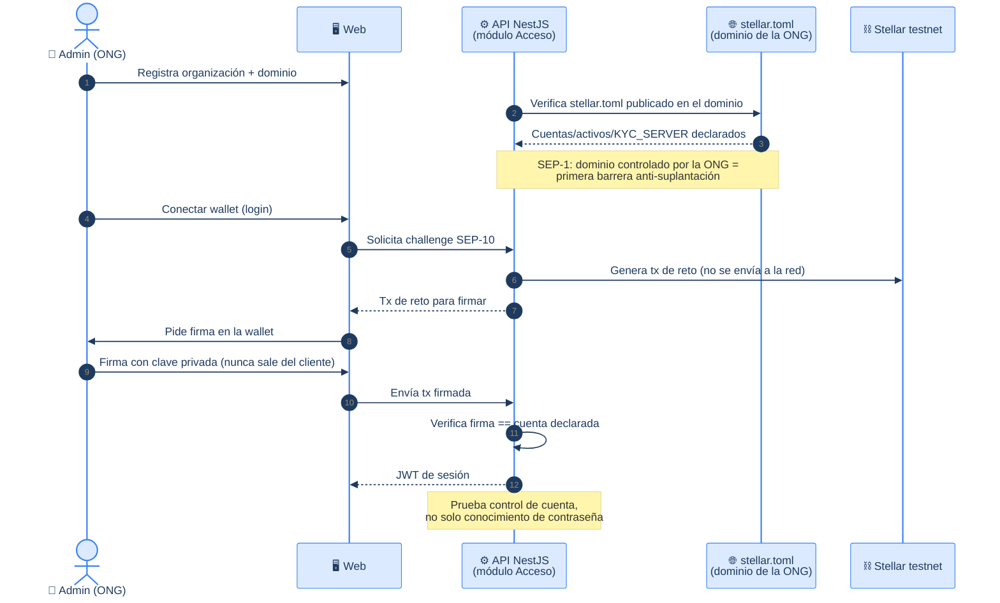
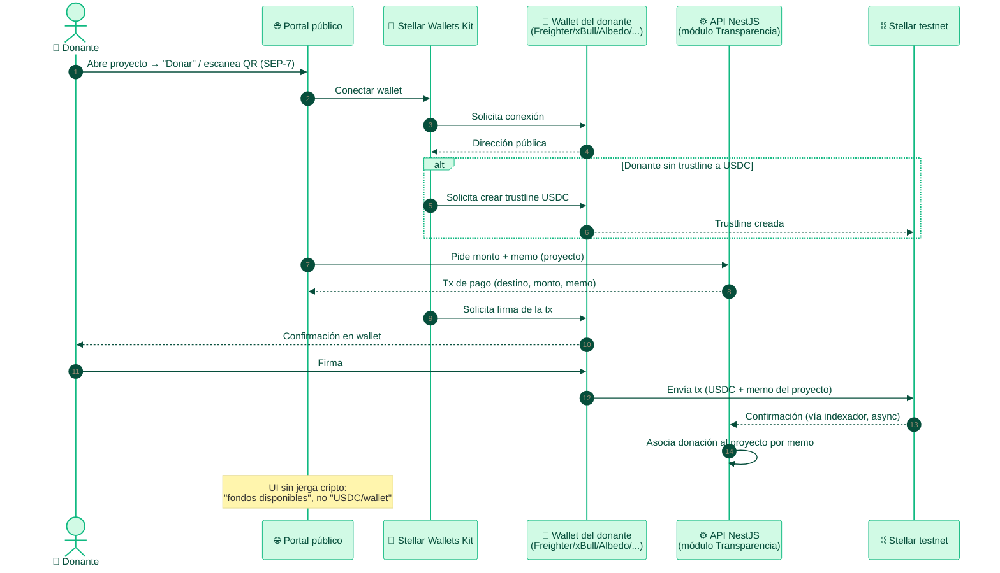
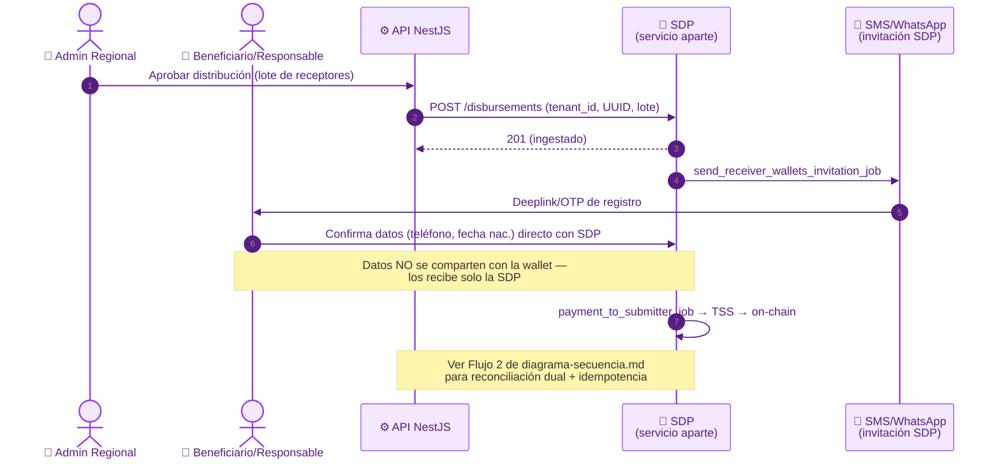
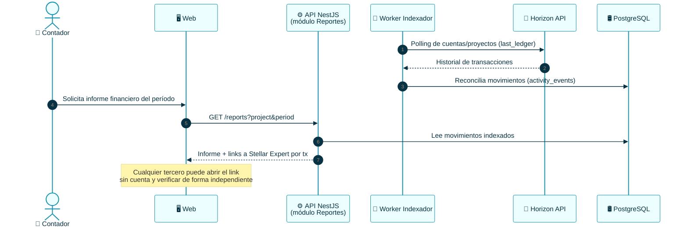

# TrustBid — Checklist y Flujos de Integraciones Stellar

> Operacionaliza [`integraciones-stellar.md`](../integraciones-stellar.md) (el mapa
> técnico de SEPs/herramientas) en **checklist por fase** + **flujos de secuencia**
> listos para implementar. **Fuente de verdad del mapeo:** ese documento — si algo
> aquí lo contradice, gana `integraciones-stellar.md`.
>
> Coherente con [diagrama-secuencia.md](./diagrama-secuencia.md) (mismas
> convenciones de actores/notación) y [casos-de-uso.md](./casos-de-uso.md) (UCxx).

---

## 🤖 Contexto para agentes / IA

- Este documento es **checklist de implementación**, no un artefacto canónico de
  modelo de datos. Si un flujo de aquí requiere una tabla/columna que no existe en
  [der.md](./der.md) o [diagrama-clases.md](./diagrama-clases.md), **márcalo como
  pendiente de schema**, no asumas que ya existe (mismo criterio aplicado en
  `diagrama-secuencia.md` con el flujo de desembolso).
- **Testnet primero, siempre.** Ningún ítem de este checklist se marca `done` con
  mainnet o con claves que no sean de testnet.
- **Blockchain invisible:** ningún ítem de UI debe filtrar terminología cripto al
  usuario final (ver CLAUDE.md sección 1).
- Sigue el **roadmap por fases** de `integraciones-stellar.md` sección 8 — no
  adelantar Fase 2/3 si Fase 1 no está cerrada (regla de "red de seguridad primero"
  de CLAUDE.md sección 4).

---

## Checklist por fase

### Fase 1 — Base de confianza y donar

| # | Ítem | Pieza | Módulo (UC) | Estado |
|---|---|---|---|---|
| 1.1 | Publicar `stellar.toml` en el dominio de cada ONG verificada | SEP-1 | M1 (UC01) | ⬜ |
| 1.2 | Declarar en el `stellar.toml` las cuentas/activos y la URL del `KYC_SERVER` | SEP-1 | M1 | ⬜ |
| 1.3 | Implementar challenge/response de SEP-10 (Web Auth) en la API | SEP-10 | M1 (UC03) | ⬜ |
| 1.4 | Emitir JWT de sesión tras firma válida; expirar y refrescar | SEP-10 | M1 | ⬜ |
| 1.5 | (Si la cuenta es smart wallet) variante SEP-45 para cuentas-contrato Soroban | SEP-45 | M1 | ⬜ |
| 1.6 | Integrar Stellar Wallets Kit en el frontend (Freighter, xBull, Albedo, Rabet, WalletConnect) | SAK | M5 (UC30) | ⬜ |
| 1.7 | Botón "Donar" → conectar wallet → firmar transferencia USDC | SAK | M5 (UC30) | ⬜ |
| 1.8 | Generar trustline a USDC desde la wallet del donante (flujo guiado) | USDC | M5 | ⬜ |
| 1.9 | Generar link/QR `web+stellar:pay?...` por proyecto/campaña, con `memo` que etiqueta el proyecto | SEP-7 | M5 (UC30) | ⬜ |
| 1.10 | Indexar Horizon API: leer historial de cuentas/proyectos en vivo | Horizon | M6 (UC34) | ⬜ |
| 1.11 | Generar reporte financiero básico desde datos del ledger (auditoría mínima) | Horizon | M4 (UC27) | ⬜ |

### Fase 2 — Cumplimiento y escala

| # | Ítem | Pieza | Módulo (UC) | Estado |
|---|---|---|---|---|
| 2.1 | Catálogo de campos SEP-9 (persona + organización) en el formulario de registro | SEP-9 | M1 (UC01) | ⬜ |
| 2.2 | Endpoint `PUT/GET /customer` (SEP-12), requiere sesión SEP-10 previa | SEP-12 | M1 | ⬜ |
| 2.3 | Validación de KYB: integrar proveedor (Sumsub/Persona) o checklist manual fase 1 | SEP-12/KYB | M1 | ⬜ |
| 2.4 | Resultado de KYB alimenta la primera insignia/SBT de reputación | SEP-12 → Soroban SBT | M1↔M6 | ⬜ |
| 2.5 | Clonar/levantar `stellar-disbursement-platform-backend` (servicio aparte) | SDP | — (infra) | ⬜ |
| 2.6 | Configurar SDP contra testnet con cuenta emisora de la fundación | SDP | M2 (UC06) | ⬜ |
| 2.7 | Endpoint interno que dispara desembolso vía API de SDP, con `tenant_id` propagado | SDP | M6 (UC11) | ⬜ |
| 2.8 | Manejar callback/polling de estado SDP (pendiente→pagado) — ver flujo 2 | SDP | M6 | ⬜ |
| 2.9 | Confirmar que el receptor registra wallet vía deeplink/OTP sin compartir datos con la wallet | SDP (SEP-10/24 nativos) | M3 | ⬜ |
| 2.10 | Integrar anchor regional LatAm para rampa fiat→USDC (on-ramp donante) | SEP-24/SEP-6 | M5 | ⬜ |
| 2.11 | Diseñar contrato Soroban de insignia/ACTA (patrón SBT, no transferible) | Soroban SBT | M6 (UC35) | ⬜ |
| 2.12 | Emitir SBT al cumplir hito de proyecto / auditoría aprobada | Soroban SBT | M6 | ⬜ |
| 2.13 | (Opcional) Human Passport para anti-sybil de la cuenta de la ONG | SBT | M1 | ⬜ |

### Fase 3 — Privacidad avanzada

| # | Ítem | Pieza | Módulo (UC) | Estado |
|---|---|---|---|---|
| 3.1 | Evaluar `groth16_verifier` (soroban-examples) sobre Protocol 22 / BLS12-381 | Soroban ZK | M6 | ⬜ |
| 3.2 | Definir la afirmación a probar sin exponer datos (ej. "gasto dentro de presupuesto") | Soroban ZK | M6 | ⬜ |
| 3.3 | Implementar generación de prueba (off-chain) + verificación (on-chain) | Soroban ZK | M6 | ⬜ |
| 3.4 | (Si un financiador lo exige) `approval server` de SEP-8 para regular transferencias | SEP-8 | M7 | ⬜ |

### Exploratorio (fuera del camino crítico)

| # | Ítem | Pieza | Nota |
|---|---|---|---|
| E.1 | Evaluar MPP para monetizar API de datos/verificación por consulta | MPP | No bloquea v1 |
| E.2 | Evaluar MPP para donaciones iniciadas por agentes IA | MPP | No bloquea v1 |

---

## Flujos de integración (secuencia)

> Mismas convenciones que [diagrama-secuencia.md](./diagrama-secuencia.md):
> autonumber, actores con 👤, sistemas externos con su ícono, notas para
> decisiones de control. UI siempre sin terminología cripto.

### Flujo A — Identidad y login de la organización (SEP-1 + SEP-10/45)

> Checklist 1.1–1.5 · Prerrequisito de todo lo demás (KYB, SBT, desembolsos).



---

### Flujo B — Donación con wallet (SAK + SEP-7 + USDC)

> Checklist 1.6–1.9 · UC29, UC30.



---

### Flujo C — KYC/KYB de la organización (SEP-9 + SEP-12)

> Checklist 2.1–2.4 · Requiere SEP-10 previo (Flujo A). Alimenta el SBT de reputación.

```mermaid
%%{init: {'theme':'base','themeVariables':{'primaryColor':'#fef3c7','primaryTextColor':'#451a03','primaryBorderColor':'#f59e0b','lineColor':'#64748b','fontSize':'13px'}}}%%
sequenceDiagram
    autonumber
    actor A as 👤 Admin (ONG)
    participant W as 🖥️ Web
    participant API as ⚙️ API NestJS<br/>(módulo Acceso)
    participant KYB as 🔍 Proveedor KYB<br/>(Sumsub/Persona) o manual
    participant DB as 🛢️ PostgreSQL
    participant M6 as ⛓️ Módulo Blockchain<br/>(SBT)

    A->>W: Completa campos SEP-9 (organización)
    W->>API: PUT /customer (SEP-12, JWT de SEP-10)
    API->>DB: Guarda campos KYB (pendiente)
    API->>KYB: Envía a validación
    KYB-->>API: Resultado (aprobado/rechazado)
    API->>DB: Actualiza estado KYB
    alt KYB aprobado
        API->>M6: Solicita emisión de insignia/ACTA inicial
        M6->>M6: Emite SBT (no transferible) a la cuenta de la ONG
        Note over M6: SEP-12 transporta el dato;<br/>el SBT es la prueba on-chain del resultado
    else KYB rechazado
        API-->>W: Notifica motivo, solicita corrección
    end
```

---

### Flujo D — Desembolso masivo vía SDP

> Checklist 2.5–2.9 · Mismo flujo de fondo que **Flujo 2** de
> [diagrama-secuencia.md](./diagrama-secuencia.md) — éste detalla la integración
> SDP en sí (registro de wallet del receptor vía deeplink/OTP), no la reconciliación
> dual completa. Ver ese documento para idempotencia, Saga y reversa append-only.



---

### Flujo E — Auditoría desde el ledger (Horizon)

> Checklist 1.10–1.11 · UC27, UC34. No requiere SEP — es lectura directa del ledger.



---

## Trazabilidad

| Flujo | Checklist | UCs | Documento relacionado |
|---|---|---|---|
| A · Identidad/login | 1.1–1.5 | UC01, UC03 | diagrama-secuencia.md (no se repite) |
| B · Donación | 1.6–1.9 | UC29, UC30 | diagrama-secuencia.md Flujo 3 (verificación donante) |
| C · KYC/KYB | 2.1–2.4 | UC01 | — |
| D · Desembolso SDP | 2.5–2.9 | UC11 | diagrama-secuencia.md **Flujo 2** (reconciliación dual completa) |
| E · Auditoría Horizon | 1.10–1.11, 2.x | UC27, UC34 | diagrama-secuencia.md Flujo 4 (reporte) |

> Los flujos de **SBT/reputación** (2.11–2.13) y **ZK** (3.1–3.3) no tienen diagrama
> de secuencia aún porque su modelo de datos no está en `der.md` /
> `diagrama-clases.md` — agregar ahí primero (tabla de insignias/credenciales) antes
> de dibujar el flujo, para no repetir el error corregido en el flujo de desembolso.
