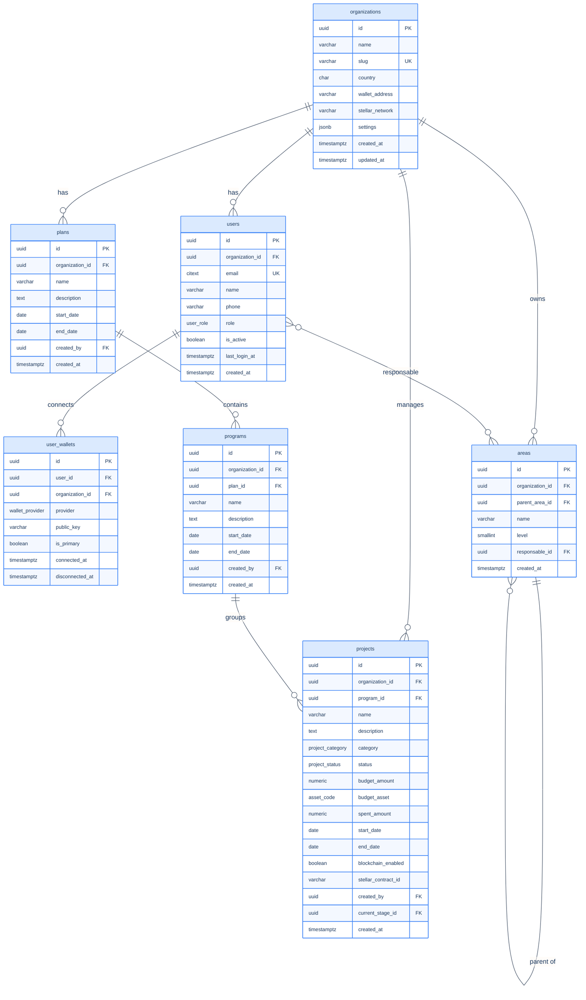
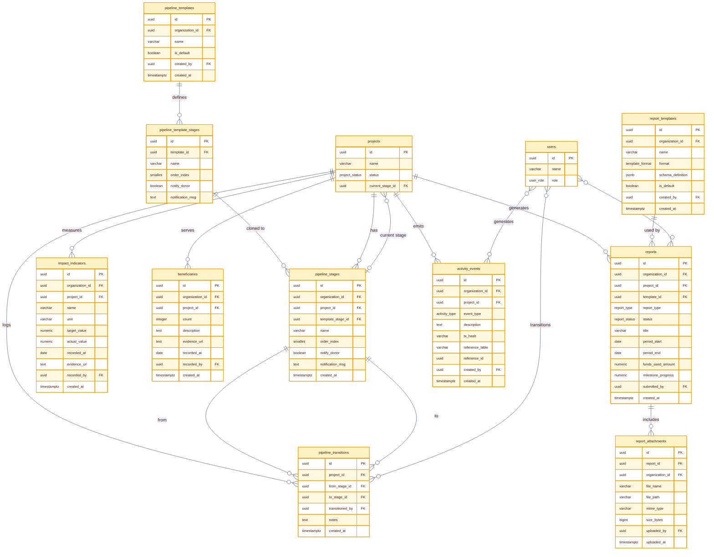
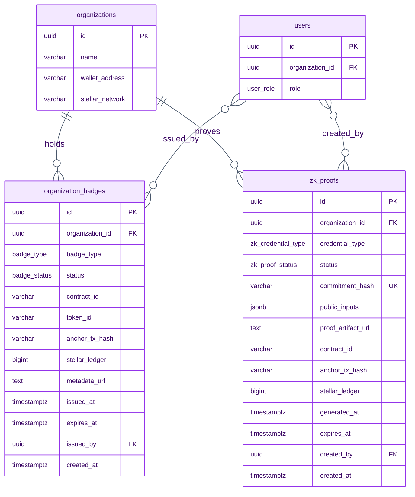

# TrustBid — Diagrama Entidad-Relación (DER)

> 25 tablas — Sprint 1+2 (`init-db.sql`) + Sprint 3 (`sprint3-schema.sql`) + Sprint 4 (`sprint4-sbt-zk.sql`).
> Dividido en 4 vistas por dominio. El diagrama de clases (`diagrama-clases.md`) muestra la visión OOP.

---

## Vista 1 — Identidad y Jerarquía

Entidades: `organizations`, `users`, `user_wallets`, `plans`, `programs`, `areas`, `projects`

---

## Vista 2 — Operaciones Financieras

Entidades: `projects` (ref), `areas` (ref), `accounts`, `custodian_keys`, `funding_sources`, `transactions`, `expense_splits`, `invoice_ocr`, `indexer_state`

> `transactions.funding_source_id` → trazabilidad directa para transacciones simples (sin split).
> `transactions.project_id` → nullable cuando hay `expense_splits`.
> `invoice_ocr.ocr_status`: `pending → extracted → validated | rejected` (validación humana requerida).

```mermaid
%%{init: {'theme': 'base', 'themeVariables': {'primaryColor': '#d1fae5', 'primaryTextColor': '#064e3b', 'primaryBorderColor': '#10b981', 'lineColor': '#475569', 'fontSize': '11px'}}}%%
erDiagram

    projects {
        uuid id PK
        varchar name
        project_status status
        numeric budget_amount
        asset_code budget_asset
        uuid program_id FK
        uuid current_stage_id FK
    }

    areas {
        uuid id PK
        uuid organization_id FK
        uuid parent_area_id FK
        varchar name
        smallint level
    }

    accounts {
        uuid id PK
        uuid organization_id FK
        uuid project_id FK
        uuid area_id FK
        varchar name
        varchar wallet_address
        numeric budget_amount
        numeric spent_amount
        asset_code asset_code
        timestamptz created_at
    }

    custodian_keys {
        uuid id PK
        uuid organization_id FK
        uuid account_id FK
        varchar public_key
        varchar kms_key_id
        varchar key_type
        timestamptz created_at
    }

    funding_sources {
        uuid id PK
        uuid organization_id FK
        uuid project_id FK
        varchar name
        funding_source_type funder_type
        numeric amount
        asset_code asset_code
        date received_at
        timestamptz created_at
    }

    transactions {
        uuid id PK
        uuid organization_id FK
        uuid project_id FK
        uuid account_id FK
        uuid area_id FK
        uuid funding_source_id FK
        varchar beneficiary
        varchar concept
        numeric amount
        asset_code asset_code
        varchar memo_id UK
        varchar tx_hash
        tx_status tx_status
        bigint stellar_ledger
        varchar support_file_path
        uuid created_by FK
        timestamptz created_at
        timestamptz confirmed_at
    }

    expense_splits {
        uuid id PK
        uuid transaction_id FK
        uuid project_id FK
        uuid funding_source_id FK
        numeric amount
        numeric percentage
    }

    invoice_ocr {
        uuid id PK
        uuid organization_id FK
        uuid transaction_id FK
        text image_url
        ocr_status ocr_status
        jsonb extracted_fields
        jsonb ocr_raw
        uuid validated_by FK
        timestamptz validated_at
        text rejection_reason
        timestamptz created_at
    }

    indexer_state {
        smallint id PK
        bigint last_ledger
        timestamptz last_sync
        varchar status
    }

    projects ||--o{ accounts : "allocates"
    projects ||--o{ funding_sources : "funded by"
    projects ||--o{ transactions : "tracks"
    projects ||--o{ expense_splits : "receives"

    areas }o--o{ accounts : "associated"
    areas }o--o{ transactions : "associated"

    accounts ||--o{ transactions : "records"
    accounts ||--o| custodian_keys : "managed by"

    funding_sources ||--o{ transactions : "funds directly"
    funding_sources ||--o{ expense_splits : "sourced by"
    transactions ||--o{ expense_splits : "split into"
    transactions ||--o| invoice_ocr : "has OCR"

    indexer_state }o..o{ transactions : "indexes"
```

---

## Vista 3 — Pipeline, Impacto y Reportes

Entidades: `projects` (ref), `users` (ref), `pipeline_templates`, `pipeline_template_stages`, `pipeline_stages`, `pipeline_transitions`, `impact_indicators`, `beneficiaries`, `report_templates`, `reports`, `report_attachments`, `activity_events`

---

---

## Vista 4 — Reputación y Credenciales ZK (Sprint 4)

Entidades: `organizations` (ref), `users` (ref), `organization_badges`, `zk_proofs`

> `organization_badges.status`: `pending → issued | revoked | expired`.
> `zk_proofs.status`: `computing → anchoring → anchored | failed`.
> Ambas tablas son append-only: revocación = nuevo registro, nunca UPDATE del original.

---

## Enums del schema

| Enum | Valores |
|---|---|
| `user_role` | admin, responsable, donante, **contador**, **admin_regional** |
| `wallet_provider` | freighter, albedo, custodial |
| `project_status` | draft, active, paused, completed, archived |
| `project_category` | infrastructure, education, health, technology, environment, social, other |
| `asset_code` | XLM, USDC |
| `tx_status` | pending, submitted, confirmed, failed |
| `report_type` | financial, milestone, audit |
| `report_status` | draft, submitted, approved, rejected |
| `activity_type` | verification, disbursement, expense, report, project |
| `funding_source_type` | international_org, government, corporate, individual, event, other |
| `template_format` | eu, usaid, idb, custom |
| `ocr_status` | pending, extracted, validated, rejected |
| `badge_type` *(Sprint 4)* | kyb_verified, transparency_bronze, transparency_silver, transparency_gold, audit_passed |
| `badge_status` *(Sprint 4)* | pending, issued, revoked, expired |
| `zk_credential_type` *(Sprint 4)* | donor_privacy, budget_compliance, impact_threshold, audit_trail |
| `zk_proof_status` *(Sprint 4)* | computing, anchoring, anchored, failed |

## Convenciones

| Notación | Significado |
|---|---|
| `PK` | Primary key |
| `FK` | Foreign key |
| `UK` | Unique constraint |
| `||--o{` | Uno a muchos (obligatorio → opcional) |
| `}o--o|` | Muchos opcional a uno opcional |
| `}o..o{` | Relación conceptual sin FK directa |
