```mermaid
%%{init: {'theme': 'base', 'themeVariables': {'primaryColor': '#dbeafe', 'primaryTextColor': '#1e3a5f', 'primaryBorderColor': '#3b82f6', 'lineColor': '#475569', 'fontSize': '11px'}}}%%
classDiagram
    direction TB

    %% ── IDENTITY & HIERARCHY ──────────────────────────────
    class Organization {
        +UUID id PK
        +String name
        +String slug UK
        +Char2 country
        +String walletAddress
        +String stellarNetwork
        +JSONB settings
    }

    class Plan {
        +UUID id PK
        +UUID organizationId FK
        +String name
        +String description
        +Date startDate
        +Date endDate
        +UUID createdBy FK
    }

    class Program {
        +UUID id PK
        +UUID organizationId FK
        +UUID planId FK
        +String name
        +String description
        +Date startDate
        +Date endDate
    }

    class User {
        +UUID id PK
        +UUID organizationId FK
        +String email UK
        +String name
        +UserRole role
        +Boolean isActive
        +DateTime lastLoginAt
    }

    class Area {
        +UUID id PK
        +UUID organizationId FK
        +UUID parentAreaId FK
        +String name
        +SmallInt level
        +UUID responsableId FK
    }

    class UserWallet {
        +UUID id PK
        +UUID userId FK
        +UUID organizationId FK
        +WalletProvider provider
        +String publicKey
        +Boolean isPrimary
    }

    class CustodianKey {
        +UUID id PK
        +UUID organizationId FK
        +UUID accountId FK UK
        +String publicKey
        +String kmsKeyId
        +String keyType
    }

    %% ── PROJECT & BUDGET ──────────────────────────────────
    class Project {
        +UUID id PK
        +UUID organizationId FK
        +UUID programId FK
        +String name
        +ProjectCategory category
        +ProjectStatus status
        +Decimal budgetAmount
        +AssetCode budgetAsset
        +Decimal spentAmount
        +Boolean blockchainEnabled
        +String stellarContractId
        +UUID currentStageId FK
    }

    class Account {
        +UUID id PK
        +UUID organizationId FK
        +UUID projectId FK
        +UUID areaId FK
        +String name
        +String walletAddress
        +Decimal budgetAmount
        +Decimal spentAmount
        +AssetCode assetCode
    }

    class FundingSource {
        +UUID id PK
        +UUID organizationId FK
        +UUID projectId FK
        +String name
        +FundingSourceType funderType
        +Decimal amount
        +AssetCode assetCode
        +Date receivedAt
    }

    %% ── OPERATIONS ────────────────────────────────────────
    class Transaction {
        +UUID id PK
        +UUID organizationId FK
        +UUID projectId FK nullable
        +UUID accountId FK
        +UUID areaId FK
        +String beneficiary
        +String concept
        +Decimal amount
        +AssetCode assetCode
        +String memoId UK
        +String txHash
        +TxStatus txStatus
        +BigInt stellarLedger
        +String supportFilePath
    }

    class ExpenseSplit {
        +UUID id PK
        +UUID transactionId FK
        +UUID projectId FK
        +UUID fundingSourceId FK
        +Decimal amount
        +Decimal percentage
    }

    %% ── PIPELINE ──────────────────────────────────────────
    class PipelineTemplate {
        +UUID id PK
        +UUID organizationId FK
        +String name
        +Boolean isDefault
    }

    class PipelineTemplateStage {
        +UUID id PK
        +UUID templateId FK
        +String name
        +SmallInt orderIndex
        +Boolean notifyDonor
        +String notificationMsg
    }

    class PipelineStage {
        +UUID id PK
        +UUID organizationId FK
        +UUID projectId FK
        +UUID templateStageId FK
        +String name
        +SmallInt orderIndex
        +Boolean notifyDonor
        +String notificationMsg
    }

    class PipelineTransition {
        +UUID id PK
        +UUID projectId FK
        +UUID fromStageId FK
        +UUID toStageId FK
        +UUID transitionedBy FK
        +DateTime createdAt
    }

    %% ── IMPACT ────────────────────────────────────────────
    class ImpactIndicator {
        +UUID id PK
        +UUID organizationId FK
        +UUID projectId FK
        +String name
        +String unit
        +Decimal targetValue
        +Decimal actualValue
        +Date recordedAt
        +String evidenceUrl
    }

    class Beneficiary {
        +UUID id PK
        +UUID organizationId FK
        +UUID projectId FK
        +Integer count
        +String description
        +String evidenceUrl
        +Date recordedAt
    }

    %% ── REPORTING ─────────────────────────────────────────
    class ReportTemplate {
        +UUID id PK
        +UUID organizationId FK
        +String name
        +TemplateFormat format
        +JSONB schemaDefinition
        +Boolean isDefault
    }

    class Report {
        +UUID id PK
        +UUID organizationId FK
        +UUID projectId FK
        +UUID templateId FK
        +ReportType reportType
        +ReportStatus status
        +String title
        +Date periodStart
        +Date periodEnd
        +Decimal fundsUsedAmount
        +Decimal milestoneProgress
        +UUID submittedBy FK
    }

    class ReportAttachment {
        +UUID id PK
        +UUID reportId FK
        +String fileName
        +String filePath
        +String mimeType
        +BigInt sizeBytes
    }

    %% ── AUDIT & BLOCKCHAIN ────────────────────────────────
    class ActivityEvent {
        +UUID id PK
        +UUID organizationId FK
        +UUID projectId FK
        +ActivityType eventType
        +String description
        +String txHash
        +UUID referenceId
        +DateTime createdAt
    }

    class IndexerState {
        +SmallInt id PK
        +BigInt lastLedger
        +DateTime lastSync
        +String status
    }

    %% ── ENUMS ─────────────────────────────────────────────
    class UserRole {
        <<enumeration>>
        admin
        responsable
        donante
        contador
        admin_regional
    }
    class ProjectStatus {
        <<enumeration>>
        draft
        active
        paused
        completed
        archived
    }
    class TxStatus {
        <<enumeration>>
        pending
        submitted
        confirmed
        failed
    }
    class ReportStatus {
        <<enumeration>>
        draft
        submitted
        approved
        rejected
    }
    class WalletProvider {
        <<enumeration>>
        freighter
        albedo
        custodial
    }
    class AssetCode {
        <<enumeration>>
        XLM
        USDC
    }
    class TemplateFormat {
        <<enumeration>>
        eu
        usaid
        idb
        custom
    }

    class OcrStatus {
        <<enumeration>>
        pending
        extracted
        validated
        rejected
    }

    class InvoiceOcr {
        +UUID id PK
        +UUID organizationId FK
        +UUID transactionId FK
        +String imageUrl
        +OcrStatus ocrStatus
        +JSONB extractedFields
        +JSONB ocrRaw
        +UUID validatedBy FK
        +DateTime validatedAt
        +String rejectionReason
        +DateTime createdAt
    }

    %% ── RELATIONSHIPS ─────────────────────────────────────

    Organization "1" --> "0..*" Plan : has
    Organization "1" --> "0..*" User : has
    Organization "1" --> "0..*" Area : owns
    Organization "1" --> "0..*" PipelineTemplate : defines
    Organization "1" --> "0..*" ReportTemplate : configures

    Plan "1" --> "0..*" Program : contains
    Program "1" --> "0..*" Project : groups

    User --> UserRole : role
    User "1" --> "0..*" UserWallet : connects
    UserWallet --> WalletProvider : provider

    Area "0..1" --> "0..*" Area : parent of
    Area --> User : responsable

    Project "1" --> "0..*" Account : allocates
    Project "1" --> "0..*" FundingSource : funded by
    Project "1" --> "0..*" Transaction : tracks
    Project "1" --> "0..*" PipelineStage : has stages
    Project "1" --> "0..*" ImpactIndicator : measures
    Project "1" --> "0..*" Beneficiary : serves
    Project "1" --> "0..*" Report : generates
    Project "1" --> "0..*" ActivityEvent : logs
    Project --> ProjectStatus : status
    Project --> PipelineStage : currentStage

    Account --> Area : area
    Account "1" --> "0..*" Transaction : records
    Account "1" --> "0..1" CustodianKey : managed by

    FundingSource "1" --> "0..*" ExpenseSplit : sourced by
    Transaction "1" --> "0..*" ExpenseSplit : split into
    Transaction "1" --> "0..1" InvoiceOcr : has OCR
    Transaction --> TxStatus : txStatus
    Transaction --> AssetCode : asset
    InvoiceOcr --> OcrStatus : status

    PipelineTemplate "1" --> "0..*" PipelineTemplateStage : defines
    PipelineStage --> PipelineTemplateStage : cloned from
    PipelineStage "1" --> "0..*" PipelineTransition : logs

    Report --> ReportTemplate : uses
    Report --> ReportStatus : status
    Report "1" --> "0..*" ReportAttachment : includes

    ActivityEvent --> User : createdBy
    IndexerState ..> Account : tracks ledger
```

# TrustBid — Diagrama de Clases Completo

> Sprint 1+2 (`init-db.sql`) + Sprint 3 (`sprint3-schema.sql`).
> Multi-tenant por `organization_id` con RLS. Jerarquía: Plan → Programa → Proyecto.

---



---

## Estructura jerárquica

```
Organization
├── Plan (estratégico)
│   └── Program (temático)
│       └── Project (operacional) ← unidad de ejecución
│           ├── Account (cuenta financiera por área)
│           ├── FundingSource (fuentes de fondos)
│           ├── Transaction (gastos/pagos)
│           │   └── ExpenseSplit (distribución entre proyectos)
│           ├── PipelineStage (etapas del flujo)
│           │   └── PipelineTransition (historial de cambios)
│           ├── ImpactIndicator (indicadores de impacto)
│           ├── Beneficiary (beneficiarios reales)
│           └── Report (reportes por donante)
│               └── ReportAttachment
└── Area (unidad organizacional, auto-referencial hasta 3 niveles)
    └── Sub-área
        └── Sub-sub-área
```

## Tablas por sprint

| Sprint | Tablas | Archivo |
|---|---|---|
| 1+2 | `organizations`, `users`, `user_wallets`, `projects`, `accounts`, `transactions`, `reports`, `report_attachments`, `activity_events`, `custodian_keys`, `indexer_state` | `scripts/init-db.sql` |
| 3 | `plans`, `programs`, `areas`, `funding_sources`, `expense_splits`, `pipeline_templates`, `pipeline_template_stages`, `pipeline_stages`, `pipeline_transitions`, `impact_indicators`, `beneficiaries`, `report_templates` | `scripts/sprint3-schema.sql` |

## Alteraciones a tablas existentes (Sprint 3)

| Tabla | Columna añadida | Motivo |
|---|---|---|
| `projects` | `program_id` FK | Jerarquía Plan→Programa→Proyecto |
| `projects` | `current_stage_id` FK | Estado actual del pipeline |
| `accounts` | `area_id` FK | Vinculo a unidad organizacional |
| `transactions` | `area_id` FK | Trazabilidad por área |
| `transactions` | `project_id` → nullable | Splits distribuyen entre proyectos |
| `reports` | `template_id` FK | Motor de plantillas por donante |
