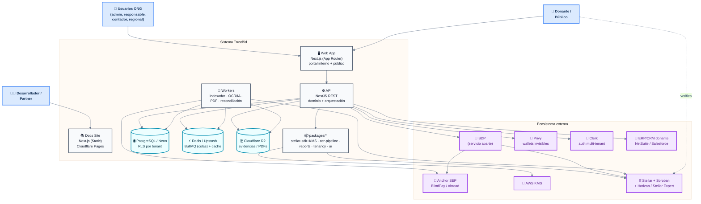
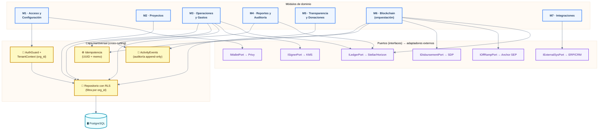

# TrustBid — Diagrama de Componentes

> Vista estructural del sistema en dos niveles del modelo **C4**: Contenedores
> (C4-L2) y Componentes de la API (C4-L3).
> **Fuente de verdad:** [casos-de-uso.md](./casos-de-uso.md) (módulos M1–M7) ·
> [diagrama-clases.md](./diagrama-clases.md) · [diagrama-secuencia.md](./diagrama-secuencia.md).

---

## 🤖 Contexto para agentes / IA

- El sistema es un **monolito modular** (NestJS) + **workers** desacrochados por
  cola, no microservicios. No separar en servicios físicos sin una razón de
  escalabilidad real (ver regla 10 de la skill de arquitectura).
- Cada **módulo de la API mapea 1:1 a un módulo de casos de uso** (M1–M7).
- Las piezas externas (SDP, Privy, Anchor, Stellar) **se integran, no se
  reimplementan**. TrustBid las orquesta.
- Toda dependencia va **hacia interfaces** (puertos), no hacia implementaciones
  concretas — habilita reemplazar el anchor (BlindPay↔Abroad) sin tocar el dominio.

---

## Nivel 2 (C4) — Contenedores

---

## Nivel 3 (C4) — Componentes internos de la API NestJS

> Cada módulo corresponde a un módulo de casos de uso (M1–M7).

---

## Responsabilidad de cada componente (Alta Cohesión)

| Componente | Responsabilidad única | UCs |
|---|---|---|
| **M1 Acceso/Config** | Org, usuarios, roles, jerarquía, wallets | UC01–04 |
| **M2 Proyectos** | Plan→Programa→Proyecto, presupuesto, fuentes, pipeline | UC05–11 |
| **M3 Operaciones** | Gastos, OCR, splits, evidencia, impacto, beneficiarios | UC12–18 |
| **M4 Reportes** | Templates, conciliación, import, export por donante | UC19–28 |
| **M5 Transparencia** | Portal público, donaciones, trazabilidad | UC29–32 |
| **M6 Blockchain** | Orquesta firma/anclaje/desembolso, idempotencia | UC33–35 |
| **M7 Integraciones** | API hacia/desde ERP/CRM del donante | UC36–37 |
| **Transversal** | Tenant, RLS, auditoría, idempotencia (todos los módulos) | — |

## Decisiones de diseño (consecuencias)

- **Puertos y adaptadores (Hexagonal):** el dominio no conoce a SDP/Privy/anchor
  concretos → se puede cambiar BlindPay por Abroad sin tocar M2–M6. *(Costo: más
  interfaces que un acoplamiento directo.)*
- **Workers vía cola (BullMQ):** OCR, PDF, indexado y reconciliación no bloquean la
  API → resiliencia y respuesta rápida en 3G. *(Costo: consistencia eventual.)*
- **RLS + `org_id` transversal:** doble capa de aislamiento multi-tenant. *(Costo:
  cada repositorio debe propagar el contexto de tenant sin excepción.)*
