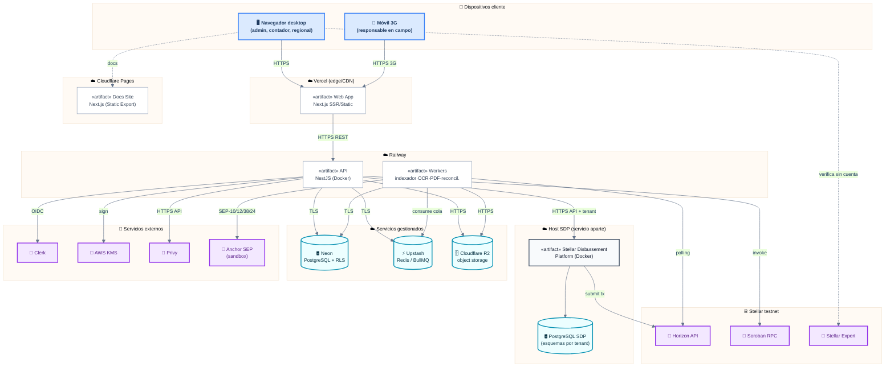

# TrustBid — Diagrama de Despliegue

> Vista física: dónde corre cada contenedor, sobre qué nodos y con qué protocolos.
> **Fuente de verdad:** [diagrama-componentes.md](./diagrama-componentes.md) ·
> [diagrama-secuencia.md](./diagrama-secuencia.md) · CLAUDE.md (stack e infra).

---

## 🤖 Contexto para agentes / IA

- Entorno del hackathon = **Stellar testnet**. Nunca apuntar a mainnet ni usar
  claves con fondos reales.
- Las llaves viven **solo** en variables de entorno del nodo; en el repo solo
  `.env.example`. KMS firma server-side: la clave privada nunca llega al cliente.
- **Regla de oro de despliegue:** Privy + off-ramp se despliegan PRIMERO (red de
  seguridad). SDP se monta encima. Si SDP no llega, deben quedar 2 integraciones
  reales desplegadas.
- SDP corre como **servicio aparte** (su propio host/contenedor + su propia BD), no
  embebido en la API.

---

## Diagrama de despliegue

---

## Nodos y artefactos

| Nodo | Artefacto desplegado | Protocolo entrante | Notas |
|---|---|---|---|
| Vercel | Web Next.js | HTTPS | Edge/CDN; portal interno + público |
| Cloudflare Pages | Docs Site Next.js (static) | HTTPS | Documentación pública para desarrolladores/partners |
| Railway | API NestJS (Docker) | HTTPS REST | Dominio + orquestación |
| Railway | Workers (Docker) | cola (BullMQ) | Indexador, OCR, PDF, reconciliación |
| Host SDP | SDP + su PostgreSQL | HTTPS API | Servicio aparte, esquemas por tenant |
| Neon | PostgreSQL + RLS | TLS 5432 | BD principal multi-tenant |
| Upstash | Redis / BullMQ | TLS | Colas + cache |
| Cloudflare R2 | Object storage | HTTPS S3 | Evidencias y PDFs |
| Clerk | Auth gestionada | OIDC/JWT | Multi-tenant, magic link |
| AWS KMS | Custodia de claves | API firmada | Firma server-side, no-custodial técnico |
| Privy | Wallets embebidas | HTTPS API | Una wallet invisible por área |
| Anchor SEP | Off-ramp fiat (sandbox) | SEP-10/12/38/24 | BlindPay / Abroad |
| Stellar testnet | Horizon · Soroban · Expert | HTTPS | Confirmación y verificación on-chain |

## Atributos de calidad cubiertos

| Atributo | Cómo se logra en el despliegue |
|---|---|
| **Disponibilidad** | Servicios gestionados (Neon/Upstash/R2/Vercel) con SLA; workers desacoplados |
| **Seguridad** | KMS server-side, RLS en Neon, secretos solo en env, testnet |
| **Escalabilidad** | API y workers escalan por separado; colas absorben picos |
| **Resiliencia** | Cola con reintentos + idempotencia; SDP aislado (fallback Privy+anchor) |
| **Verificabilidad** | Cualquiera abre Stellar Expert sin cuenta (control externo) |
| **Aislamiento multi-tenant** | RLS (Neon) + `org_id` en API + esquemas por tenant (SDP) |
