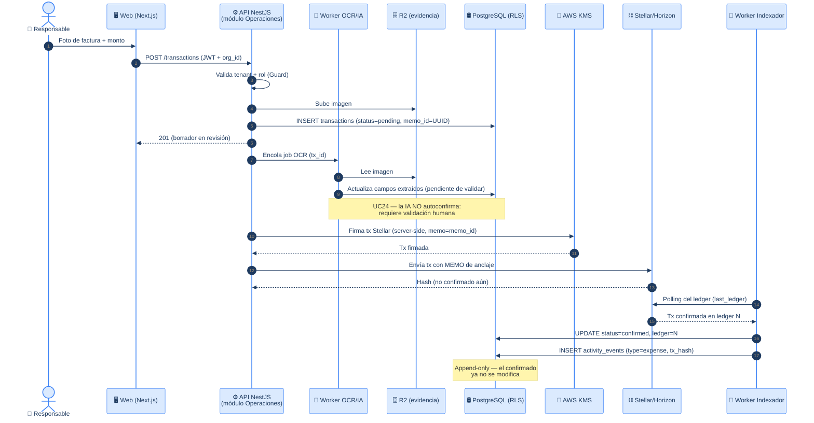
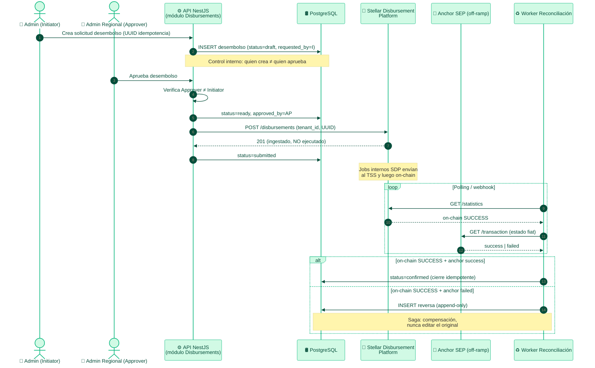
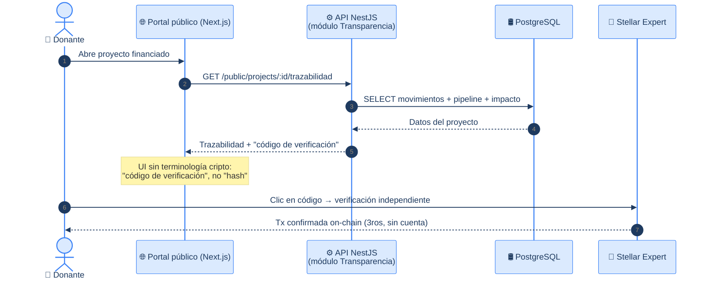
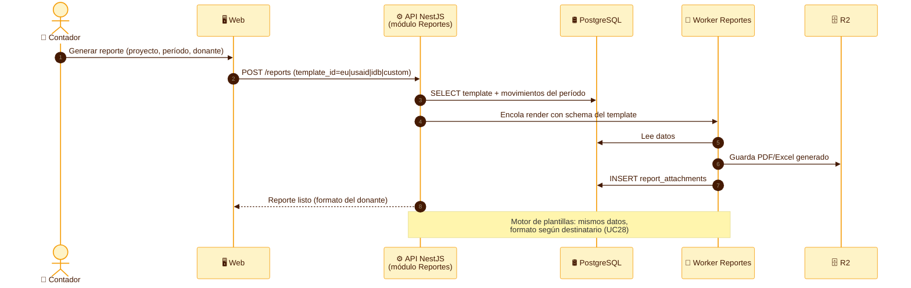

# TrustBid — Diagramas de Secuencia

> Flujos dinámicos del sistema, trazables a los artefactos estáticos.
> **Fuente de verdad:** [casos-de-uso.md](./casos-de-uso.md) (UCxx) ·
> [der.md](./der.md) (tablas) · [diagrama-clases.md](./diagrama-clases.md) (clases).
> Stack: Next.js (web) · NestJS (API) · Workers · PostgreSQL/Neon (RLS) · R2 ·
> AWS KMS · SDP · Privy · Anchor SEP · Stellar/Soroban.

---

## 🤖 Contexto para agentes / IA (leer antes de modificar)

Estos diagramas son **canónicos**. Cualquier código o flujo nuevo debe respetar:

1. **Multi-tenant:** toda operación lleva `organization_id` (= `fundacion_id`). Se
   propaga también a SDP como `tenant_id` 1:1, nunca se resuelve por separado.
2. **Append-only:** un movimiento/desembolso confirmado **no se edita ni borra**.
   Una corrección es un nuevo registro (reversa contable).
3. **Idempotencia:** toda escritura externa (SDP/anchor) usa un `UUID` generado por
   TrustBid *antes* de la llamada + `memo` Stellar. Un reintento nunca duplica.
4. **Async ≠ confirmado:** un `201` de SDP confirma *ingestión*, no *ejecución*. El
   estado `confirmed` solo se marca tras confirmación on-chain (webhook/polling).
5. **Blockchain invisible:** en strings de usuario nunca aparece wallet, hash, USDC,
   Stellar. Se usa "cuenta del área", "código de verificación", "fondos".
6. **Control interno:** desembolsos exigen separación de funciones
   (Initiator ≠ Approver). Ver flujo 2.

---

## Flujo 1 — Registrar gasto con OCR + anclaje on-chain

> UC13, UC15, UC16, UC24, UC33, UC34 · Tablas: `transactions`, `expense_splits`,
> `activity_events`, `indexer_state` · Actor: Responsable de Área (móvil, 3G).

**Control interno:** el registro nace `pending`; solo el indexador (proceso de
sistema, no un humano) lo pasa a `confirmed` al verlo en el ledger. La evidencia
queda en R2 y el anclaje on-chain es verificable por terceros.

---

## Flujo 2 — Desembolso donante → área → off-ramp (SDP + reconciliación dual)

> UC11, UC30 + desembolso · Tablas: `funding_sources`, `transactions`,
> `expense_splits`, `custodian_keys` · **Separación de funciones obligatoria.**

**Control interno (clave para auditoría/jurado):**
- **Initiator ≠ Approver** — la API rechaza que el mismo usuario cree y apruebe.
- **Idempotencia** — el `UUID` evita doble desembolso ante reintentos.
- **Reconciliación dual (Saga)** — si el riel fiat falla tras el éxito on-chain, se
  registra una **reversa append-only**, no se borra el movimiento.

---

## Flujo 3 — Donante verifica trazabilidad (sin cuenta)

> UC29, UC31, UC32 · Tablas: `projects`, `transactions`, `pipeline_stages`,
> `activity_events` · Actor: Donante (lectura pública).

**Credibilidad:** el donante verifica en una fuente externa (Stellar Expert), no
solo en la palabra de TrustBid. Cumple "todo verificable" del proyecto.

---

## Flujo 4 — Generar y exportar reporte por template de donante

> UC21, UC27, UC28 · Tablas: `report_templates`, `reports`, `report_attachments`.

---

## Trazabilidad de los flujos

| Flujo | UCs | Tablas principales | Patrón de diseño |
|---|---|---|---|
| 1 · Gasto + OCR + anclaje | UC13,15,16,24,33,34 | transactions, activity_events, indexer_state | Pipeline · Append-only |
| 2 · Desembolso + off-ramp | UC11,30 | funding_sources, transactions, custodian_keys | **Saga** · Idempotencia · Segregación de funciones |
| 3 · Verificación donante | UC29,31,32 | projects, transactions, pipeline_stages | CQRS lectura · verificación externa |
| 4 · Reporte por template | UC21,27,28 | report_templates, reports, report_attachments | Strategy (template) · Worker async |
