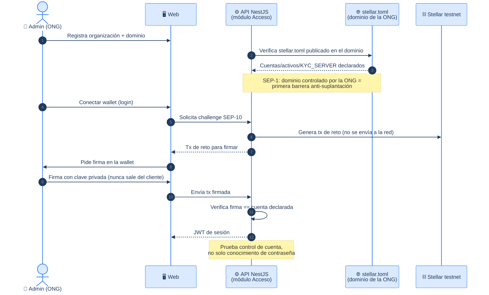
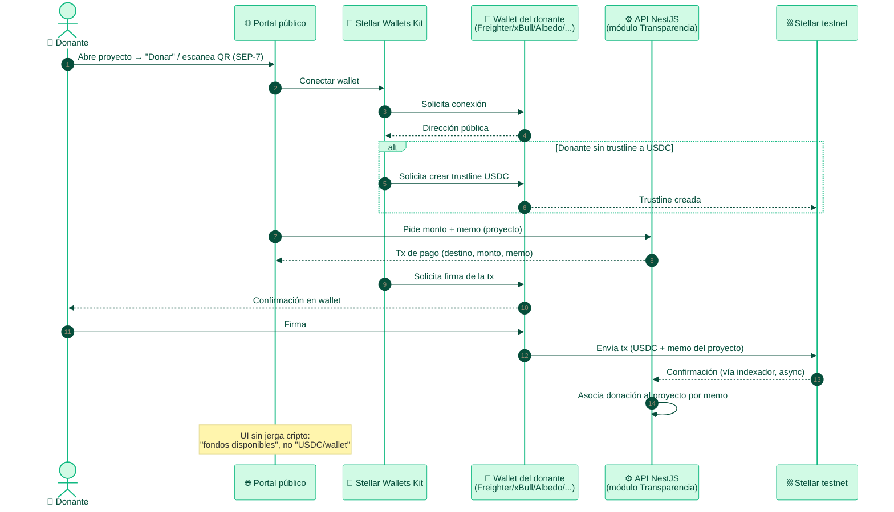
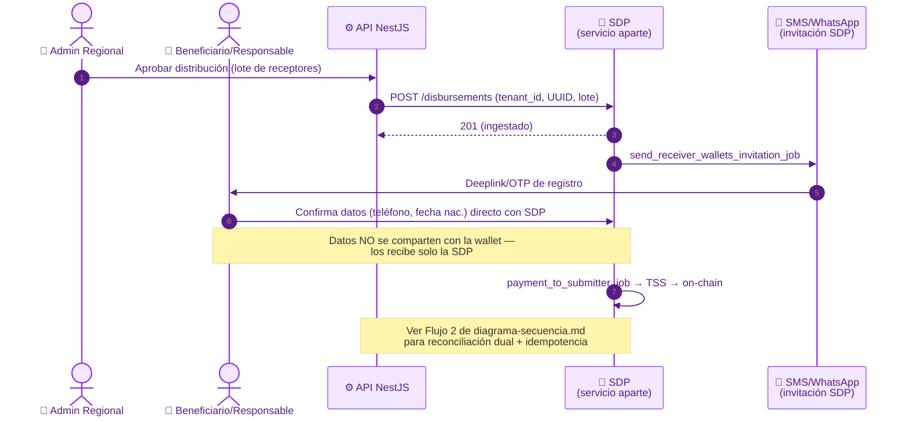
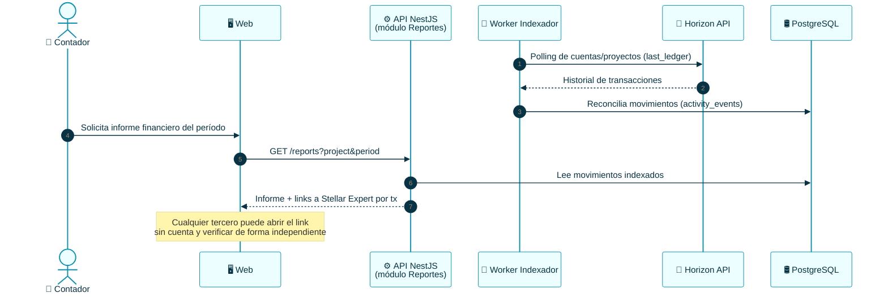

# TrustBid — Flujos de Integraciones Stellar

> Flujos de secuencia para las piezas de [`integraciones-stellar.md`](../integraciones-stellar.md)
> (el mapa técnico de SEPs/herramientas). **Fuente de verdad del mapeo:** ese
> documento — si algo aquí lo contradice, gana `integraciones-stellar.md`.
>
> Coherente con [diagrama-secuencia.md](./diagrama-secuencia.md) (mismas
> convenciones de actores/notación) y [casos-de-uso.md](./casos-de-uso.md) (UCxx).

---

## 🤖 Contexto para agentes / IA

- Si un flujo requiere una tabla/columna que no existe en [der.md](./der.md) o
  [diagrama-clases.md](./diagrama-clases.md), **márcalo como pendiente de schema**,
  no asumas que ya existe (mismo criterio aplicado en `diagrama-secuencia.md` con el
  flujo de desembolso).
- **Testnet primero, siempre.** Nunca mainnet ni claves con fondos reales.
- **Blockchain invisible:** ningún paso de UI debe filtrar terminología cripto al
  usuario final (ver CLAUDE.md sección 1).
- Respeta el **roadmap por fases** de `integraciones-stellar.md` sección 8.

---

## Flujo A — Identidad y login de la organización (SEP-1 + SEP-10/45)

> SEP-1, SEP-10, SEP-45 · UC01, UC03 · Prerrequisito de todo lo demás
> (KYB, SBT, desembolsos).



---

## Flujo B — Donación con wallet (SAK + SEP-7 + USDC)

> Stellar Wallets Kit, SEP-7, USDC · UC29, UC30.



---

## Flujo C — KYC/KYB de la organización (SEP-9 + SEP-12)

> SEP-9, SEP-12 · UC01 · Requiere SEP-10 previo (Flujo A). Alimenta el SBT de reputación.

```mermaid
%%{init: {'theme':'base','themeVariables':{'primaryColor':'#fef3c7','primaryTextColor':'#451a03','primaryBorderColor':'#f59e0b','lineColor':'#64748b','fontSize':'13px'}}}%%
sequenceDiagram
    autonumber
    actor A as 👤 Admin (ONG)
    participant W as 🖥️ Web
    participant API as ⚙️ API NestJS<br/>(módulo Acceso)
    participant KYB as 🔍 Proveedor KYB<br/>(Sumsub/Persona) o manual
    participant DB as 🛢️ PostgreSQL
    participant M6 as ⛓️ Módulo Blockchain<br/>(SBT)

    A->>W: Completa campos SEP-9 (organización)
    W->>API: PUT /customer (SEP-12, JWT de SEP-10)
    API->>DB: Guarda campos KYB (pendiente)
    API->>KYB: Envía a validación
    KYB-->>API: Resultado (aprobado/rechazado)
    API->>DB: Actualiza estado KYB
    alt KYB aprobado
        API->>M6: Solicita emisión de insignia/ACTA inicial
        M6->>M6: Emite SBT (no transferible) a la cuenta de la ONG
        Note over M6: SEP-12 transporta el dato;<br/>el SBT es la prueba on-chain del resultado
    else KYB rechazado
        API-->>W: Notifica motivo, solicita corrección
    end
```

---

## Flujo D — Desembolso masivo vía SDP

> SDP · UC11 · Mismo flujo de fondo que **Flujo 2** de
> [diagrama-secuencia.md](./diagrama-secuencia.md) — éste detalla la integración
> SDP en sí (registro de wallet del receptor vía deeplink/OTP), no la reconciliación
> dual completa. Ver ese documento para idempotencia, Saga y reversa append-only.



---

## Flujo E — Auditoría desde el ledger (Horizon)

> Horizon API · UC27, UC34 · No requiere SEP — es lectura directa del ledger.



---

## Trazabilidad

| Flujo | Piezas Stellar | UCs | Documento relacionado |
|---|---|---|---|
| A · Identidad/login | SEP-1, SEP-10/45 | UC01, UC03 | — |
| B · Donación | SAK, SEP-7, USDC | UC29, UC30 | diagrama-secuencia.md Flujo 3 |
| C · KYC/KYB | SEP-9, SEP-12 | UC01 | — |
| D · Desembolso SDP | SDP | UC11 | diagrama-secuencia.md **Flujo 2** |
| E · Auditoría Horizon | Horizon API | UC27, UC34 | diagrama-secuencia.md Flujo 4 |

> Los flujos de **SBT/reputación** y **ZK** (Soroban) no tienen diagrama aún porque
> su modelo de datos no está en `der.md` / `diagrama-clases.md` — agregar ahí primero
> (tabla de insignias/credenciales) antes de dibujar el flujo, para no repetir el
> error corregido en el flujo de desembolso.
