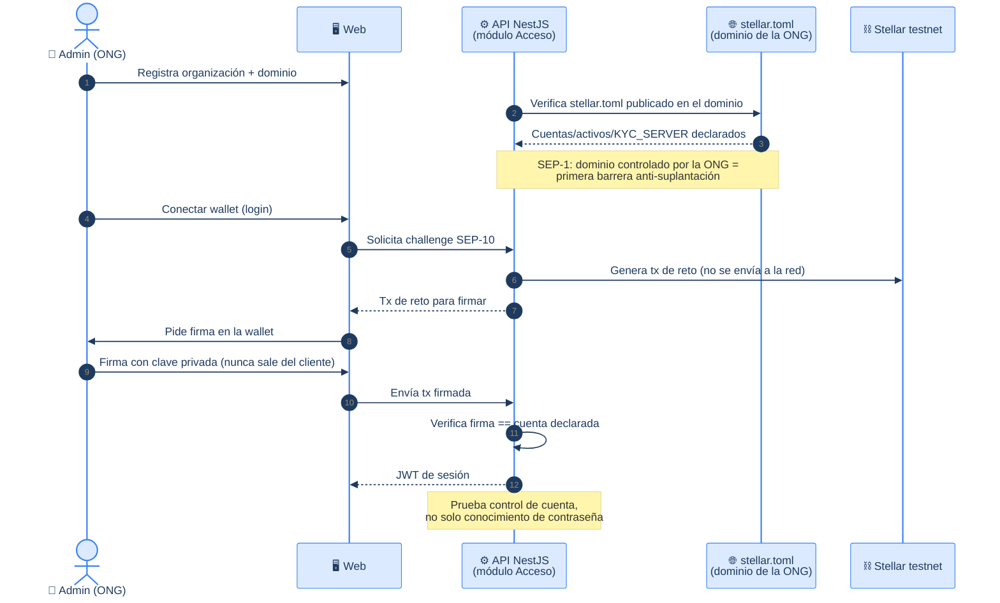
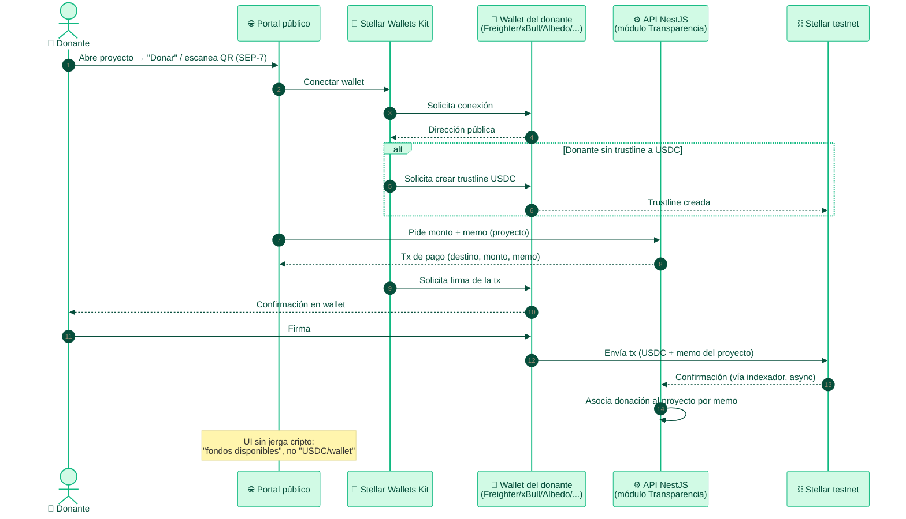
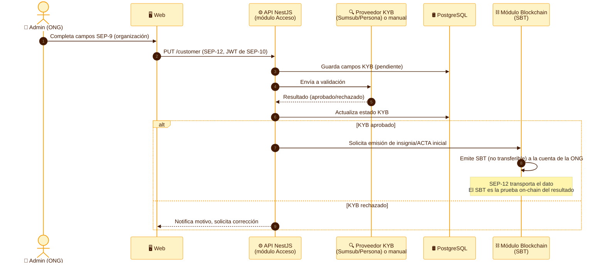
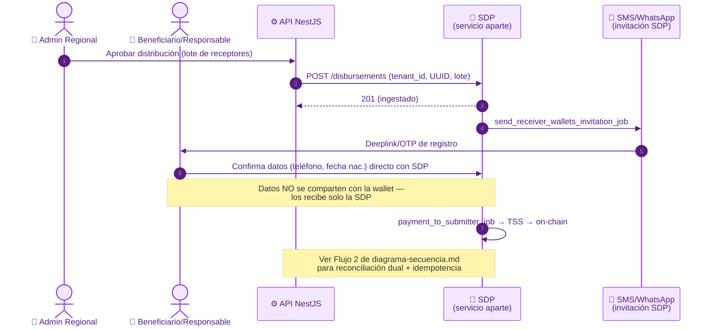
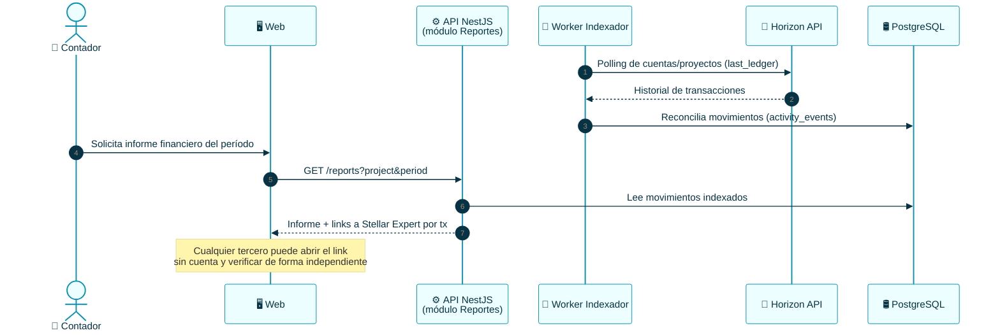
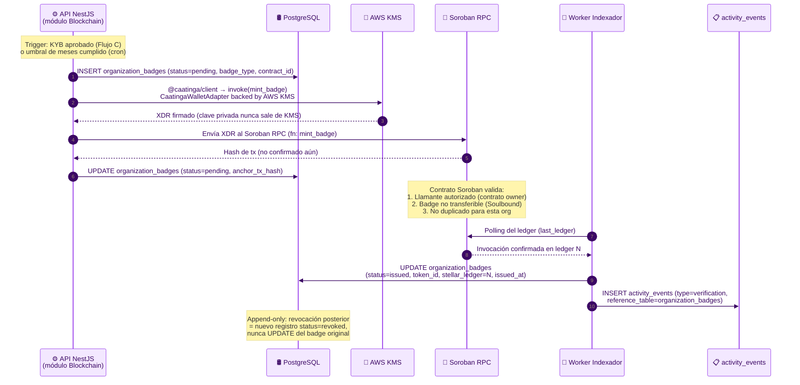
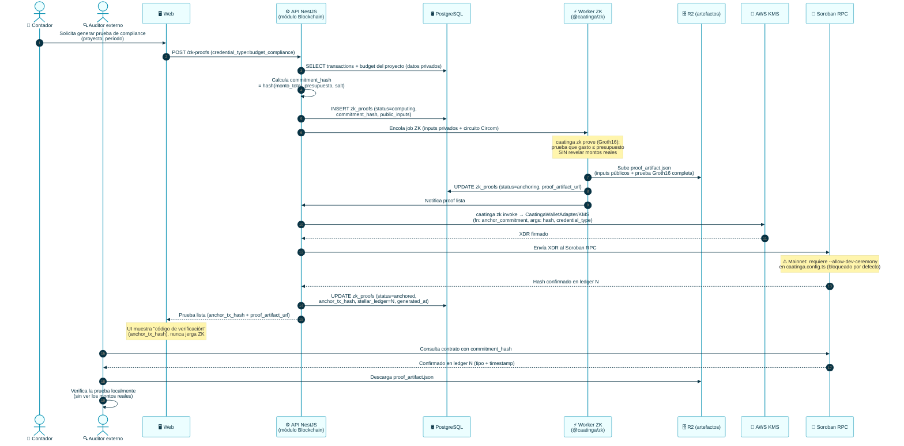
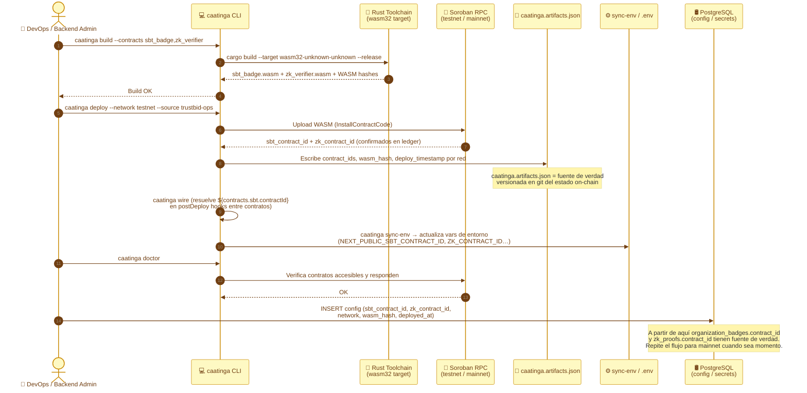
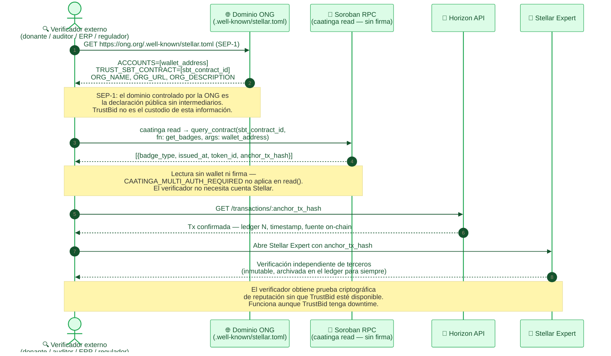

# TrustBid — Flujos de Integraciones Stellar

> Flujos de secuencia para las piezas de [`integraciones-stellar.md`](../integraciones-stellar.md)
> (el mapa técnico de SEPs/herramientas). **Fuente de verdad del mapeo:** ese
> documento — si algo aquí lo contradice, gana `integraciones-stellar.md`.
>
> Coherente con [diagrama-secuencia.md](./diagrama-secuencia.md) (mismas
> convenciones de actores/notación) y [casos-de-uso.md](./casos-de-uso.md) (UCxx).

---

## 🤖 Contexto para agentes / IA

- Si un flujo requiere una tabla/columna que no existe en [der.md](./der.md) o
  [diagrama-clases.md](./diagrama-clases.md), **márcalo como pendiente de schema**,
  no asumas que ya existe (mismo criterio aplicado en `diagrama-secuencia.md` con el
  flujo de desembolso).
- **Testnet primero, siempre.** Nunca mainnet ni claves con fondos reales.
- **Blockchain invisible:** ningún paso de UI debe filtrar terminología cripto al
  usuario final (ver CLAUDE.md sección 1).
- Respeta el **roadmap por fases** de `integraciones-stellar.md` sección 8.

---

## Flujo A — Identidad y login de la organización (SEP-1 + SEP-10/45)

> SEP-1, SEP-10, SEP-45 · UC01, UC03 · Prerrequisito de todo lo demás
> (KYB, SBT, desembolsos).

---

## Flujo B — Donación con wallet (SAK + SEP-7 + USDC)

> Stellar Wallets Kit, SEP-7, USDC · UC29, UC30.

---

## Flujo C — KYC/KYB de la organización (SEP-9 + SEP-12)

> SEP-9, SEP-12 · UC01 · Requiere SEP-10 previo (Flujo A). Alimenta el SBT de reputación.

---

## Flujo D — Desembolso masivo vía SDP

> SDP · UC11 · Mismo flujo de fondo que **Flujo 2** de
> [diagrama-secuencia.md](./diagrama-secuencia.md) — éste detalla la integración
> SDP en sí (registro de wallet del receptor vía deeplink/OTP), no la reconciliación
> dual completa. Ver ese documento para idempotencia, Saga y reversa append-only.

---

## Flujo E — Auditoría desde el ledger (Horizon)

> Horizon API · UC27, UC34 · No requiere SEP — es lectura directa del ledger.

---

## Flujo F — Emisión de SBT de reputación (Soroban)

> Soroban SBT · Tablas: `organization_badges`, `activity_events` ·
> Prerrequisito: **Flujo C** (KYB aprobado) para `badge_type = kyb_verified`.
> Los badges de transparencia (bronze/silver/gold) los dispara el módulo Blockchain
> automáticamente al detectar umbrales de meses de cumplimiento en DB.

**Invariantes del contrato SBT:**
- `mint_badge` solo puede llamarlo el owner del contrato (AWS KMS, server-side).
- La función `transfer` está deshabilitada — el token es no transferible.
- `revoke_badge` emite una nueva entrada en el ledger; el badge original queda inmutable.
- El `token_id` lo asigna el contrato y se recupera del evento de la tx confirmada.

---

## Flujo G — Prueba ZK de compliance presupuestario (Soroban)

> ZK (zk-SNARK offchain + anclaje Soroban) · Tablas: `zk_proofs`, `activity_events` ·
> UC27, UC34 — un auditor externo verifica que el gasto ≤ presupuesto sin ver montos reales.

**Garantías de privacidad:**
- El `commitment_hash` en Soroban no revela montos ni fechas.
- Los `public_inputs` en DB y en el artefacto solo incluyen el threshold (ej. `compliance: true`) y el período, no los valores exactos.
- El auditor puede verificar matemáticamente la prueba con herramientas estándar (snarkjs) sin necesitar acceso a DB ni a R2 privado si se le comparte el artefacto.

---

## Flujo H — Despliegue inicial de contratos Soroban (one-time, DevOps)

> Caatinga CLI · Prerrequisito de F y G · Se ejecuta una vez por entorno (testnet → mainnet).
> Resuelve la pregunta: *¿de dónde viene el `contract_id` que guardan `organization_badges`
> y `zk_proofs`?* Sin este flujo, F y G tienen una referencia huérfana.

**Notas operativas:**
- `--source trustbid-ops` es un alias de Stellar CLI que apunta a la cuenta pagadora (no usa clave privada raw — ver restricción Caatinga).
- El `caatinga.artifacts.json` se commitea al repo de `backend/` para que CI/CD pueda reproducir el estado exacto.
- Para mainnet: mismos pasos con `--network mainnet` + añadir `allowDevCeremony: false` en `caatinga.config.ts` para el módulo ZK.

---

## Flujo I — Verificación pública de reputación ONG (SEP-1 + on-chain)

> SEP-1, Soroban RPC, Horizon · Tablas: `organization_badges` (solo lectura) ·
> **Diferenciador clave:** cualquier tercero (donante, auditor, ERP, regulador) puede
> verificar la reputación y los objetivos on-chain de una ONG **sin depender de TrustBid**.
> La fuente de verdad es el dominio propio de la ONG (SEP-1) + el ledger Soroban (inmutable).

**Por qué esto es el diferenciador:**
- **Sin custodia:** la ONG publica su propio `stellar.toml` en su dominio — TrustBid no puede modificarlo.
- **Inmutabilidad:** los badges en el ledger Soroban no pueden borrarse ni editarse retroactivamente.
- **Integración nativa con ERPs y flujos de caja:** un ERP puede hacer polling automatizado de `stellar.toml` + Soroban RPC para validar automáticamente si una ONG tiene `kyb_verified` antes de procesar una transferencia. No requiere API key ni contrato con TrustBid.
- **Reguladores y auditores:** un ente regulador puede verificar el historial completo de badges a través de Horizon sin solicitar datos a TrustBid.

---

## Trazabilidad

| Flujo | Piezas Stellar / Toolchain | UCs | Documento relacionado |
|---|---|---|---|
| A · Identidad/login | SEP-1, SEP-10/45 | UC01, UC03 | — |
| B · Donación con wallet | SAK, SEP-7, USDC | UC29, UC30 | diagrama-secuencia.md Flujo 3 |
| C · KYC/KYB organización | SEP-9, SEP-12 | UC01 | — |
| D · Desembolso masivo | SDP | UC11 | diagrama-secuencia.md **Flujo 2** |
| E · Auditoría Horizon | Horizon API | UC27, UC34 | diagrama-secuencia.md Flujo 4 |
| F · Emisión SBT | Soroban + @caatinga/client + KMS | — | der.md Vista 4, sprint4-sbt-zk.sql |
| G · Prueba ZK compliance | Soroban + @caatinga/zk (Groth16) | UC27, UC34 | der.md Vista 4, sprint4-sbt-zk.sql |
| H · Despliegue contratos | caatinga CLI (build/deploy/wire) | — | sprint4-sbt-zk.sql, caatinga.artifacts.json |
| I · Verificación pública ONG | SEP-1 + Soroban RPC + Horizon | UC29, UC31, UC32 | der.md Vista 4 |
